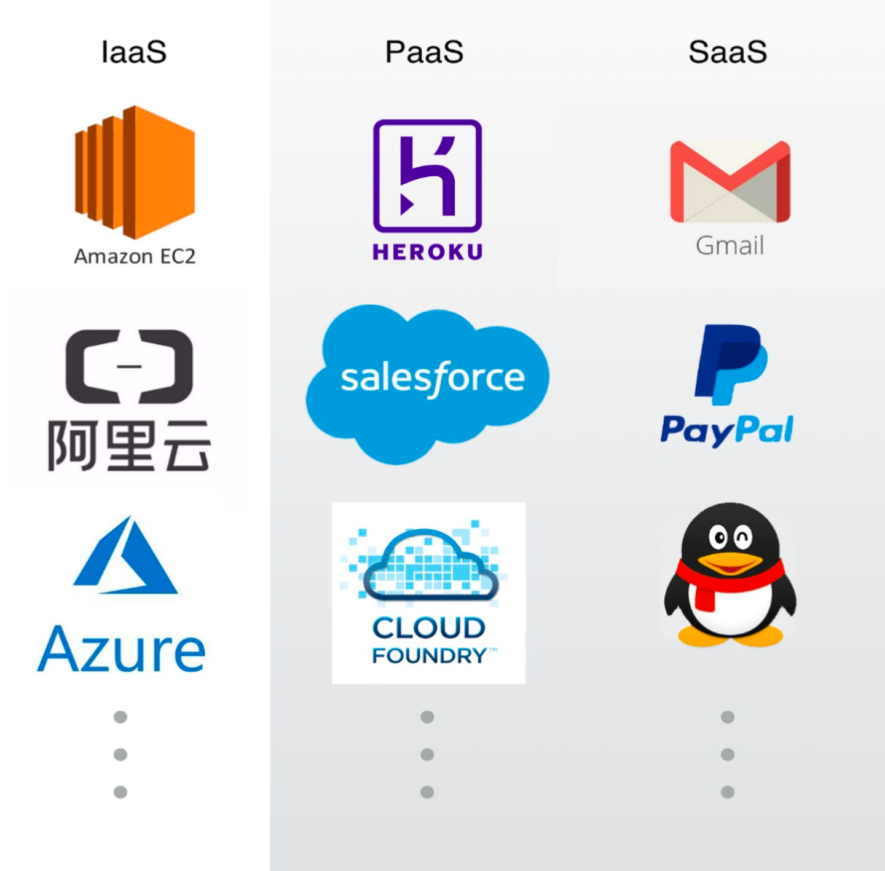

#三者是对本地部署的分层

##iaas
提供虚拟机硬件资源,IaaS提供按需快速配置虚拟化硬件基础架构资源，如服务器，存储和网络。

当您需要灵活控制虚拟化硬件时
当您需要控制应用程序的操作系统时

##paas
提供基础组件,提供平台软件或中间件执行环境的按需快速配置，例如消息队列，关系型数据库管理系统和容器编排系统

当您不打算安装平台软件或中间件和底层操作系统时
当您不打算管理和维护底层中间件和操作系统时

##saas
提供业务服务能力,通过Web向消费者提供应用程序或软件服务。 SaaS不要求消费者管理底层平台和基础架构。电子邮件服务，数据备份服务和SMS服务是SaaS的示例

当您需要具有即用型应用程序或软件而无需管理底层堆栈时

#阿里云
