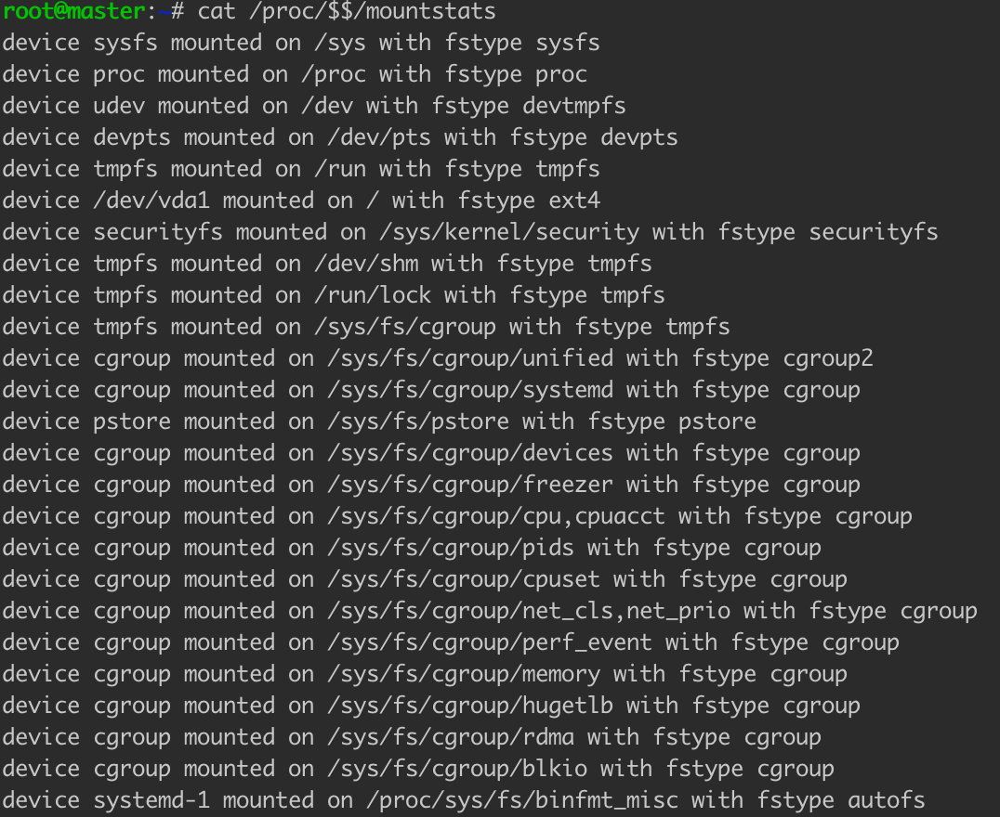

#临界知识
docker沙盒
docker如何做到本地环境和云端环境的高度一致
tty字符型设备
#编译部署docker镜像
docker build .
#启动容器
// docker run [OPTIONS] IMAGE [COMMAND] [ARG...]
docker run -it busybox /bin/sh //运行容器grafana/grafana,并执行命令/bin/sh ，使用终端交互方式-it
#namespace查看
##pid进程号
ls -l /proc/[pid]/ns

##mount挂载
cat /proc/$$/mounts,//挂载的文件系统
cat /proc/$$/mountstats,//挂载文件名，位置

mount --make-shared <mount-object>
mount --make-slave <shared-mount-object>
```asp
-B, --bind              mount a subtree somewhere else (same as -o bind)
 -M, --move              move a subtree to some other place
 -R, --rbind             mount a subtree and all submounts somewhere else
 --make-shared           mark a subtree as shared
 --make-slave            mark a subtree as slave
 --make-private          mark a subtree as private
 --make-unbindable       mark a subtree as unbindable
 --make-rshared          recursively mark a whole subtree as shared
 --make-rslave           recursively mark a whole subtree as slave
 --make-rprivate         recursively mark a whole subtree as private
 --make-runbindable      recursively mark a whole subtree as unbindable
```

swam，docker集群
1.监控哪些?业务,中间件
2.如何监控?业务如何监控?中间件如何监控?
3.如何部署?

docker未启动文件拷贝
docker查看错误日志
dokcer查看启动命令
docker进入容器
docker后台运行
docker文件共享

docker文件volume创建用户问题，容器内权限/容器的权限

docker运行时用户，whoami && id：：https://segmentfault.com/a/1190000021917842

https://blog.csdn.net/c851204293/article/details/108536329

Docker的守护线程绑定的是unix socket，而不是TCP端口，这个套接字默认属于root，其他用户可以通过sudo去访问这个套接字文件。所以docker服务进程都是以root账户运行。


--mount type=bind,source=/Users/chris//Downloads/hello_world,destination=/home/work/hello

docker层:https://docs.docker.com/storage/storagedriver/images/container-layers.jpg

docker找不到:https://stackoverflow.com/questions/36454955/docker-and-netstat-netstat-is-not-showing-ports-exposed-by-docker-containers

两种挂载方式的区别

docker 镜像vs容器的区别，启动过程原理,,权限原理，执行顺序

dockerfile VOLUME  创建时机

[dockerfile volume执行顺序]https://note.qidong.name/2018/01/docker-volume-permission/

docker

为啥容器已经设置为nobody，docker-compose创建的文件仍为root

https://juejin.cn/post/6844903971421683719

echo $USER

WORKDIR:docker中工作目录

docker push/pull

wokedir

docker exev -it prometheus /bin/sh


docker inspect ee7ff0bae90b

docker logs --since 30m ee7ff0bae90b


docker --no-trunc

docker network create --subnet 173.17.0.0/16 monitor_fintech


查看宕机docker容器中文件docker cp aa65b5f75bfa:/opt/mifi-monitor-assistant/bin/docker_startup.sh ~/deploy/docker_startup.sh
https://stackoverflow.com/questions/36454955/docker-and--netstat-is-not-showing-ports-exposed-by-docker-containers


netstat -tln

docker logs -f


grafana docker转发 404问题,https://grafana.com/docs/grafana/latest/administration/configure-docker/
https://grafana.com/docs/grafana/latest/administration/configuration/


