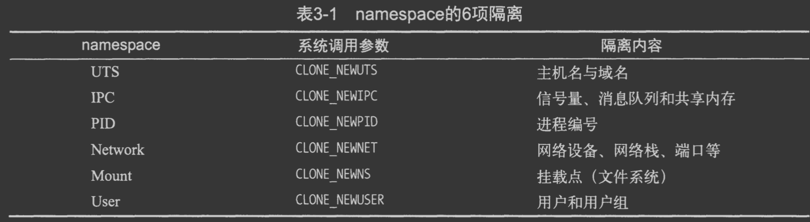
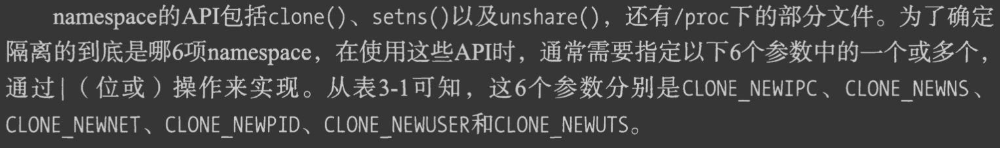

#临界知识
容器的沙盒技术
#沙盒边界
容器技术的核心功能，就是通过约束和修改进程的动态表现，从而为其创造出一个“边界”
Cgroups 技术是用来制造约束的主要手段，而Namespace 技术则是用来修改进程视图的主要方法
#linux命名空间namespace技术
同一个namespace的进程感知彼此变化,外界进程无感知

##namespace操作
```asp
clone
setns
```

