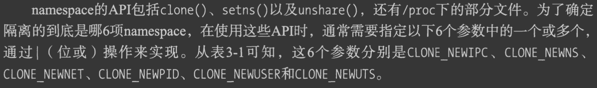

#临界知识
容器的沙盒技术
系统默认root namespace
挂载隔离
虚拟网络设备对
#沙盒边界
容器技术的核心功能，就是通过约束和修改进程的动态表现，从而为其创造出一个“边界”
Cgroups 技术是用来制造约束的主要手段，而Namespace 技术则是用来修改进程视图的主要方法
#linux命名空间namespace技术
同一个namespace的进程感知彼此变化,外界进程无感知

##namespace操作
```asp
clone
setns
```

##UTS namespace(主机名&域名 的隔离)
每个容器拥有独立的主机名和域名,在网络上被视为独立的节点
[容器与容器云]
##IPC namespace(进程间通信 的隔离)
同一个namespace下的进程彼此可见,不同namespace进程互不可见
[容器与容器云]
##PID namespace(pid 的隔离)
两个不同的namespace下的进程可以有相同的id
pid namespace树状结构,最顶层是系统初始化时创建root namespace
不同pid namespace有层级关系,父节点可以看到子节点的进程

###pid namespace中的 init进程

[容器与容器云]
###proc文件隔离
##mount namespace(文件系统挂载点隔离)
[容器与容器云]


共享挂载(share)
从属挂载(slave)
共享/从属挂载(shared and slave)
私有挂载(private)
不可绑定挂载(unbindable)


默认所有挂载都是私有挂载
##network namespace(网络资源隔离)
虚拟网络设备对

