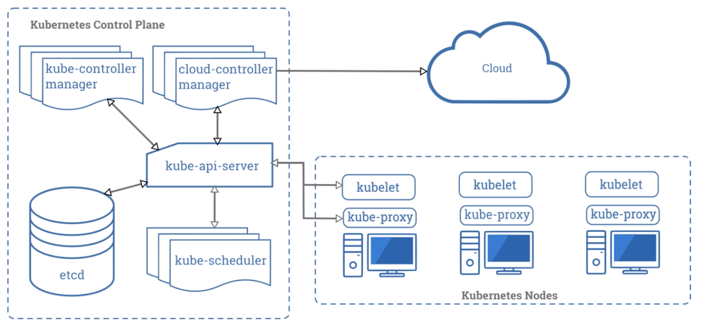
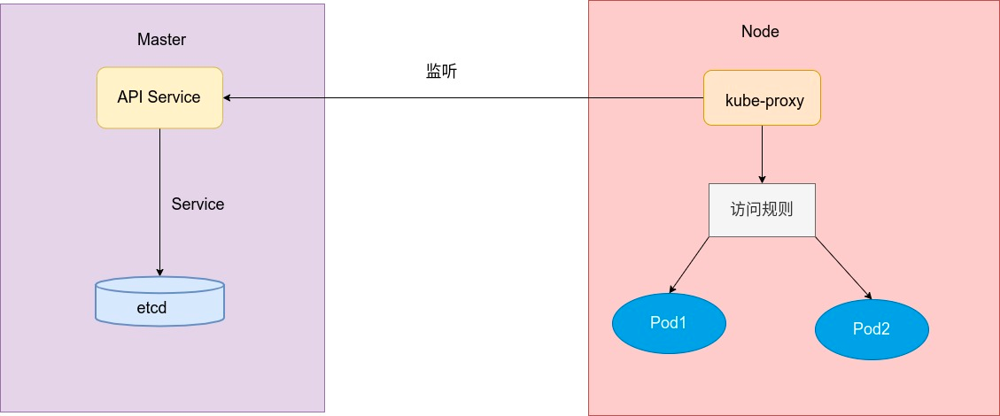
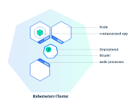
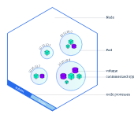
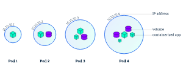

#拓扑

#master
##apiserver
kubectl主要向api server发出rest api请求
```asp
1. kube-apiserver是Kubernetes最重要的核心组件之一
2. 提供集群管理的REST API接口，包括认证授权，数据校验以及集群状态变更等
3. 提供其他模块之间的数据交互和通信的枢纽(其他模块通过API Server查询或修改数据，只
有API Server才直接操作etcd)
```

##kube-scheduler
```asp
kube-scheduler负责分配调度Pod到集群内的节点上，它监听kube-apiserver，
查询还未分 配Node的Pod，然后根据调度策略为这些Pod分配节点
```
##Controller Manager
```asp
是 Kubernetes的大脑，它通过apiserver监控整个集群的状态，并确保集群处于预期的工作状态
```
###deployment controller
控制管理pod的部署和运行

##etcd
```asp
kubernetes需要存储很多东西，像它本身的节点信息，组件信息，还有通过kubernetes运行 的pod，deployment，service等等。都需要持久化。etcd就是它的数据中心。生产环境中为 了保证数据中心的高可用和数据的一致性，一般会部署最少三个节点。
2. 这里只部署一个节点在master。etcd也可以部署在kubernetes每一个节点。组成etcd集群。
3. 如果已经有etcd外部的服务，kubernetes直接使用外部etcd服务
```
##kubectl
```asp
kubectl是Kubernetes的命令行工具，是Kubernetes用户和管理员必备的管理工具。 
kubectl提供了大量的子命令，方便管理Kubernetes集群中的各种功能
```
#node

##kubelet
```asp
一个在集群中每个节点上运行的代理。它保证容器都运行在 Pod 中
一个在集群中每个工作节点上都运行一个kubelet服务进程，默认监听10250端口，接收并执 行master发来的指令，管理Pod及Pod中的容器。
每个kubelet进程会在API Server上注册节 点自身信息，定期向master节点汇报节点的资源使用情况，并通过cAdvisor监控节点和容器 的资源
```
##kube-proxy
```asp
一个在集群中每台工作节点上都应该运行一个kube-proxy服务，它监听API server中service 和endpoint的变化情况，
并通过iptables等来为服务配置负载均衡，是让我们的服务在集群 外可以被访问到的重要方式
```
##pod


###pod 与 controller(自主性pod & 非自主性pod)
pod可以被控制器管理,也可以不被控制器管理
pod可以被service管理,也可以不被service管理
