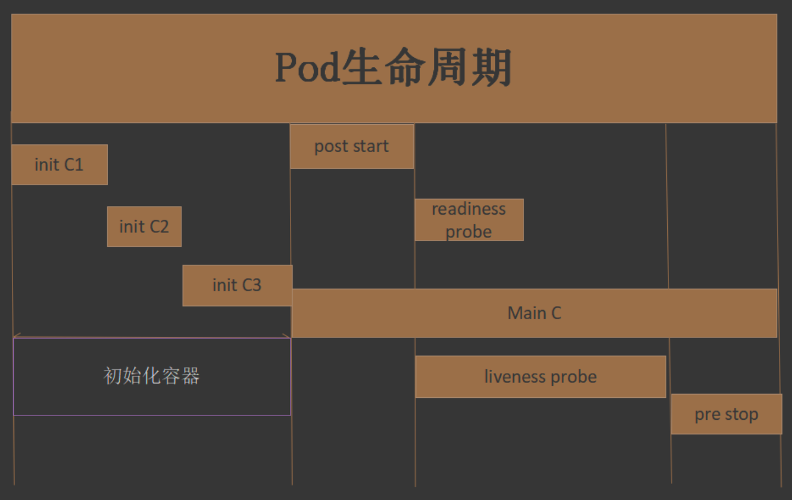

#临界知识
pod启动的几个阶段(生命周期)
initC容器与普通容器的区别(类似spark任务中的拓扑前置任务hdfs check)
容器

#pod创建过程
```asp
pod是k8s的基础单元，以下为一个pod资源对象的典型创建过程:
1. 用户通过kubectl或其他api客户端提交pod spec给api server
2. api server尝试着将pod对象的相关信息存入etcd中，待写入操作执行完成，api server即会返回
确认信息至客户端。
3. api server开始反映etcd中的状态变化
4. 所有的k8s组件均使用watch机制来跟踪检查api server上的相关变动
5. kube-scheduler通过其watch觉察到api server创建了新的pod对象但尚未绑定至任何工作节点
6. kube-scheduler为pod对象挑选一个工作节点并将结果信息更新至api server
7. 调度结果信息由api server更新至etcd，而且api server也开始反映此pod对象的调度结果
8. pod被调度到目标工作节点上的kubelet尝试在当前节点上调用docker启动容器，并将容器的结果
状态回送至api server
9. api server将pod状态信息存入etcd中
10. 在etcd确认写入操作成功完成后，api server将确认信息发送至相关的kubelet。
```
#pod生命周期
##相位(状态)

##initC(查看依赖服务的状态)
[](https://www.cnblogs.com/yanh0606/p/11395920.html)
```asp
initContainers是一种专用的容器，在应用程序容器启动之前运行，可以包括一些应用程序镜像中不存在的实用工具和安装脚本，可以完成应用的必要数据初始化等工作。
总的来说就是在正式的容器启动之前做一些准备工作的。
例如一个应用容器挂载的volume目录需要一些必不可少的初始化文件，不加init容器的时候直接挂载volume应用容器的那个目录是空的（因为docker挂载一个volume时，
会用volume的内容覆盖容器内挂载目录的内容），这就需要让init容器也跟应用容器挂载同一个volume目录，将初始化文件放进去，然后在启动应用容器就能正常看到那些初始化文件了

一个pod可以运行多个容器，同样的一个pod也可能有一个或多个先于应用容器启动的 Init 容器，每个容器启动失败后都会根据你配置的重启策略进行重启，
直到运行成功。Init 容器与普通的基本一样，主要区别如下:
Init 容器总是运行到成功运行完为止。
前面的 Init 容器必须已经运行完成，才会开始运行下一个init容器，而应用程序容器时并行运行的。
```
##readinessProbe(就绪探针,就绪性检测)
```asp
kubectl get pod -w
kubectl get pod -w
NAME                          READY   STATUS              RESTARTS   AGE
livenessprobepod1-test        0/1     ContainerCreating   0          8s
livenessprobepod1-test        0/1     ErrImagePull        0          91s
livenessprobepod1-test        0/1     ImagePullBackOff    0          103s
livenessprobepod1-test        1/1     Running             0          2m3s
livenessprobepod1-test        1/1     Running             1          3m9s
livenessprobepod1-test        1/1     Running             2          4m19s
livenessprobepod1-test        1/1     Running             3          5m27s
```
```
用于判断容器中应用是否启动完成，当探测成功后才使 Pod 对外提供网络访问，设置容器 Ready 状态为 true，如果探测失败，则设置容器的 Ready 状态为 false。
对于被 Service 管理的 Pod，Service 与 Pod、EndPoint 的关联关系也将基于 Pod 是否为 Ready 状态进行设置，如果 Pod 运行过程中 Ready 状态变为 false，
则系统自动从 Service 关联的 EndPoint 列表中移除，如果 Pod 恢复为 Ready 状态。将再会被加回 Endpoint 列表。通过这种机制就能防止将流量转发到不可用的 Pod 上
```
##livenessProbe(存活探针,存活性检测)
[](https://blog.csdn.net/qq_32641153/article/details/100614499)
kubectl describe pod livenessprobepod1-test查看状态
```asp
存活探针主要作用是，用指定的方式进入容器检测容器中的应用是否正常运行，如果检测失败，则认为容器不健康，那么 Kubelet 将根据 Pod 中设置的 
restartPolicy （重启策略）来判断，Pod 是否要进行重启操作，如果容器配置中没有配置 livenessProbe 存活探针，Kubelet 将认为存活探针探测一直为成功状态。
```

##生命周期钩子函数
```asp
postStart:于容器创建完成之后立即运行的钩子处理器(handler)，不过k8s无法确保它一定会 于容器中的entrypoint之前运行
preStop:于容器终止操作之前立即运行的钩子处理器，它以同步的方式调用，因此在其完成之前 会阻塞删除容器的操作调用
```
