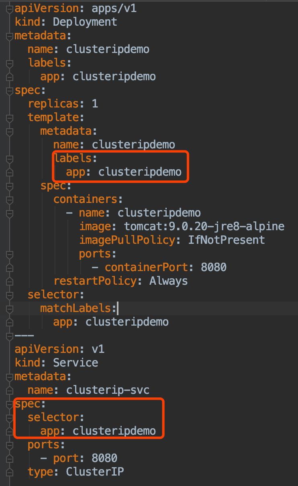
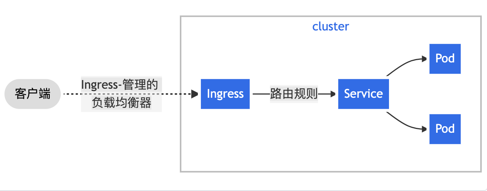
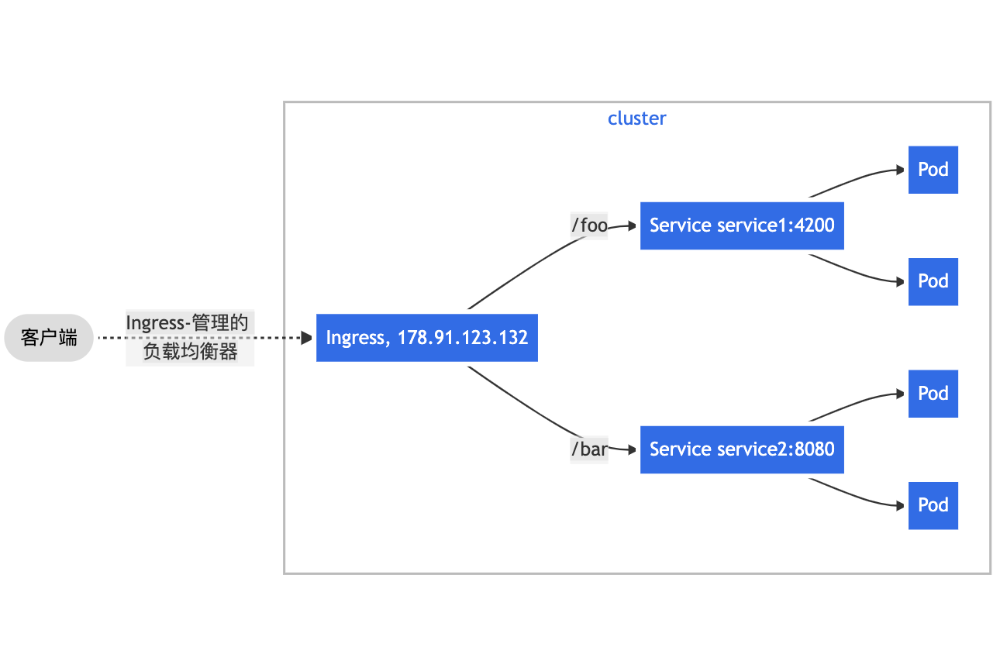

#临界知识
service四层网络,ingress七层网络
#service对pod管理
标签label,选择器,
```asp
selector:
    matchLabels:
      app: clusteripdemo
```

#网络方式
##ClusterIp
##NodePort
#Ingress


[](https://kubernetes.io/zh/docs/concepts/services-networking/ingress/)
```asp
ingress 可以理解为 Service 的 Service，即在现有 Service 的前面再搭建一层 Service，作为外部流量的统一入口，进行请求路由的转发。

说白了就是在前端搭建一个 nginx或者haproxy，将不同 host 或 url 转发到对应的后端 Service，再由 Service 转给 Pod。只不过 ingress 对 nginx/haproxy 进行了一些解耦和抽象
```
[](https://segmentfault.com/a/1190000024512206)
##ingress controller
基于nginx服务的ingress controller
##ingress 服务
[02_ingress-service-nodeport.yml]
#几种端口

#IPVS(LVS,4层)
