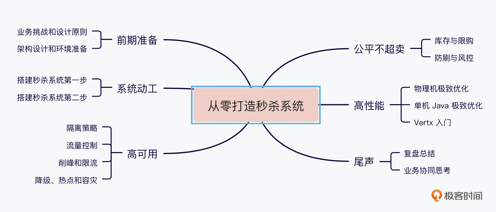
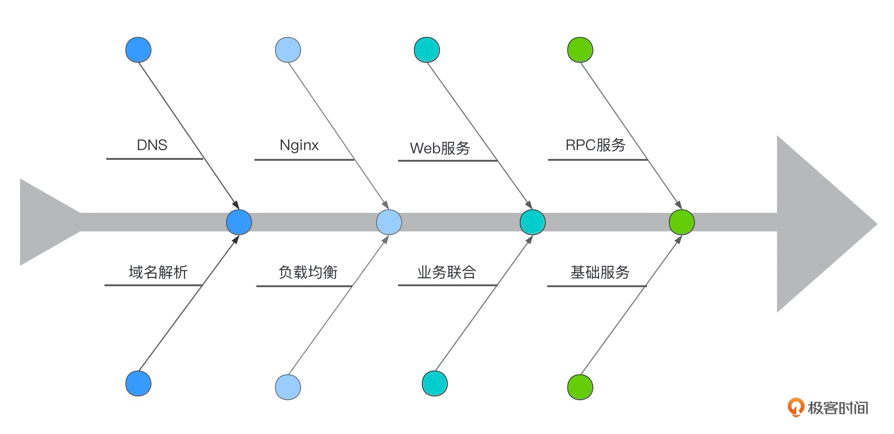

##临界知识
秒杀系统优化思路:减少请求路径长度(CDN缓存,redis缓存,local缓存),减缓请求密度(消息队列),减少请求数量(限流),减少请求数据大小(网络传输,字符编码,CPU处理),
增强服务性能(机器,服务处理,数据库,隔离服务&隔离机器&隔离数据库),简化服务逻辑(减少序列化合并服务,使用字节流避免字符集转换,简化日志,去除spring框架),请求监控

优化分类:业务精简(业务分级),技术高性能

硬件资源:网卡(减少数据),cpu(减少数据,减少逻辑),磁盘(缓存,避免mysql),内存(缓存)

秒杀系统涉及的对象:前端页面资源,服务处理(无状态),后端商品库存(数据库)
秒杀系统涉及过程:页面->下订单->后端服务->mysql

秒杀系统三指标:高可用,高性能,高一致

秒杀系统2/8:热点数据,热点操作(库存读写)
秒杀系统隔离:业务隔离,系统隔离,数据隔离

[秒杀中的redis](https://time.geekbang.org/column/article/307421)
[](https://zhuanlan.zhihu.com/p/92563050)
##秒杀中的技术栈

nginx lua,epoll,协程,tomcat vs nginx性能

业务隔离,是否扩容,降级,限流
系统隔离,商品详情页,ngnix,dubbo分组,
负载均衡隔离:lvs,haproxy,nginx,DNS  域名 <->ip

容器化部署

重点秒杀详情页、秒杀结算页
##问题
短时间（瞬时），大量请求，买一个（数量少）商品。
巨大的瞬时流量,热点数据问题,刷子流量
解决：高并发（读，写）

##目标
稳：高可用，系统稳定的提供服务
准：超卖。数据一致性问题,
快：高性能。（优化的点）
安全:恶意请求,刷单

##流程请求链路

##优化思路
###数据要尽量少
请求的数据包括上传给系统的数据
系统返回给用户的数据（通常就是网页）
数据在网络上传输需要时间，其次不管是请求数据还是返回数据都需要服务器做处理，
而服务器在写网络时通常都要做压缩和字符编码，这些都非常消耗 CPU，所以减少传输的数据量可以显著减少 CPU 的使用
###请求数要尽量少
###路径要尽量短
每经过一个节点，一般都会产生一个新的 Socket 连接,每增加一个连接都会增加新的不确定性
减少中间节点可以减少数据的序列化与反序列化），并减少延时（可以减少网络传输耗时）
多个相互强依赖的应用合并部署在一起，把远程过程调用（RPC）变成 JVM 内部之间的方法调用
###依赖要尽量少
###高可用
服务无状态,数据库备份
##秒杀系统对象扩展
前端静态资源(CDN,服务端)
动态资源(时间)
热点数据(缓存,隔离)
服务性能(硬件,JVM,代码)

数据库库存(数据库选型,数据库优化)
消息队列(排队,流量削峰)
监控

##秒杀系统过程扩展
前端异步加载动态资源
静态数据缓存CDN
热点数据缓存预热
##高可用
###流量削峰
答题
排队
限流
###高并发读AP
允许读场景下一定的脏数据，这样只会导致少量原本无库存的下单请求被误认为是有库存的，等到真正写数据时再保证最终一致性，由此做到高可用和一致性之间的平衡。
实际上，分层校验的核心思想是：不同层次尽可能过滤掉无效请求，只在“漏斗” 最末端进行有效处理，从而缩短系统瓶颈的影响路径。
###高并发写
更换DB选型,考虑使用redis
优化DB性能,mysql优化
##高性能
##一致性
###减库存
```asp
预扣库存。这种方式相对复杂一些，买家下单后，库存为其保留一定的时间（如 15 分钟），超过这段时间，库存自动释放，释放后其他买家可以购买
```
##监控
