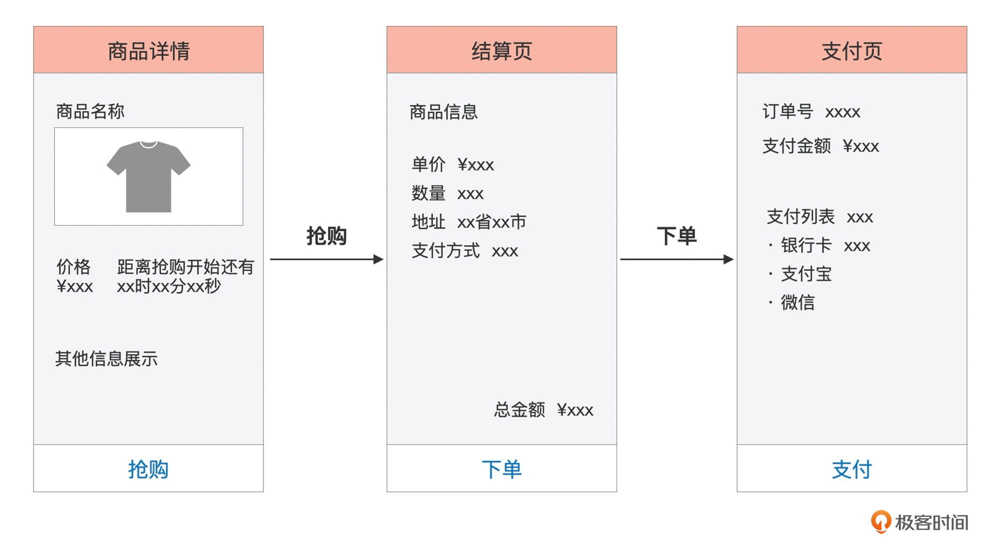

#需求流程
预约->抢购->下单->支付

##需求点

#系统流程
客户端->dns->CDN->nginx->lvs->web->网关->redis->mq->mysql
##DNS
[z_08_DNS_.md]
##CDN
[z_09_CDN_.md]
##nginx
[z_11_nginx_.md]
##LVS
[z_10_lvs_keepalived.md]
##tomcat
##redis
##mq
##熔断降级
##
