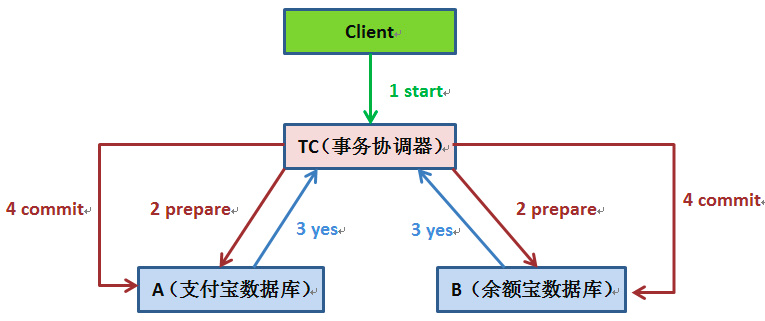

##临界知识
##一致性问题
在分布式系统中，每个节点虽然可以知晓自己的操作时成功或者失败，却无法知道其他节点的操作的成功或失败。当一个事务跨越多个节点时，为了保持事务的ACID特性，需要引入一个作为协调者的组件来统一掌控所有节点
##2PC
用于解决数据分片后，不同数据库之间的分布式事务问题

###银行内部不同数据库转账
数据库XA 2PC,两阶段提交
##消息队列+消息表+幂等

###支付宝与微信不同系统转账
##TCC,重试+幂等

##3PC
##paxos算法
Paxos是解决相同数据多副本下的数据一致性问题
###
###
###
