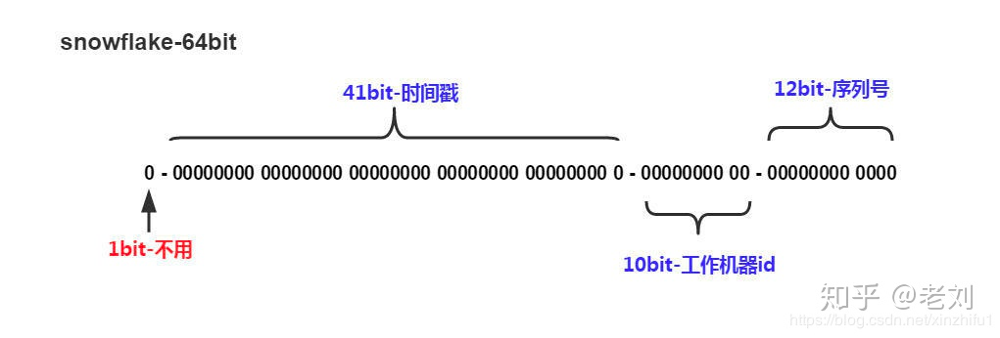
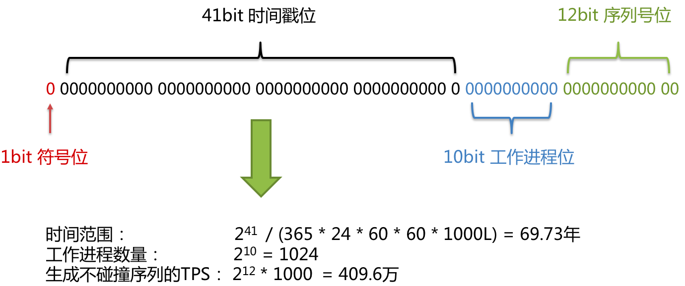

[](https://mp.weixin.qq.com/s/yIE5NOj7nqCu2AnWCte1Rg)
[](https://github.com/Snailclimb/JavaGuide/blob/main/docs/distributed-system/distributed-id.md)
#分布式ID的需求
```asp
1.全局唯一 ：ID 的全局唯一性肯定是首先要满足的
2.高性能 ： 分布式 ID 的生成速度要快，对本地资源消耗要小
3.高可用 ：生成分布式 ID 的服务要保证可用性无限接近于 100%
4.有序递增 ：如果要把 ID 存放在数据库的话，ID 的有序性可以提升数据库写入速度。并且，很多时候 ，我们还很有可能会直接通过 ID 来进行排序
5.安全性
```
#UUID
##全局唯一
固定长度128比特，也就是16字节(1 byte = 8 bit),32个16进制表示形式下的字符组成
123e4567-e89b-12d3-a456-426614174000
时间戳+mac地址

[](https://www.cnblogs.com/throwable/p/14343086.html)

长度过长16 字节128位，36位长度的字符串，存储以及查询对MySQL的性能消耗较大
##高性能
每秒可以生成超过1000万个UUID
##高可用
本地
##有序递增
非自增
##安全性
良好
#基于数据库自增ID
```asp
CREATE DATABASE `SEQ_ID`;
CREATE TABLE SEQID.SEQUENCE_ID (
    id bigint(20) unsigned NOT NULL auto_increment, 
    value char(10) NOT NULL default '',
    PRIMARY KEY (id),
) ENGINE=MyISAM;
insert into SEQUENCE_ID(value)  VALUES ('values');
```
##全局唯一
##高性能
性能差,性能受到mysql性能,无法扛住高并发场景
##高可用
##有序递增
##安全性
#基于数据库的号段模式
```asp
CREATE TABLE `sequence_id_generator` (
  `id` int(10) NOT NULL,
  `current_max_id` bigint(20) NOT NULL COMMENT '当前最大id',
  `step` int(10) NOT NULL COMMENT '号段的长度',
  `version` int(20) NOT NULL COMMENT '版本号',
  `biz_type`    int(20) NOT NULL COMMENT '业务类型',
   PRIMARY KEY (`id`)
) ENGINE=InnoDB DEFAULT CHARSET=utf8mb4;

UPDATE sequence_id_generator SET current_max_id = 0+100, version=version+1 WHERE version = 0  AND `biz_type` = 101
SELECT `current_max_id`, `step`,`version` FROM `sequence_id_generator` where `biz_type` = 101
```
##全局唯一
##高性能
数据库压力小
##高可用
##有序递增
ID 有序递增
##安全性
#基于Redis模式
##单机
##集群
#雪花算法
一个Long类型占8个字节，每个字节占8比特，也就是说一个Long类型占64个比特


正数位（占1比特）+ 时间戳（占41比特）+ 机器ID（占5比特）+ 数据中心（占5比特）+ 自增值（占12比特）
```asp
第一个bit位（1bit）：Java中long的最高位是符号位代表正负，正数是0，负数是1，一般生成ID都为正数，所以默认为0。
时间戳部分（41bit）：毫秒级的时间，不建议存当前时间戳，而是用（当前时间戳 - 固定开始时间戳）的差值，可以使产生的ID从更小的值开始；41位的时间戳可以使用69年，(1L << 41) / (1000L * 60 * 60 * 24 * 365) = 69年
工作机器id（10bit）：也被叫做workId，这个可以灵活配置，机房或者机器号组合都可以。
序列号部分（12bit），自增值支持同一毫秒内同一个节点可以生成4096个ID
```
缺点:强依赖机器时钟，如果机器上时钟回拨，会导致发号重复或者服务会处于不可用状态
##全局唯一
##高性能
1毫秒4096个
##高可用
本地
##有序递增
局部有序递增
##安全性

#leaf
[](https://tech.meituan.com/2017/04/21/mt-leaf.html)
##双号段模式
##snowflake(时钟问题)
[](https://tech.meituan.com/2017/04/21/mt-leaf.html)
#最佳实践
id-generator
##冲突
