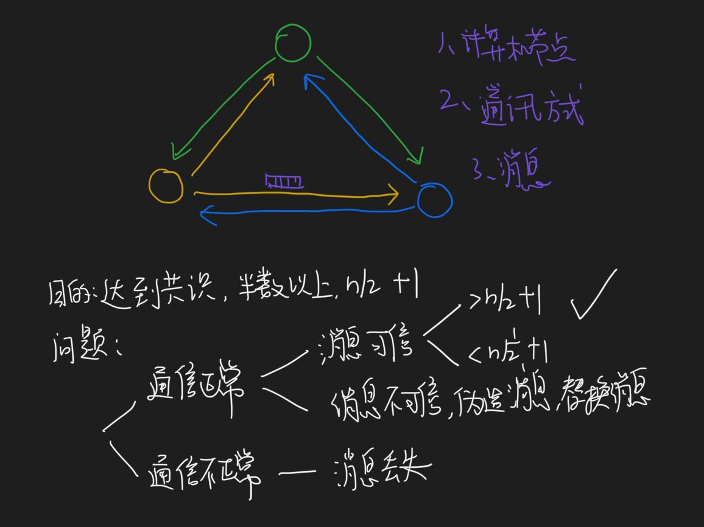

##拜占庭将军问题
拜占庭将军问题描述的是最困难的，也是最复杂的一种分布式故障场 景，除了存在故障行为，还存在恶意行为的一个场景

###口信消息型拜占庭问题
###签名消息型拜占庭问题之解
###拜占庭容错算法(Byzantine Fault Tolerance，BFT)
除了存在故障行为，还存在恶意行为的一个场景,比如在数字货币的区块链技术中
常用的拜占庭容错算法还有:PBFT 算 法，PoW 算法
###非拜占庭容错算法(Crash Fault Tolerance，CFT)
CFT 解决的是分布式的系统中存在故障，但不存在恶意节点的场景下 的共识问题
这个场景可能会丢失消息，或者有消息重复，但不存在错误消 息，或者伪造消息的情况
常见的算法有 Paxos 算法、Raft 算法、ZAB 协议
