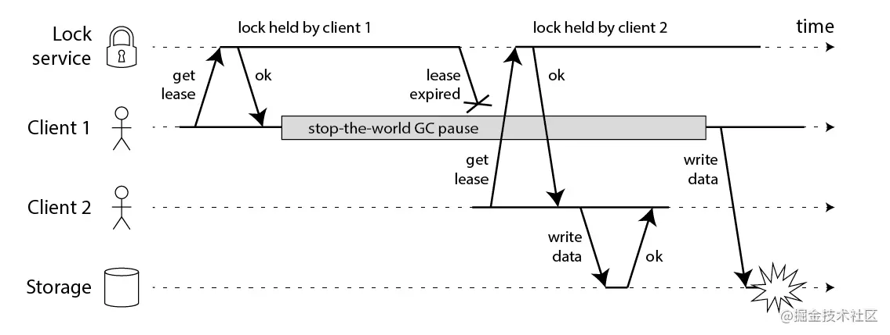
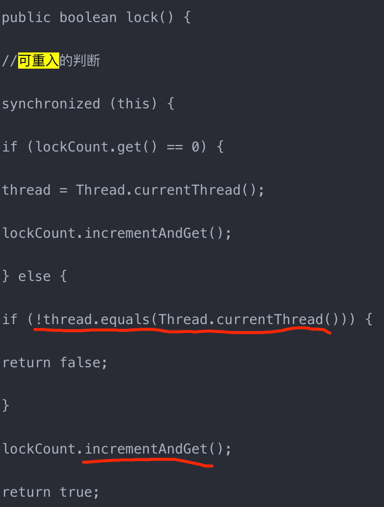

#分布式锁的核心功能
```asp
1.一个方法（资源）在同一时间只能被一个机器的一个线程执行
2.高可用/高性能的获取锁与释放锁
3.具备可重入特性
4.具备锁失效机制（自动过期），防止死锁
5.具备非阻塞锁特性
```
[](https://time.geekbang.org/column/article/485006)
[](https://time.geekbang.org/column/article/125983)
#数据库
[](https://blog.csdn.net/u013256816/article/details/92854794)
##insert(thread_id + del_time)
```asp
CREATE TABLE `methodlock` (
  `id` int(10) unsigned NOT NULL AUTO_INCREMENT,
  `method_name` varchar(100) NOT NULL DEFAULT '' COMMENT '加锁的方法名',
  `note` varchar(255) NOT NULL DEFAULT '' COMMENT '备注',
  `add_time` timestamp NOT NULL DEFAULT CURRENT_TIMESTAMP ON UPDATE CURRENT_TIMESTAMP COMMENT '锁创建时间',
  PRIMARY KEY (`id`),
  UNIQUE KEY `uniq_method` (`method_name`) USING BTREE COMMENT 'method_name的唯一索引'
) ENGINE=InnoDB DEFAULT CHARSET=utf8mb4 COMMENT='加锁的方法';

```
资源:method字段
高性能获取锁:插入失败时进行轮询,高性能如何满足?轮询时间设置
高可用获取锁:lvs+keepalived+双主MHA数据库集群
可重入:增加thread id字段,插入前select是否有where method=** and thread id=**字段
锁失效:增加del_time,定时任务清理
非阻塞:满足
##悲观锁select for update
资源:method字段
高性能获取锁:阻塞获取锁
高可用:lvs+keepalived+双主MHA数据库集群
可重入:select for update支持可重入
锁失效:连接释放锁会自动释放
非阻塞:阻塞
##乐观锁
```asp
CREATE TABLE `optimistic_lock` (
	`id` BIGINT NOT NULL AUTO_INCREMENT,
	`method` int NOT NULL COMMENT '锁定的资源',
	`version` int NOT NULL COMMENT '版本信息',
	`created_at` datetime COMMENT '创建时间',
	`updated_at` datetime COMMENT '更新时间',
	`deleted_at` datetime COMMENT '删除时间', 
	PRIMARY KEY (`id`),
	UNIQUE KEY `uiq_idx_method` (`method`) 
) ENGINE=InnoDB DEFAULT CHARSET=utf8mb4 COMMENT='数据库分布式锁表';

SELECT version FROM optimistic_lock WHERE method = **
UPDATE optimistic_lock SET version = version + 1 WHERE method = ** AND version = oldVersion
```
资源:resource字段
高性能获取锁:非阻塞获取锁,while循环
高可用:lvs+keepalived+双主MHA数据库集群
可重入:
锁失效:无失效问题
非阻塞:非阻塞
乐观锁比较适合并发量不高，并且写操作不频繁的场景
#redis分布式锁
[redisson](https://www.cnblogs.com/jackson0714/p/redisson.html)
[](https://github.com/redis/redis-doc/blob/master/topics/distlock.md)
[](https://time.geekbang.org/column/article/301092)
[](http://zhangtielei.com/posts/blog-redlock-reasoning.html)
```asp
1.一个方法（资源）在同一时间只能被一个机器的一个线程执行
2.高可用/高性能的获取锁与释放锁
3.具备可重入特性
4.具备锁失效机制（自动过期），防止死锁
5.具备非阻塞锁特性
```
##同一时间只能被一个机器的一个线程执行
setnx,del
##高可用获取锁与释放锁(分布式锁redlock)
###高可用(分布式锁redlock)
redis服务挂了
```asp
在 Sentinel 集群中，主节点挂掉时，从节点会取而代之，客户端上却并没有明显感 知。原先第一个客户端在主节点中申请成功了一把锁，
但是这把锁还没有来得及同步到从节 点，主节点突然挂掉了。然后从节点变成了主节点，这个新的节点内部没有这个锁，所以当 另一个客户端过来请求加锁时，
立即就批准了。这样就会导致系统中同样一把锁被两个客户 端同时持有，不安全性由此产生

使用redlock
会向过半节点发送 set(key, value, nx=True, ex=xxx) 指令，只要过半节点 set 成功，那就认为加锁成功。释放锁时，需要向所有节点发送 del 指令。
不过 Redlock 算法还 需要考虑出错重试、时钟漂移等很多细节问题，同时因为 Redlock 需要向多个节点进行读 写，意味着相比单实例 Redis 性能会下降一些
```

###红锁安全性
watch dog

```asp
client1获取了锁并且设置了锁的超时时间，但是client1之后出现了STW，这个STW时间比较长，导致分布式锁进行了释放，client2获取到了锁，这个时候client1恢复了锁，那么就会出现client1，2同时获取到锁，这个时候分布式锁不安全问题就出现了。这个其实不仅仅局限于RedLock,对于我们的ZK,Mysql一样的有同样的问题

```
###zookeeper安全性
###获取锁(过期时间+随机数)
setnx(key, value, expireTime)
###锁释放(过期时间+随机数)
```asp
Redis 的分布式锁不能解决超时问题，如果在加锁和释放锁之间的逻辑执行的太长，以至 于超出了锁的超时限制，就会出现问题。
因为这时候锁过期了，第二个线程重新持有了这把锁， 但是紧接着第一个线程执行完了业务逻辑，就把锁给释放了，第三个线程就会在第二个线程逻 辑执行完之间拿到了锁

tag = random.nextint() # 随机数 if redis.set(key, tag, nx=True, ex=5)://setnx,SET if Not eXists
do_something()
redis.delifequals(key, tag) # 假象的 delifequals 指令
有一个更加安全的方案是为 set 指令的 value 参数设置为一个随机数，释放锁时先匹配 随机数是否一致，然后再删除 key。但是匹配 value 和删除 key 不是一个原子操作，
Redis 也 没有提供类似于 delifequals 这样的指令，这就需要使用 Lua 脚本来处理了，因为 Lua 脚本可 以保证连续多个指令的原子性执行。

# delifequals
if redis.call("get",KEYS[1]) == ARGV[1] then
return redis.call("del",KEYS[1])
else
return 0
end
```
##高性能
具备,redis内存锁
##可重入
Redis 分 布式锁如果要支持可重入，需要对客户端的 set 方法进行包装，使用线程的 Threadlocal 变量 存储当前持有锁的计数
##锁失效机制(死锁)
过期时间5s

[](https://redis.io/commands/set)

###租期续约(redisson watch)
[redisson watch](https://developer.51cto.com/article/679902.html)
[](https://juejin.cn/post/6936956908007850014#heading-8)
##非阻塞锁
是

#Zookeeper分布式锁
[](https://www.cnblogs.com/crazymakercircle/p/14504520.html)
Curator分布式锁
```asp
1.一个方法（资源）在同一时间只能被一个机器的一个线程执行
2.高可用/高性能的获取锁与释放锁
3.具备可重入特性
4.具备锁失效机制（自动过期），防止死锁
5.具备非阻塞锁特性
```
##在同一时间只能被一个机器的一个线程执行
创建临时节点
##高可用获取锁与释放锁
###临时顺序节点
使用session会话
[](http://git.mashibing.com/bjmashibing/InternetArchitect/blob/master/10%20Zookeeper/src/main/java/com/msb/zookeeper/locks/WatchCallBack.java)
[](https://blog.csdn.net/crazymakercircle/article/details/85956246)
###惊群
###高可用
选举快,leader+follow节点少,observer节点抗读压力,且不参与选举减少参与选举的节点
##可重入


##锁失效机制
会话机制
##非阻塞锁特性
自定义

#etcd 分布式锁
[](https://time.geekbang.org/column/article/350285)
#布式锁的安全问题
[](https://juejin.cn/post/6844903688088059912)
##长时间的GC
##时钟发生跳跃
##长时间的网络I/O
