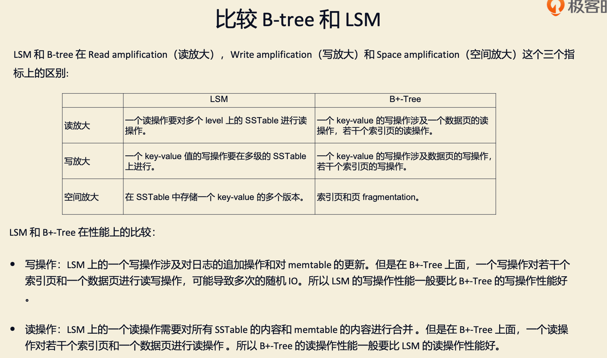

##读 写 存储 trade off
1. 读放大:读取数据时实际读取的数据量大于真正的数据量
   - 例如在LSM树中需要先在MemTable查看当前key是否存在，不存在继续从SSTable中寻找。
2. 写放大:写入数据时实际写入的数据量大于真正的数据量
   - 例如在LSM树中写入时可能触发Compact操作，导致实际写入的数据量远大于该key的数据量。
3. 空间放大:数据实际占用的磁盘空间比数据的真正大小更多
   - 上面提到的冗余存储，对于一个key来说，只有最新的那条记录是有效的，而之前的记录都是可以被清理回收的。
```asp
• 读放大(read amplification):一个查询涉及的外部存储读操作次数。如果我们查询一个数据需要
做 3 次外部存储读取，那么读放大就是 3。
• 写放大(write amplification):写入外部存储设备的数据量和写入数据库的数据量的比率。如果
我们对数据库写入了 10MB 数据，但是对外部存储设备写入了 20BM 数据，写放大就是 2。
• 空间放大(space amplification):数据库占用的外部存储量和数据库本身的数据量的比率。 如果一个 10MB 的数据库占用了 100MB，那么空间放大就是 10。
```

