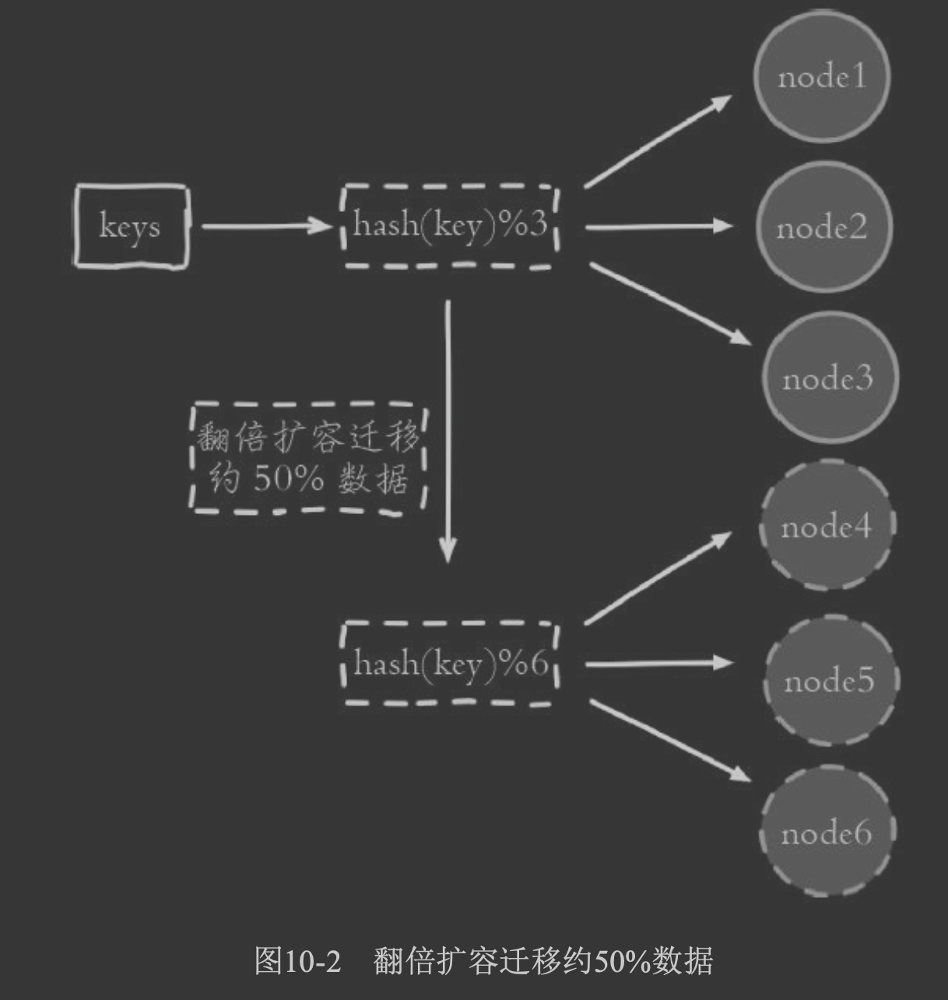
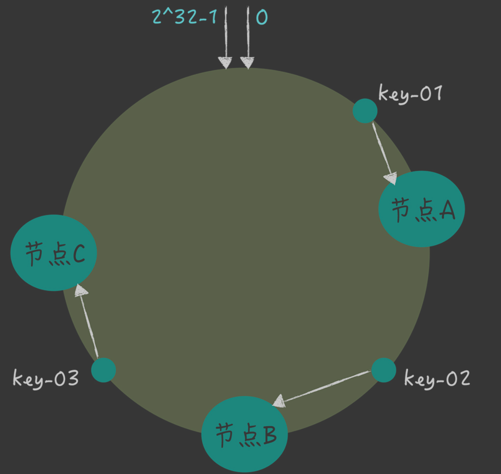
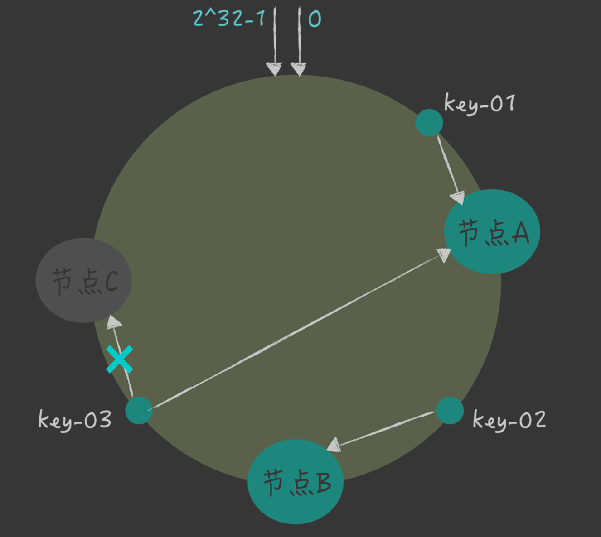
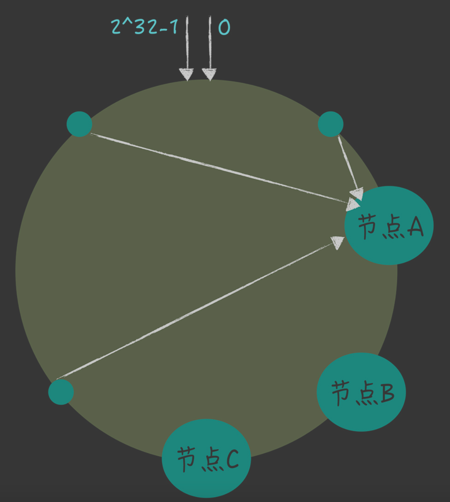
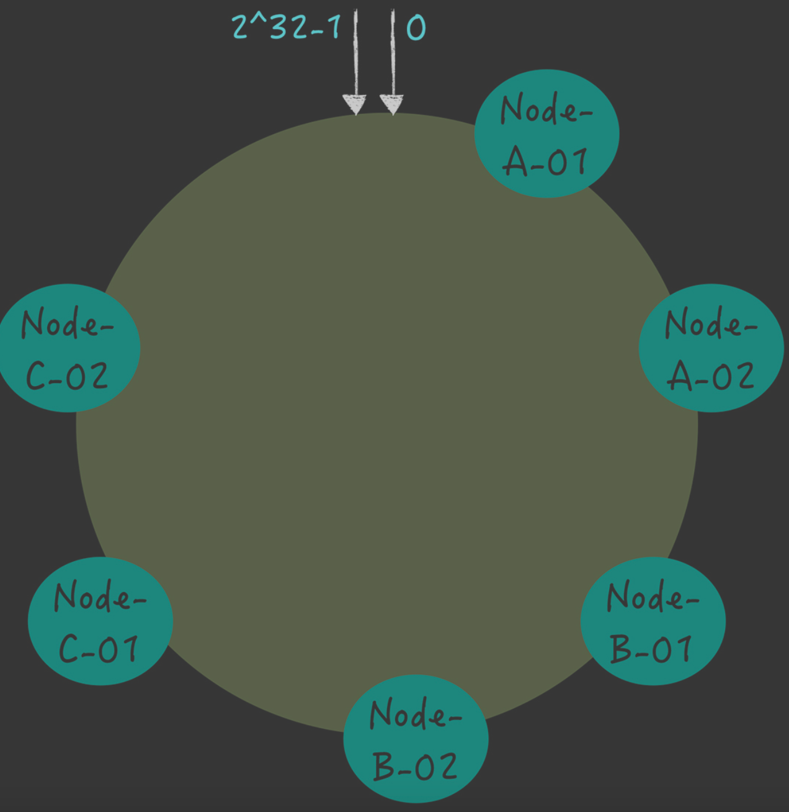
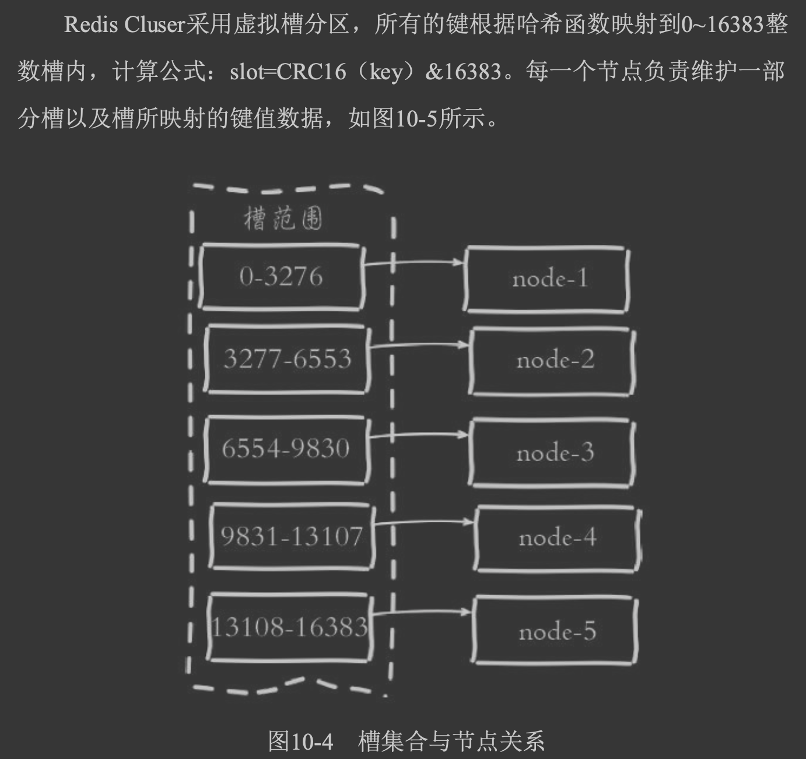
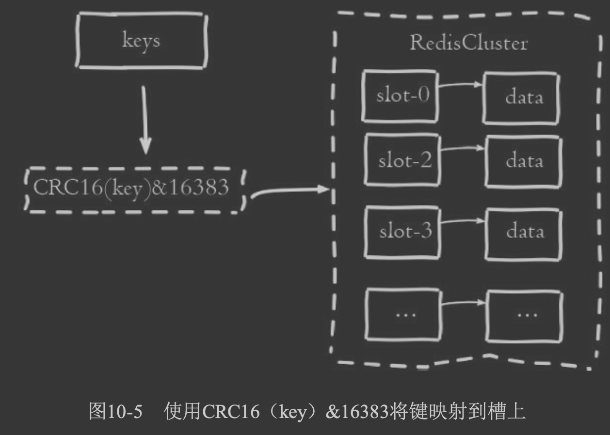
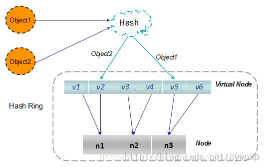
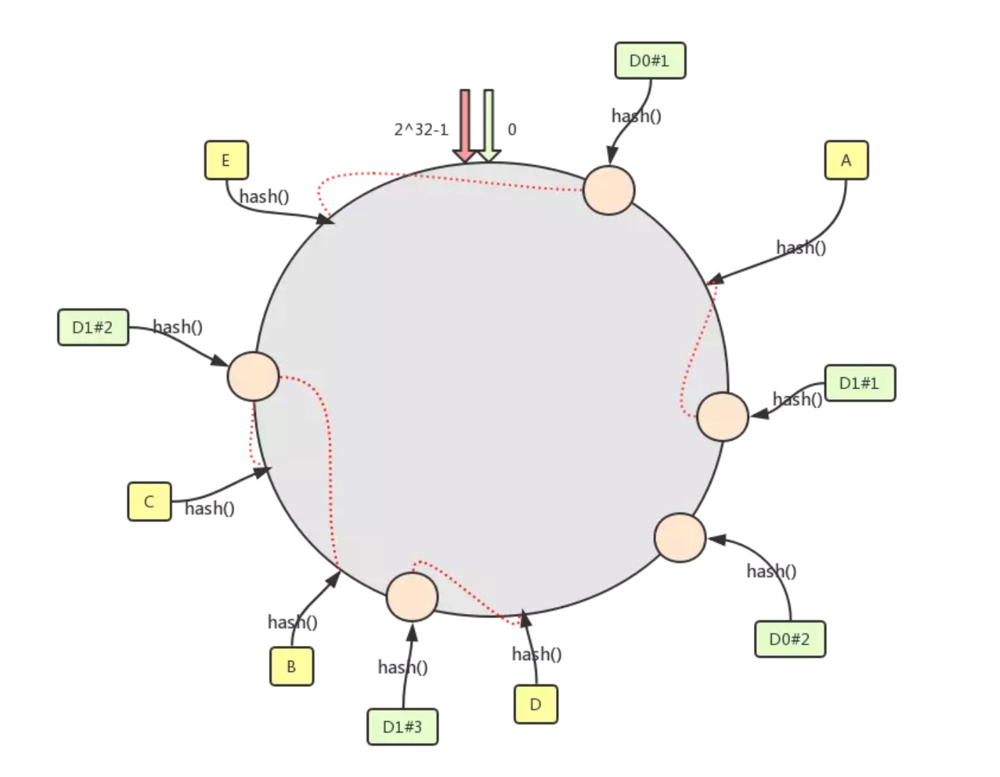

##临界知识
分片集群扩展时的热点问题
数据倾斜问题
虚拟分区节点
##参考
##hash算法
```
使用特定的数据，如Redis的键或用户ID，再根据节点数量N使用公式: hash(key)%N计算出哈希值，用来决定数据映射到哪一个节点上。
这种方 案存在一个问题:当节点数量变化时，如扩容或收缩节点，数据节点映射关 系需要重新计算，会导致数据的重新迁移。
这种方式的突出优点是简单性，常用于数据库的分库分表规则，一般采 用预分区的方式，提前根据数据量规划好分区数，
比如划分为512或1024张 表，保证可支撑未来一段时间的数据量，再根据负载情况将表迁移到其他数 据库中。
扩容时通常采用翻倍扩容，避免数据映射全部被打乱导致全量迁移 的情况
```

##分片集群热点问题
#一致hash算法(redis)
假设 key-01、key-02、 key-03 三个 key，经过哈希算法 c-hash() 计算后，在哈希环上的位置就像图 6 的样子

```asp
首先，将 key 作为参数执行 c-hash() 计算哈希值，并确定此 key 在环上的位置; 
然后，从这个位置沿着哈希环顺时针“行走”，遇到的第一节点就是 key 对应的节点
```
```asp
你可以看到，key-01 和 key-02 不会受到影响，只有 key-03 的寻址被重定位到 A。一般 来说，在一致哈希算法中，如果某个节点宕机不可用了，
那么受影响的数据仅仅是，会寻址 到此节点和前一节点之间的数据。比如当节点 C 宕机了，受影响的数据是会寻址到节点 B 和节点 C 之间的数据(例如 key-03)，寻址到其他哈希环空间的数据(例如 key-01)， 不会受到影响。
```


对于 1000 万 key 的 3 节点 KV 存储，如 果我们增加 1 个节点，变为 4 节点集群，只需要迁移 24.3% 的数据:
总的来说，使用了一致哈希算法后，扩容或缩容的时候，都只需要重定位环空间中的一小部 分数据。也就是说，一致哈希算法具有较好的容错性和可扩展性。
##数据倾斜问题
客户端访问请求集中在少数的节点上， 出现了有些机器高负载，有些机器低负载的情况，那么在一致哈希中，有什么办法能让数据 访问分布的比较均匀呢?答案就是虚拟节点。
在一致哈希中，如果节点太少，容易因为节点分布不均匀造成数据访问的冷热不均，也就是
说大多数访问请求都会集中少量几个节点上


其实，就是对每一个服务器节点计算多个哈希值，在每个计算结果位置上，都放置一个虚拟 节点，并将虚拟节点映射到实际节点。比如，可以在主机名的后面增加编号，
分别计算 “Node-A-01”“Node-A-02”“Node-B-01”“Node-B-02”“Node-C- 01”“Node-C-02”的哈希值，于是形成 6 个虚拟节点:

如果使用了哈希 算法，需要迁移高达 90.91% 的数据，使用一致哈希的话，只需要迁移 6.48% 的数据。
我希望你能注意到这个规律，使用一致哈希实现哈希寻址时，可以通过增加节点数降低节点
宕机对整个集群的影响，以及故障恢复时需要迁移的数据量。后续在需要时，你可以通过增
加节点数来提升系统的容灾能力和故障恢复效率。
，一致哈希本质上是一种路由寻址算法，适合简单的路由寻址场景。比如在 KV 存储系统内部，它的特点是简单，不需要维护路由信息

##redis虚拟分区槽位slot



##虚拟分区槽位为啥能减少数据迁移?

可以手动自定义/重定义槽位和实际机器节点的映射关系
1,2,3->机器A
4,5->机器B
通过采取虚拟节点的方法，一个真实结点不再固定在Hash换上的某个点，而是大量地分布在整个Hash环上，这样即使上线、下线服务器，也不会造成整体的负载不均衡。
```asp
Redis 集群包含了 16384 (214)个哈希槽，也就是整个哈希函数H的值空间为 0~214 -1（即哈希值是一个14位无符号整形），每个 Key 经过计算后会落在一个具体的槽位上，
而槽位具体在哪个机器上是用户自己根据自己机器的情况配置的，机器硬盘小的可以分配少一点槽位，硬盘大的可以分配多一点。如果节点硬盘都差不多则可以平均分配。
所以哈希槽这种概念很好地解决了一致性哈希的弊端。

另外在容错性和扩展性上与一致性哈希一样，都是对受影响的数据进行转移而不影响其它的数据。而哈希槽本质上是对槽位的转移，把故障节点负责的槽位转移到其他正常的节点上。
扩展节点也是一样，把其他节点上的槽位转移到新的节点上
```
[](https://blog.csdn.net/csdn_life18/article/details/109262992)
[](https://blog.csdn.net/u010558660/article/details/52767218)
##多集群故障
那么在多个 Raft 集群组成的 KV 系统中，如何设计一致哈希，实现当某个集群的领导者节点出现故障，并选举出新的领导者后，整个系统还能稳定运行呢？


##hash分区 vs 顺序分区


#mysql数据库分库分表(sharding key)
##时间分表
##hash key
##
##分表弊端
维护问题，join问题，聚合问题，事务
