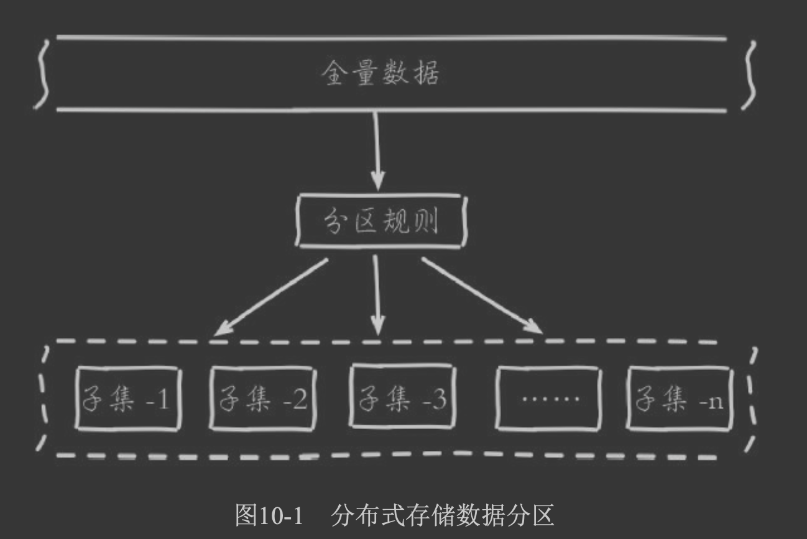
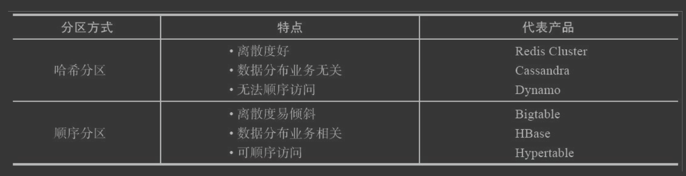

##临界知识
不同数据库模型适合不同应用场景
数据倾斜
#存储介质
##关系型数据库
##文件系统

#数据模型
##键值对数据库
##关系型数据库
##数据查询操作
KV数据库不支持复杂聚合运算
##数据更改操作
Redis 支持的 value 类型包括了 String、哈希表、列表、集合等。Redis 能够在实际业务场景中得到广泛的应用，就是得益于支持多样化类型的 value
隐含着不同数据结构在性能、空间效率等方面的差异
##数据存储方式
外存/内存

#hash分区 vs 顺序分区

