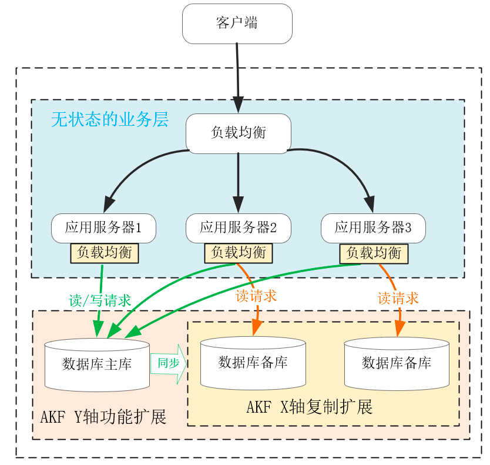
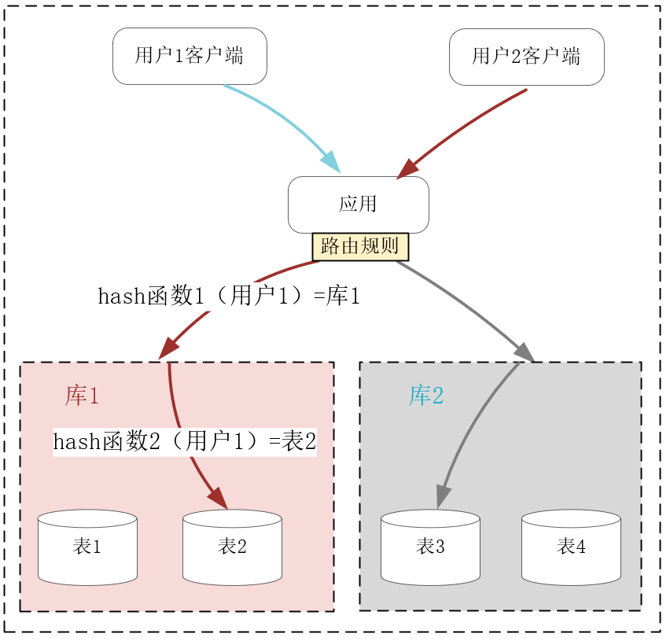
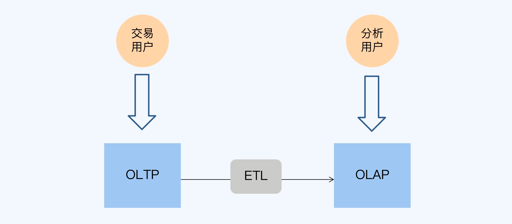
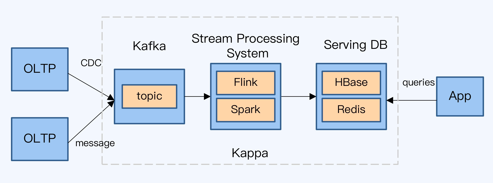

##临界知识
不同数据库模型适合不同应用场景
数据倾斜
磁盘读写:顺序读写，随机读写
##参考
[](https://db-engines.com/en/system/InfluxDB)
#存储介质
##关系型数据库
##文件系统


#数据模型
##关系型数据库
##键值对数据库
redis
没有预定义的值结构，所以只能针对 Key 执行查询，这大大限制了使用场景
##文档型数据库
MongoDB
```
文档型数据库将 Value 扩展为 XML、JSON（比如 MongoDB）等数据结构，于是允许使用者在文档型数据库的内部解析复合型的 Value 结构，
再通过其中的单一值进行查询，这就兼具了部分关系数据库的功能

```
##列式数据库
ElasticSearch，hbase
```asp
列式数据库基于 Key 来映射行，再通过列名进行二级映射，同时它基于列来安排存储的拓扑结构，这样当仅读写大量行中某个列时，
操作的数据节点、磁盘非常集中，磁盘 IO、网络 IO 都会少很多。列式数据库的应用场景非常有针对性，比如博客文章标签的行数很多，
但在做数据分析时往往只读取标签列，这就很适合使用列式数据库
```
#数据存储异构
外存/内存


#行存储vs列存储

#sql vs nosql
[](https://time.geekbang.org/column/article/267741)
##sql
事务,增删改查,单行数据查询,如果多个业务数据间互相关联，我们需要从多个不同的角度分析、计算，并保持住相关数据的一致性，那么关系数据库最为适合

单点主库无法解决数据持续增长引入的性能问题

沿 AKF Z 轴扩展数据库虽然能够降低数据规模，但分库分表后，单一值关系引申出的 ACID 事务不能基于高时延、会抖动的网络传输强行实现，否则会导致性能大幅下降
##nosql
NoSQL 数据库只是放弃了与分布式环境相悖的 ACID 事务，提供了另一种聚合数据模型，从而拥有可伸缩性的非关系数据库
数据基于 Key 分片可伸缩性非常好
顺序读写，可以提供优秀的容灾能力
一旦数据行数到了亿级别以上，就需要放弃单一值结构，将单行数据聚合为复合结构，放在可以自由伸缩的 NoSQL 数据库中。此时，我们无法寄希望于 NoSQL 数据库提供 ACID 事务，
只能基于二段式提交等算法在应用层代码中自行实现事务。

#OLAP VS OLTP VS ETL VS HTAP
[](https://time.geekbang.org/column/article/287246)
##OLTP(mysql)
```asp
OLTP 是少量数据更重视低延迟
OLTP是传统的关系型数据库的主要应用，主要是基本的、日常的事务处理，例如银行交易，实时性要求高
数据量不是很大，生产库上的数据量一般不会太大，而且会及时做相应的数据处理与转移
写多读少，而且读操作的复杂度较低，一般不涉及大数据集的汇总计算；
低延时，用户对于延时的容忍度较低，通常在 500 毫秒以内，稍微放大一些也就是秒级，超过 5 秒的延时通常是无法接受的；
高并发，并发量随着业务量而增长，没有理论上限
OLTP主要是对数据的增删改，OLAP是对数据的查询
oltp主要就是点查，一般就返回一行或几行，不像olap，通常是对某些列做聚合操作，使用列存更合适
```
##ETL
ETL(Extract-Transform-Load)是数据抽取(Extract)、清洗(Cleaning)、转换(Transform)、装载(Load)的过程,

##OLAP(复杂报表,flink,hive)
```asp
OLAP 是海量数据要追求高吞吐
OLAP是数据仓库系统的主要应用，支持复杂的分析操作，侧重决策支持，并且提供直观易懂的查询结果,典型的应用就是复杂的动态的报表系统
OLAP系统的重点是通过数据提供决策支持，所以查询一般都是动态，自定义的。所以在OLAP中，维度的概念特别重要。一般会将用户所有关心的维度数据，存入对应数据平台
实时性要求不是很高，比如最常见的应用就是天级更新数据，然后出对应的数据报表
OLAP 和 OLTP 通过 ETL 进行衔接。为了提升 OLAP 的性能，需要在 ETL 过程中进行大量的预计算，包括数据结构的调整和业务逻辑处理。
这样的好处是可以控制 OLAP 的访问延迟，提升用户体验。但是，因为要避免抽取数据对 OLTP 系统造成影响，所以必须在日终的交易低谷期才能启动 ETL 过程。
这样一来， OLAP 与 OLTP 的数据延迟通常就在一天左右，习惯上大家把这种时效性表述为 T+1。其中，T 日就是指 OLTP 系统产生数据的日期，T+1 日
是 OLAP 中数据可用的日期，两者间隔为 1 天

T+1 太慢了。是的，进入大数据时代后，商业决策更加注重数据的支撑，而且数据分析也不断向一线操作渗透，这都要求 OLAP 系统更快速地反映业务的变化
```
##Kappa架构

Kafka 和 Flink
##HTAP架构
TiDB 和 TBase,OceanBase
