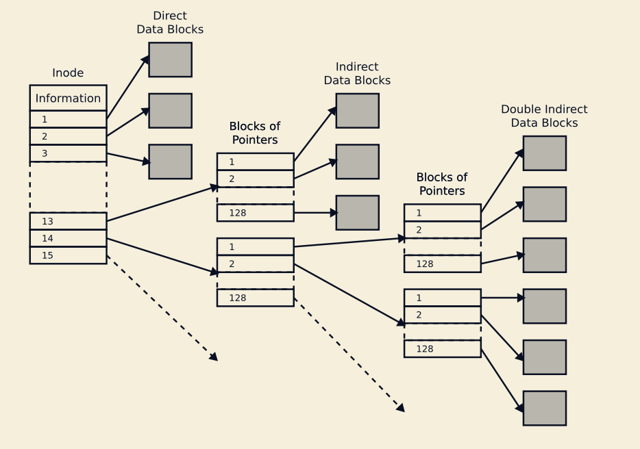
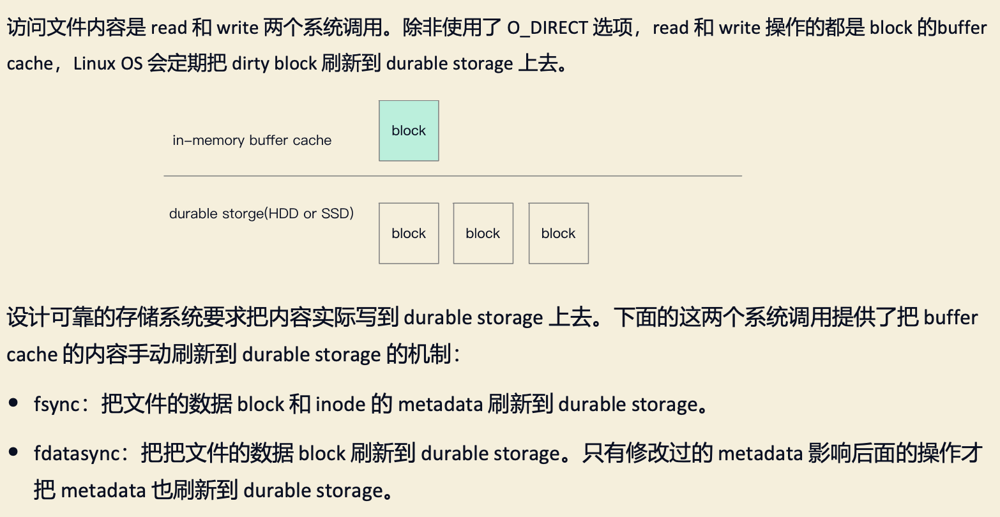
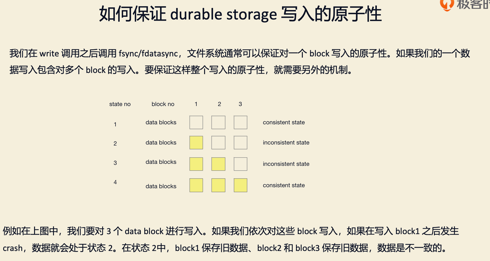
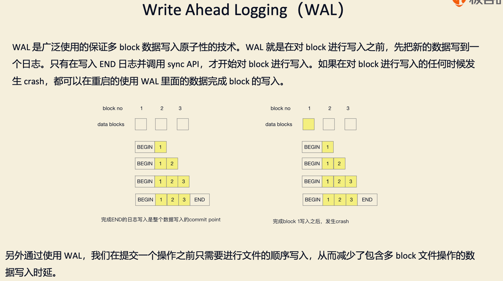
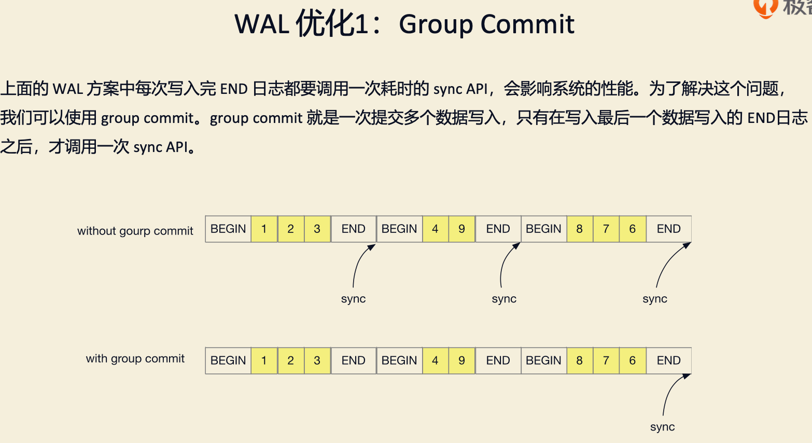
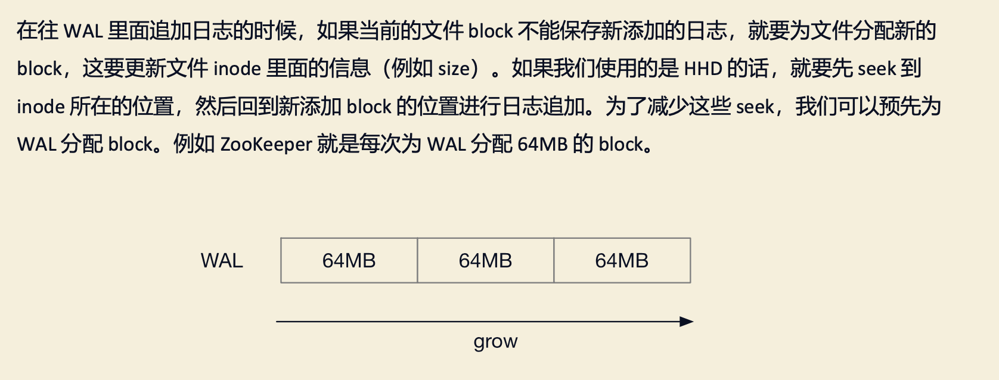
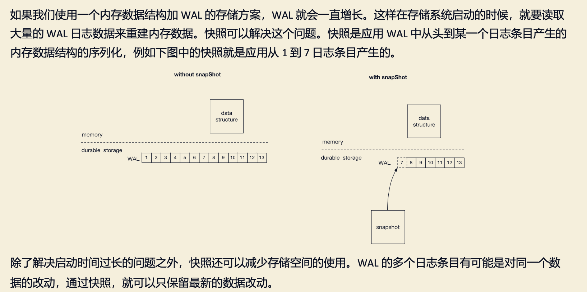
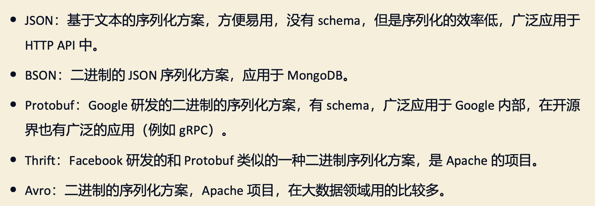

[ZooKeeper 实战与源码剖析34]
#ext4文件系统
```asp
ext4 是 Linux 系统上广泛使用的文件系统。下图列的是 ext4 文件系统 inode 的结构。其中 information 包 括文件的 size，last access time 
和 last modification time 等。文件的 inode 和 data block 存储在存储设备的 不同位置。
```

#操作系统page cache

#WAL(Write Ahead Logging)


#Group Commit

#File Padding

#快照

#序列化

