##临界知识
P的定义
C的定义
A的定义
CAP理论
BASE理论

节点有多个,需要网络通信
数据需要副本,副本同步有延时
CAP定理主要描述的是特定对象的状态,对象可能是支付金额/用户名

两阶段提交,用于事务场景,也用于分布式共识场景

一个系统多个部分组成,每个部分的一致性和可用性可采取不同策略

失败重试
##单机/单节点/单实例问题
1.单点故障,宕机服务不可用
2.纵向扩展有限,硬件(磁盘,内存技术)有限,必须横向扩展
3.可用性有限,支持的并发量有限,redis单实例太大,fork过程都会很耗时,redis会丢失高性能特点
##AKF
对于单机,单实例可以从XYZ三个维度进行拆解优化
[](https://time.geekbang.org/column/article/252741)
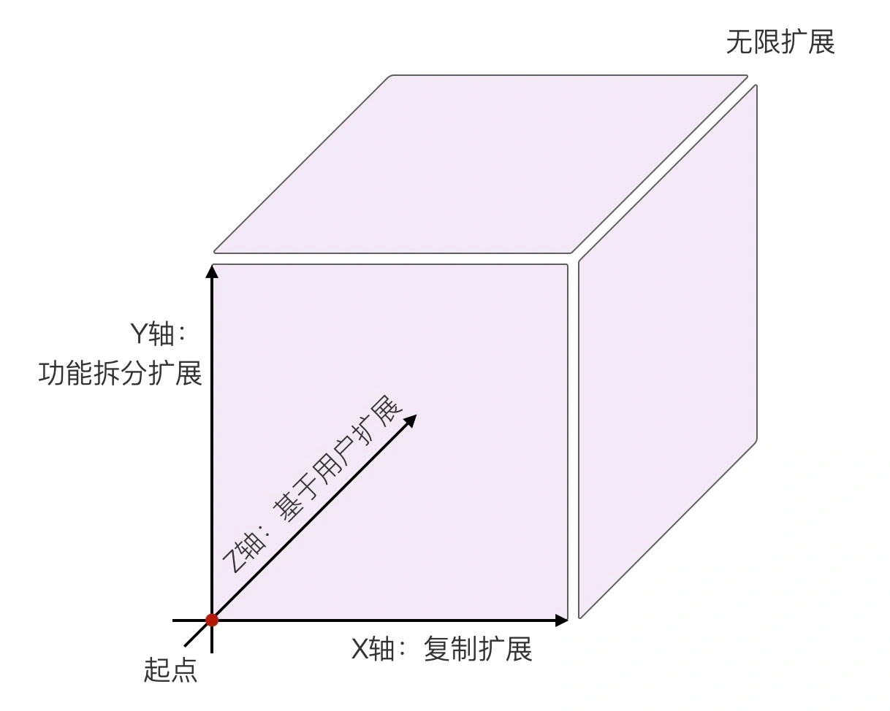
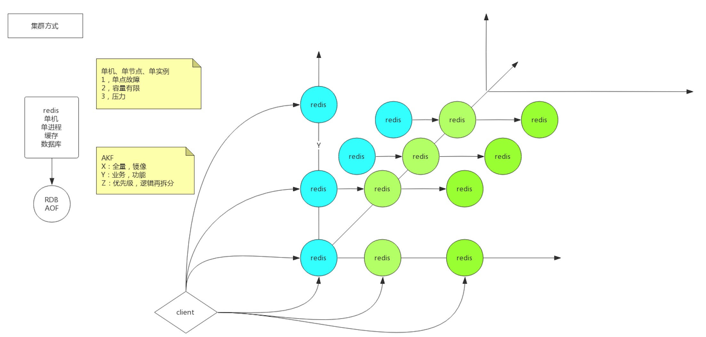
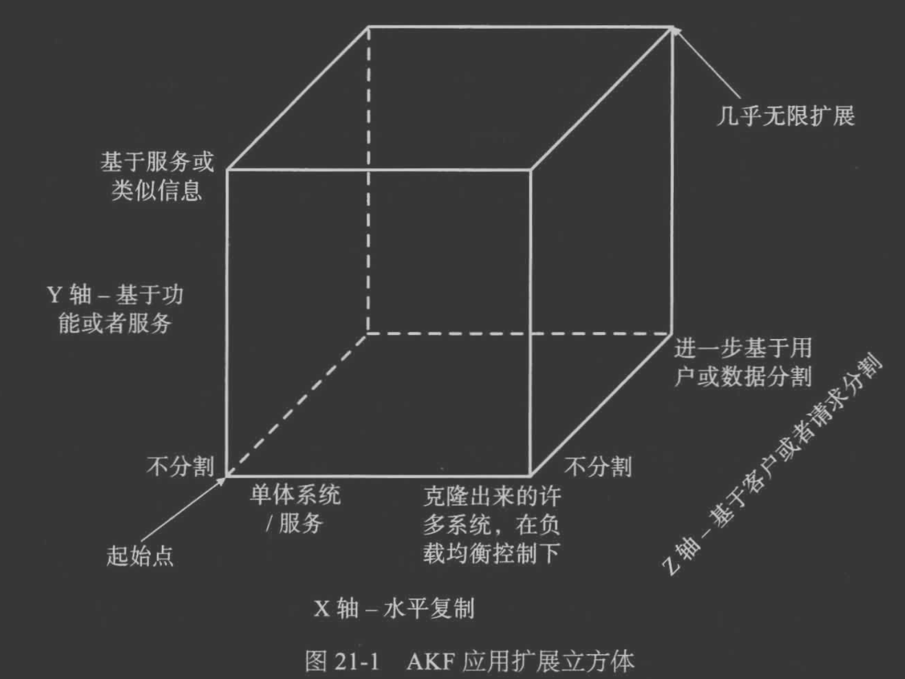
[架构即未来 现代企业可扩展的Web架构流程和组织原书第2版.pdf]
```asp
X:直接水平复制应用进程来扩展系统,全量,从库,分压高读
Y:将功能拆分出来扩展系统,功能,业务拆分,垂直拆分
Z:基于用户信息扩展系统,水平拆分,分片,切片,一个功能分成几个分区,kafka分区,rocketmq分片,redis分片
```
###X
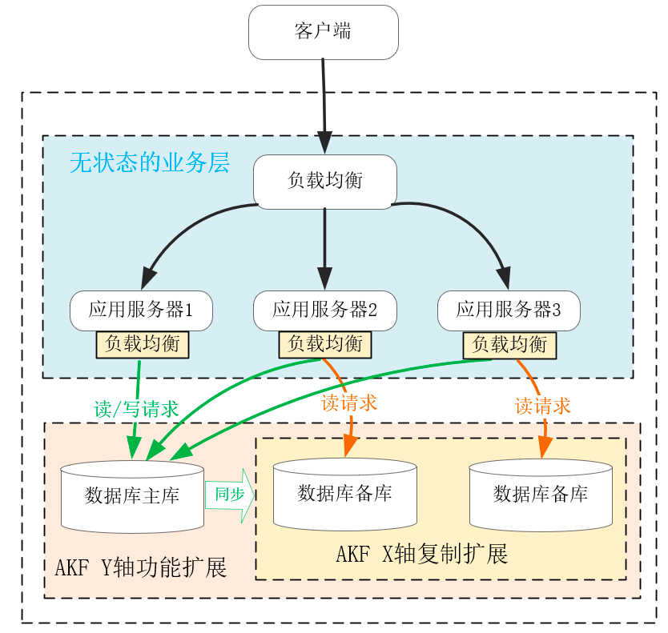
全量冗余备份
###Y
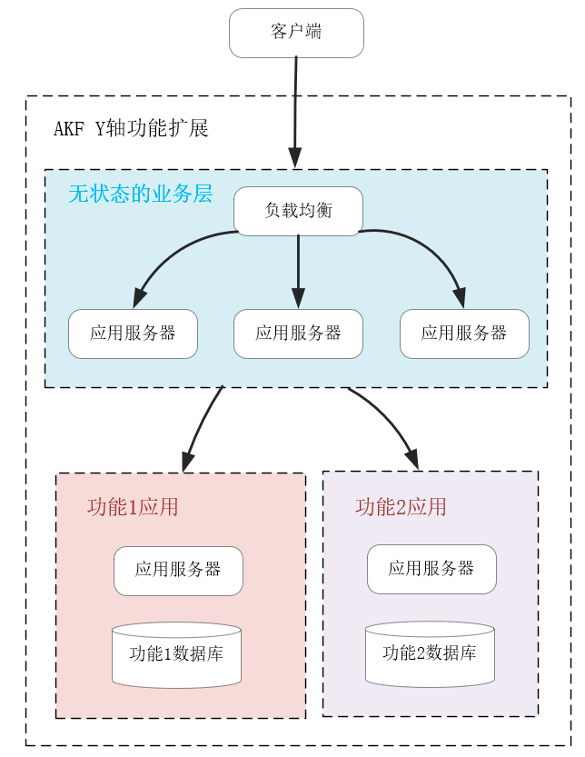
业务拆分,垂直拆分,Mysql功能分库
###Z
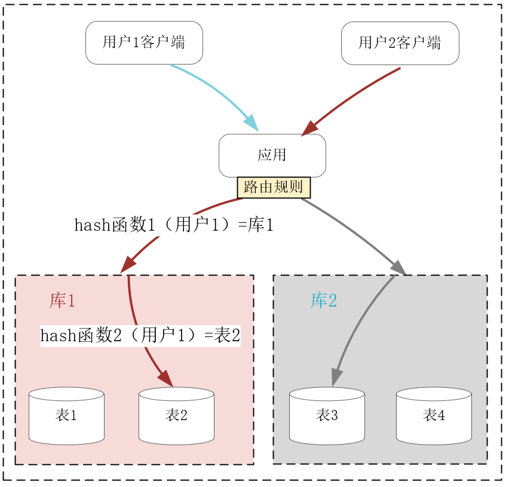
分库分表,CDN基于ip地理位置,redis分片
###AKF的问题
AKF为了解决单机/单节点问题,引入了集群,集群带来了数据一致性问题
###数据一致性问题解决方案
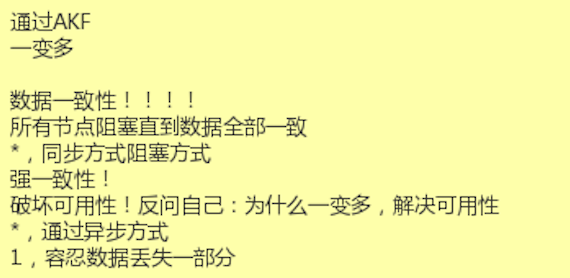
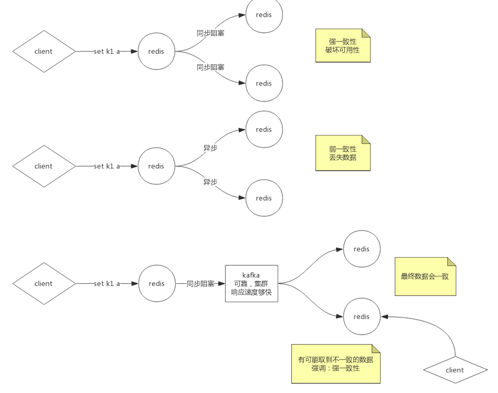
##分布式存储系统CAP理论
###C集群数据一致性
[](https://www.zhihu.com/question/54105974)
对其中一个节点进行增删改后,该节点的数据需要同步到其他节点,其他节点同步有延时,或者同步失败,
此过程中多个请求访问这两个节点,会产生数据不一致。
一致性强调 的不是数据完整，而是各节点间的数据一致。在客户端看来，集群和单机在数据一致性上是一样的。
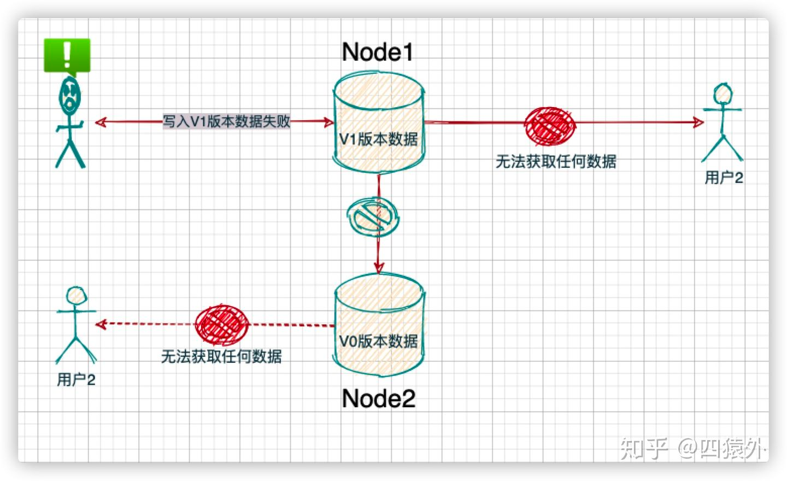
此时如何处理这种状态?禁止请求还是运行请求?
###A集群可用性
1.返回结果必须在合理的时间以内
2.部分节点宕机也能正常返回结果,且不关心节点间的结果是否满足一致性

```
不过集群毕竟不是单机，当发生分区故障的时候，有时不能仅仅因为节点间出现了通讯问
题，节点中的数据会不一致，就拒绝写入新数据，之后在客户端查询数据时，就一直返回给
客户端出错信息。

业务集群中的一些关键系统，比如名字路由系统，如果仅仅因为发生了分布故障，节点中的
数据会不一致，集群就拒绝写入新的路由信息，之后，当客户端查询相关路由信息时，系统
就一直返回给客户端出错信息，那么相关的服务都将因为获取不到指定路由信息而不可用、
瘫痪，这可以说是灾难性的故障了

可用性说的是任何来自客户端的请求，不管访问哪个节点，都能得到响应数据，但不保证是 同一份最新数据。
你也可以把可用性看作是分布式系统对访问本系统的客户端的另外一种承 诺:我尽力给你返回数据，不会不响应你，
但是我不保证每个节点给你的数据都是最新的。 这个指标强调的是服务可用，但不保证数据的一致。
```

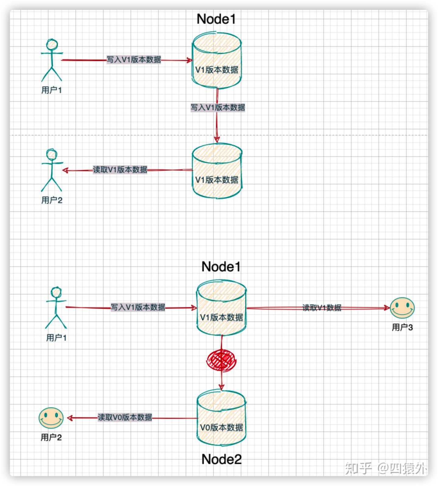
###P集群分区容忍度
节点不连通,分布式的存储系统会有很多的节点，这些节点都是通过网络进行通信。而网络是不可靠的，当节点和节点之间的通信出现了问题，此时，就称当前的分布式存储系统出现了分区
```asp
最后的分区容错性说的是，当节点间出现任意数量的消息丢失或高延迟的时候，系统仍然可 以继续提供服务。也就是说，分布式系统在告诉访问本系统的客户端:不管我的内部出现什 么样的数据同步问题，
我会一直运行，提供服务。这个指标，强调的是集群对分区故障的容 错能力
```
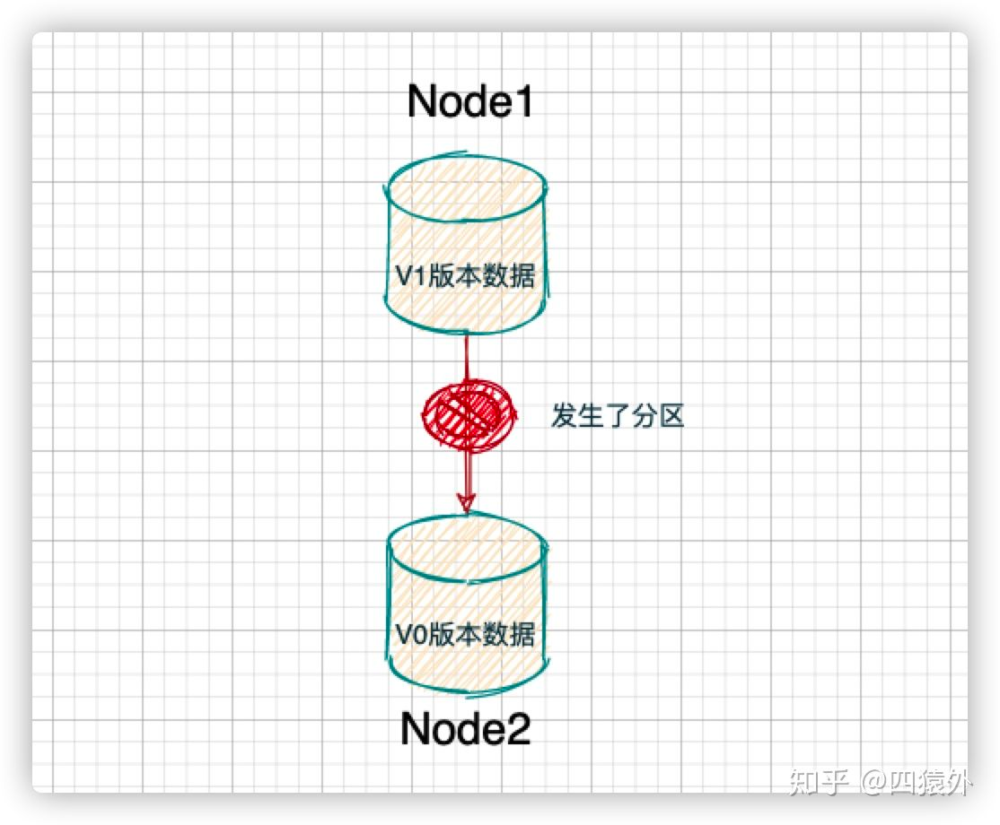
如果出现了分区问题，我们的分布式存储系统还需要继续运行。不能因为出现了分区问题，整个分布式节点全部就熄火了
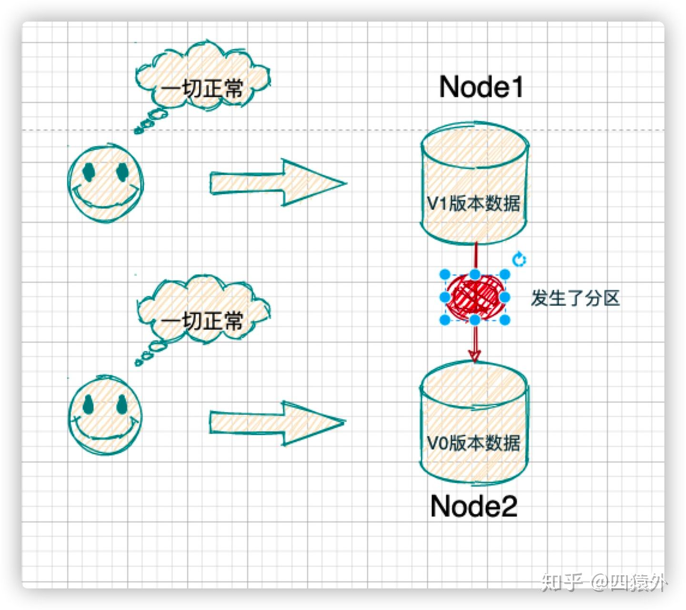
###P
P 是必然的发生的，不选 P，一旦发生分区错误，整个分布式系统就完全无法使用了，这是不符合实际需要的。所以，对于分布式系统，我们只能能考虑当发生分区错误时，如何选择一致性和可用性
节点之间的网络通讯出现了消息丢失、高延迟的问题
```asp
CAP本质上，是P，发生了，只能在C和A之间二选一，按照CAP定理的预设和限制，这是能证明的，也很容易理解。那么，在实际系统中（比如基于2PC、Raft实现），
如果我们选择了C，当无法返回最新数据时，会返回错误，这是一种运行行为；如果选择了A，会返回旧数据，这也是一种运行行为。
```
###CP
当一套系统在发生分区故障后，客户端的任何请求都被卡死或者超时，但是，系统的每个节点总是会返回一致的数据，则这套系统就是 CP 系统，经典的比如 Zookeeper
###AP
如果一套系统发生分区故障后，客户端依然可以访问系统，但是获取的数据有的是新的数据，有的还是老数据，那么这套系统就是 AP 系统，经典的比如 Eureka
###CAP问题
不是所谓的“3 选 2”,仅当出现分区问题时，才强一致性和可用性只能 2 选 1  
如果网络分区正常的话（系统在绝大部分时候所处的状态），也就说不需要保证 P 的时候，C 和 A 能够同时保证  
[](https://www.zhihu.com/question/54105974)
###分片处理与分布式事务与C数据一致性
###单机事务与数据副本与可用性
###CP 模型的 KV 存储和 AP 模型的 KV 存储，分别适合怎样的业务场景呢？
CP模型的KV存储，适合用于提供基础服务，保存少量数据，作用类似zookeeper。
AP模型的KV存储，适合查询量大的场景，不要求数据的强一致性，目前广泛应用于分布式缓存系统
能否容忍的可能的短暂的一致性延迟  
cp模型适合要求acid场景，比如银行转账。ap模型适合只要求base的场景，比如网页cdn场景

以阿里nacos来说，配置中心是cp，保证各节点配置强一致；注册中心是ap，保证了可用性，牺牲了强一致性。
```asp
1. 如果业务需要强一致性，则只能牺牲可用性而选择CP模型
2. 如果业务需要最终一致性即可，则优先满足可用性，选择AP模型
```
##CAP与ACID
ACID 理论是对事务特性的抽象和总结，方便我们实现事务
加锁、时间序列等机制，只能保证单个节点上操作的 ACID 特性，无法保证节点间操作的 ACID 特性
ACID 特性理解为 CAP 中一致性的边界，最强的一致性，也 就是 CAP 的酸(Acid

具有 ACID 特性的事务，则要求全部节点确认可以
建议在开发实现分布式系统，如果不是必须，尽量不要实现事务，可以 考虑采用强一致性或最终一致性
###事务/最强一致性
###强一致性
###最终一致性

##一致性与共识
两阶段协议解决的是分布式事务问题，而raft 这些解决的是分布式数据共识问题，即数据在主从副本的条件下保持数据对外始终一样
Consensus和Consistency
###事务
一致性，指经历算法后，各节点都提交了某些事务或都回滚了某些事务（节点的状态可能会多种多样不一定达成共识
###共识
共识，指让经历算法后，各节点达成一共同的值或者状态
##BASE理论
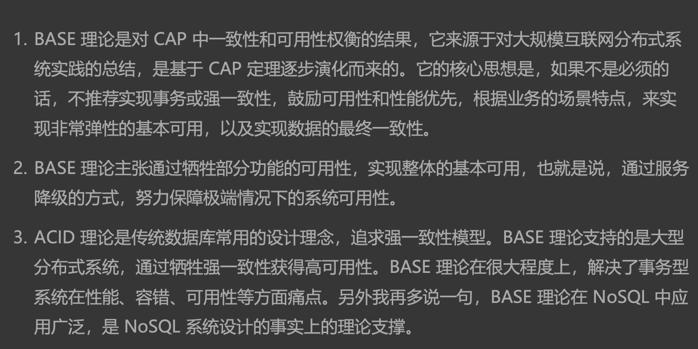
###临界知识
分布式系统是一个多对象,多状态,过程性系统,而不是瞬时单对象,因此一致性和可用性不是非此即彼,是不同对象的一致性和可用性范围可调整.
确保2/8中核心功能可用,非核心功能降级处理,使用最终一致性处理
###BASE与CAP关系
Basically Available（基本可用） 、Soft-state（软状态） 和 Eventually Consistent（最终一致性） 
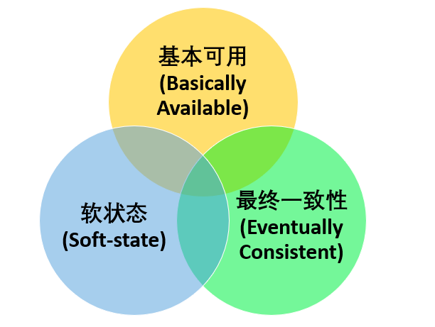
是对 CAP 中 AP 方案的一个补充  
因此，AP 方案只是在系统发生分区的时候放弃一致性，而不是永远放弃一致性。在分区故障恢复后，系统应该达到最终一致性。这一点其实就是 BASE 理论延伸的地方
###基本可用
出现不可预知故障的时候，允许损失部分可用性
```asp
响应时间上的损失: 正常情况下，处理用户请求需要 0.5s 返回结果，但是由于系统出现故障，处理用户请求的时间变为 3 s。
系统功能上的损失：正常情况下，用户可以使用系统的全部功能，但是由于系统访问量突然剧增，系统的部分非核心功能无法使用
```
```asp
DATA 节点的核心功能是读和写，所以基本可用是指读和写的基本可用。那么我们可以通 过分片和多副本，实现读和写的基本可用。也就是说，
将同一业务的数据先分片，然后再以 多份副本的形式分布在不同的节点上
```
####流量削峰
####延时响应
####体验降级
####过载保护
####熔断
####限流
####兜底
####重试
####幂等
####异步
####负载均衡
####流量切换
####自动扩缩容
####分片
####备份
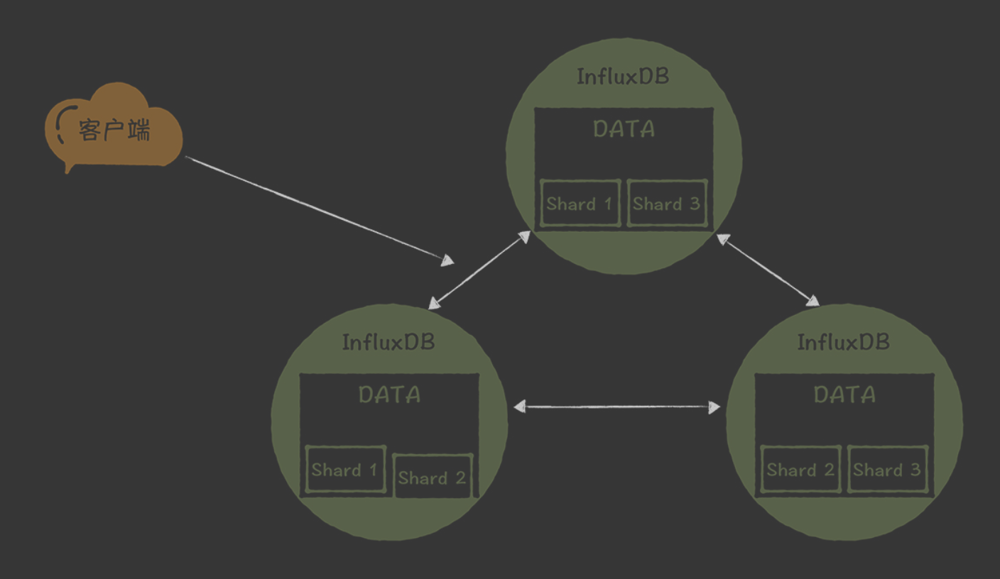
###最终一致性
系统中所有的数据副本，在经过一段时间的同步后，最终能够达到一个一致的状态
```asp
强一致性 ：系统写入了什么，读出来的就是什么。

弱一致性 ：不一定可以读取到最新写入的值，也不保证多少时间之后读取到的数据是最新的，只是会尽量保证某个时刻达到数据一致的状态。

最终一致性 ：弱一致性的升级版，系统会保证在一定时间内达到数据一致的状态。
```
####最终一致性方案
```asp
读时修复 : 在读取数据时，检测数据的不一致，进行修复。比如 Cassandra 的 Read Repair 实现，具体来说，在向 Cassandra 系统查询数据的时候，如果检测到不同节点 的副本数据不一致，系统就自动修复数据。
写时修复 : 在写入数据，检测数据的不一致时，进行修复。比如 Cassandra 的 Hinted Handoff 实现。具体来说，Cassandra 集群的节点之间远程写数据的时候，如果写失败 就将数据缓存下来，然后定时重传，修复数据的不一致性。
异步修复 : 这个是最常用的方式，通过定时对账检测副本数据的一致性，并修复。
```
```asp
写时修复不需要做数据一致性对比，性能消耗比较低，对系统运
行影响也不大，所以我推荐你在实现最终一致性时优先实现这种方式。而读时修复和异步修
复因为需要做数据的一致性对比，性能消耗比较多，在开发实际系统时，你要尽量优化一致
性对比的算法，降低性能消耗，避免对系统运行造成影响

我们可以通过写时修复和异步修复实 现最终一致性。另外，还实现自定义写一致性级别，支持 All、Quorum、One、Any 4 种 写一致性级别，
用户在写数据的时候，可以根据业务数据的特点，设置不同的写一致性级 别。

ALL:所有
quorum
one:
any:

```
