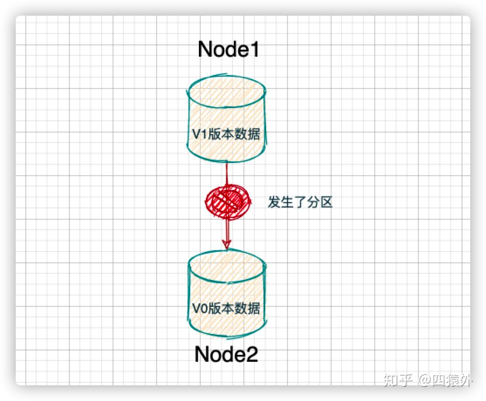
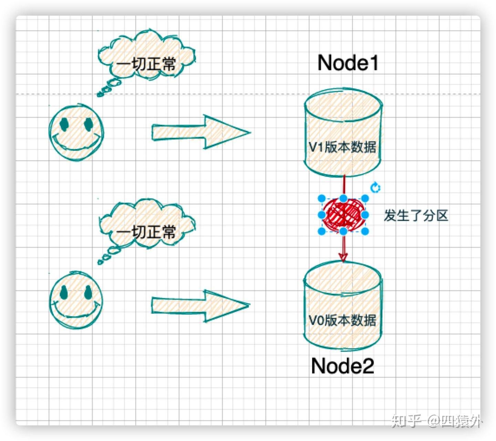
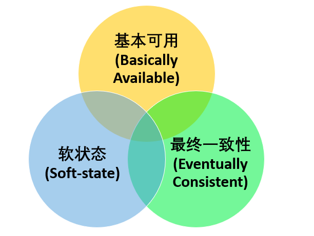

##临界知识
选举问题
同步问题
多节点
多副本
CAP理论
BASE理论
##分布式类型
##分布式存储系统CAP理论
###临界知识
节点有多个,需要网络通信
数据需要副本,副本同步有延时
CAP定理主要描述的是特定对象的状态,对象可能是支付金额/用户名

###C数据一致性
[](https://www.zhihu.com/question/54105974)
对其中一个节点进行增删改后,该节点的数据需要同步到其他节点,其他节点同步有延时,或者同步失败,
此过程中多个请求访问这两个节点,会产生数据不一致

此时如何处理这种状态?禁止请求还是运行请求?
###A可用性
1.返回结果必须在合理的时间以内
2.部分节点宕机也能正常返回结果,且不关心节点间的结果是否满足一致性

###P分区容忍度
节点不连通,分布式的存储系统会有很多的节点，这些节点都是通过网络进行通信。而网络是不可靠的，当节点和节点之间的通信出现了问题，此时，就称当前的分布式存储系统出现了分区

如果出现了分区问题，我们的分布式存储系统还需要继续运行。不能因为出现了分区问题，整个分布式节点全部就熄火了

###P
P 是必然的发生的，不选 P，一旦发生分区错误，整个分布式系统就完全无法使用了，这是不符合实际需要的。所以，对于分布式系统，我们只能能考虑当发生分区错误时，如何选择一致性和可用性
###CP
当一套系统在发生分区故障后，客户端的任何请求都被卡死或者超时，但是，系统的每个节点总是会返回一致的数据，则这套系统就是 CP 系统，经典的比如 Zookeeper
###AP
如果一套系统发生分区故障后，客户端依然可以访问系统，但是获取的数据有的是新的数据，有的还是老数据，那么这套系统就是 AP 系统，经典的比如 Eureka
###CAP问题
不是所谓的“3 选 2”,仅当出现分区问题时，才强一致性和可用性只能 2 选 1  
如果网络分区正常的话（系统在绝大部分时候所处的状态），也就说不需要保证 P 的时候，C 和 A 能够同时保证  
[](https://www.zhihu.com/question/54105974)
###分片处理与分布式事务与C数据一致性
###单机事务与数据副本与可用性

##BASE理论
###临界知识
分布式系统是一个多对象,多状态,过程性系统,而不是瞬时单对象,因此一致性和可用性不是非此即彼,是不同对象的一致性和可用性范围可调整.
###BASE与CAP关系
Basically Available（基本可用） 、Soft-state（软状态） 和 Eventually Consistent（最终一致性） 

是对 CAP 中 AP 方案的一个补充  
因此，AP 方案只是在系统发生分区的时候放弃一致性，而不是永远放弃一致性。在分区故障恢复后，系统应该达到最终一致性。这一点其实就是 BASE 理论延伸的地方
###基本可用
出现不可预知故障的时候，允许损失部分可用性
```asp
响应时间上的损失: 正常情况下，处理用户请求需要 0.5s 返回结果，但是由于系统出现故障，处理用户请求的时间变为 3 s。
系统功能上的损失：正常情况下，用户可以使用系统的全部功能，但是由于系统访问量突然剧增，系统的部分非核心功能无法使用
```
###最终一致性
系统中所有的数据副本，在经过一段时间的同步后，最终能够达到一个一致的状态
```asp
强一致性 ：系统写入了什么，读出来的就是什么。

弱一致性 ：不一定可以读取到最新写入的值，也不保证多少时间之后读取到的数据是最新的，只是会尽量保证某个时刻达到数据一致的状态。

最终一致性 ：弱一致性的升级版，系统会保证在一定时间内达到数据一致的状态。
```
####最终一致性方案
```asp
读时修复 : 在读取数据时，检测数据的不一致，进行修复。比如 Cassandra 的 Read Repair 实现，具体来说，在向 Cassandra 系统查询数据的时候，如果检测到不同节点 的副本数据不一致，系统就自动修复数据。
写时修复 : 在写入数据，检测数据的不一致时，进行修复。比如 Cassandra 的 Hinted Handoff 实现。具体来说，Cassandra 集群的节点之间远程写数据的时候，如果写失败 就将数据缓存下来，然后定时重传，修复数据的不一致性。
异步修复 : 这个是最常用的方式，通过定时对账检测副本数据的一致性，并修复。
```
