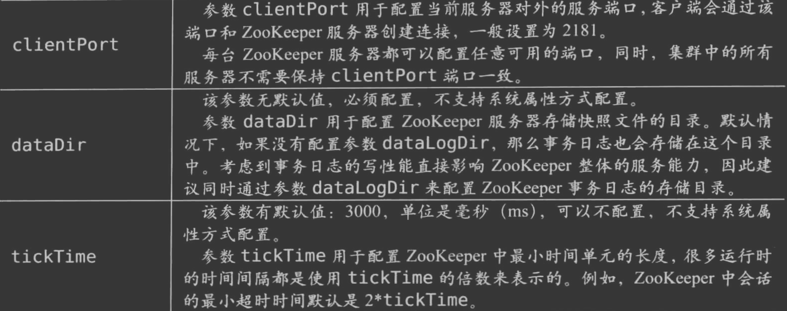
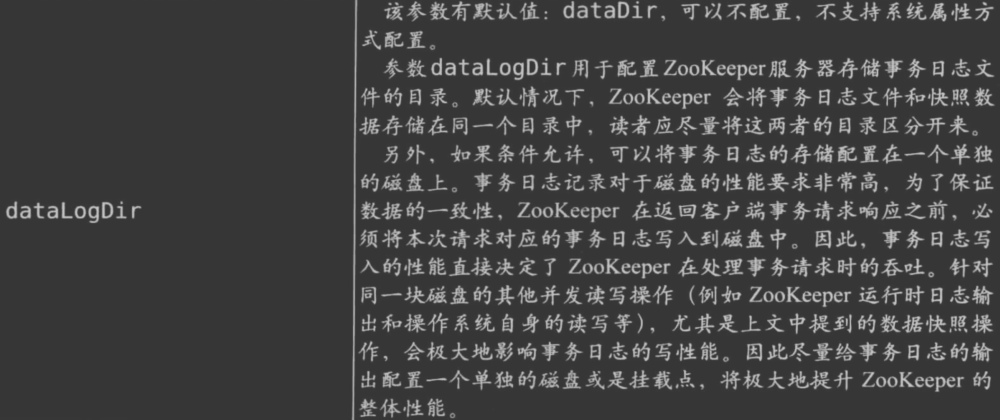
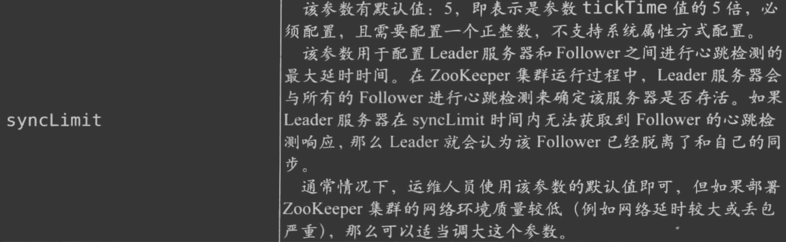
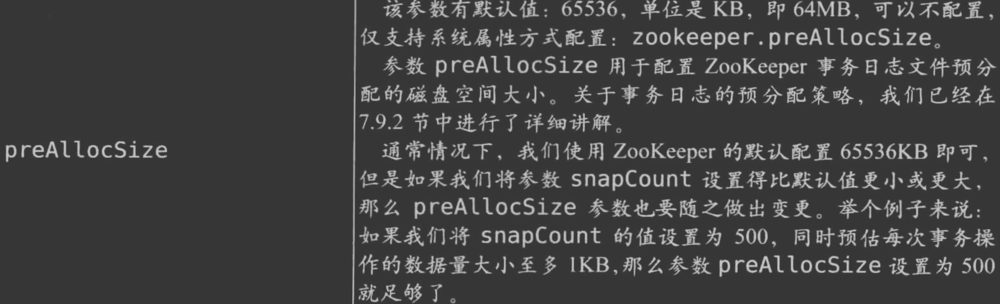
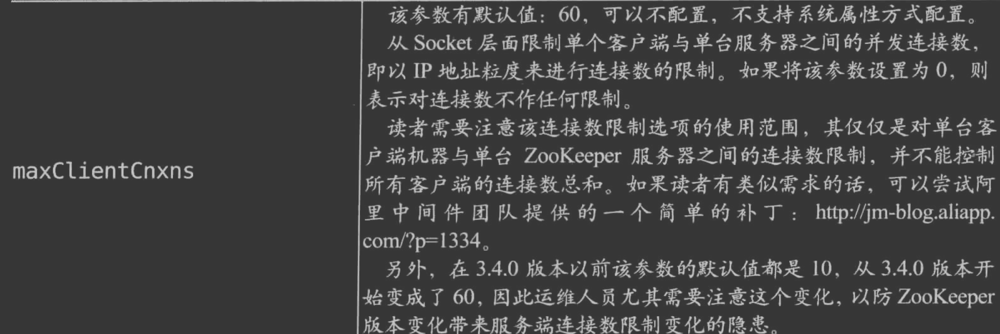
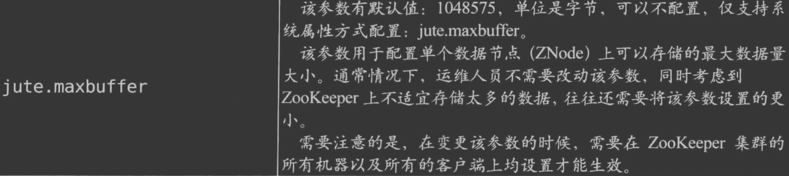
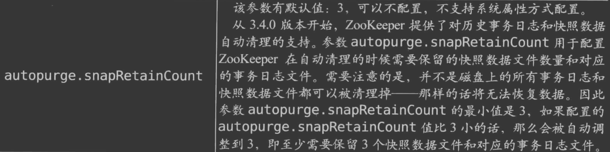
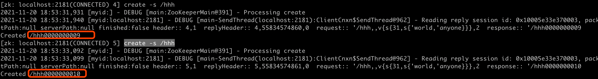
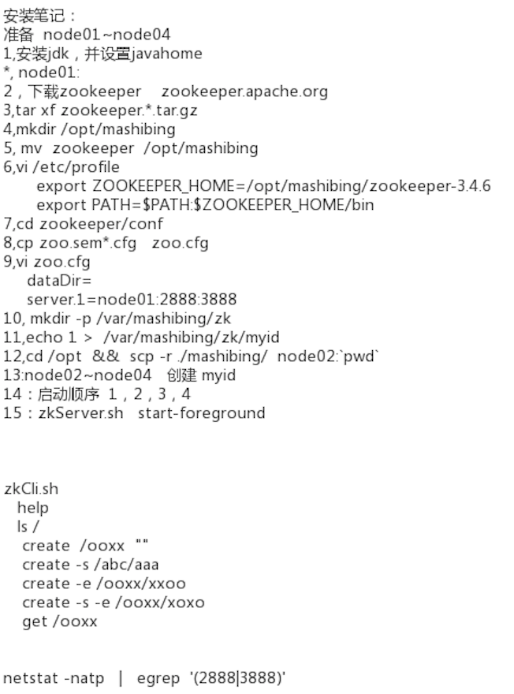

##临界知识
熟悉重要配置,方便理解实践核心原理
熟悉持久化日志,方便理解协议结构
熟悉核心命令,方便问题排查
熟悉核心监控指标,加强性能理解
##集群配置
/Users/chris/workspace/zookeeper-cluster
```asp
sh start-all.sh
```
[集群配置](https://blog.csdn.net/doing_now/article/details/105513236)
客户端端口号clientport  
事务日志目录datadir  
快照日志目录datalogDir


心跳超时synclimit

一次快照落盘时覆盖的事务总次数snapcount

事务文件预留磁盘大小,preAllocsize,主要为了加快事务的落盘速度

最大连接数

单节点最大数据量

日志清理autopurge

###debug日志打印
https://blog.csdn.net/jsky_studio/article/details/47746121
##节点操作命令
help
ls /
create [-s|-e] /path ""
get /path
stat /path

###顺序节点
create -s /path/name
create -s /hhh

###临时顺序

create -s -e /path/name
##常用四字命令
参考[从paxso到zookeeper]8.2
echo stat | nc ip port
echo mntr | nc ip port(zk当前连接数)
echo conf | nc ip port(最大连接数)

Help//帮助命令

##连接监控
```asp
单台机器连接过多:
too many connections
```
##磁盘管理
```asp
日志清理:
事务日志定期清理
快照定期清理
使用单独的磁盘作为事务日志输出目录
避免swap虚拟内存的使用,调整jvm大小
```

