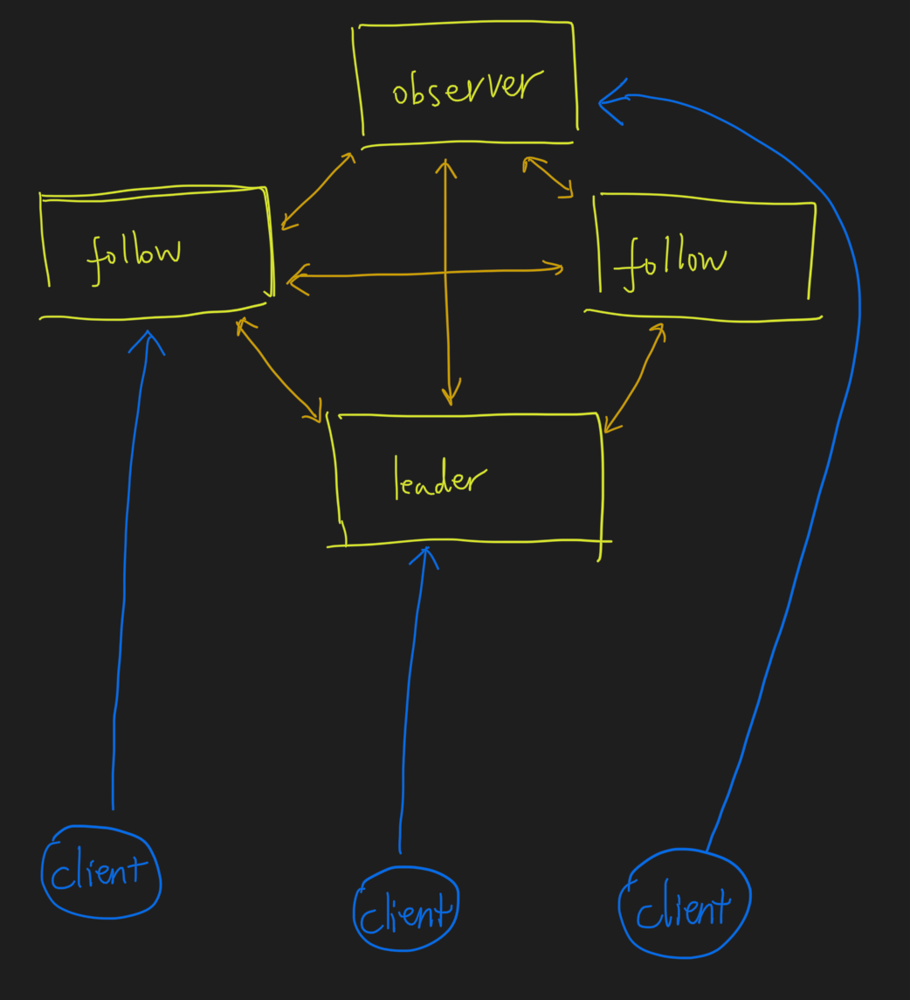

#临界知识
心跳包ping,客户端ping通知状态,服务端ping监控状态
长链接
#集群角色

##leader
```asp
1.事务请求唯一调度者和处理者,保证事务的顺序性
2.集群内部各服务的调度者

每一个客户端与leader建立长链接,并定期主动发送心跳包ping
leader服务与每一个follower/observer建立tcp长链接,用于数据同步,请求转发,选举
```
##follower
```asp
处理非事务请求,转发事务请求给leader
参与事务请求投票
参与leader选举投票
```
##Observer
[](https://blog.csdn.net/lamfang/article/details/109039288)
```asp
Observer的主要作用是提高zookeeper集群的读性能,为了在提高zookeeper读性能（也就是支持更多的客户端连接）的同时
又不影响zookeeper的写性能(增加follower会影响事务投票,影响写性能)

处理非事务请求,转发事务请求给leader
不参与任何事务投票,leader不会将事务请求投票发送给Observer
```
