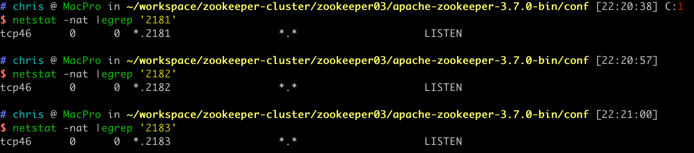

#临界知识
心跳包ping,客户端ping通知状态,服务端ping监控状态
长链接
#集群角色

##leader
```asp
1.事务请求唯一调度者和处理者,保证事务的顺序性
2.集群内部各服务的调度者

每一个客户端与leader建立长链接,并定期主动发送心跳包ping
leader服务与每一个follower/observer建立tcp长链接,用于数据同步,请求转发,选举
```
##follower
```asp
处理非事务请求,转发事务请求给leader
参与事务请求投票
参与leader选举投票
```
##Observer
[](https://blog.csdn.net/lamfang/article/details/109039288)
```asp
Observer的主要作用是提高zookeeper集群的读性能,为了在提高zookeeper读性能（也就是支持更多的客户端连接）的同时
又不影响zookeeper的写性能(增加follower会影响事务投票,影响写性能)

处理非事务请求,转发事务请求给leader
不参与任何事务投票,leader不会将事务请求投票发送给Observer
```

#选举
ZAB算法


#通信
```asp
每个节点的配置：
server.1=localhost:2881:3881(288*处理读/写事务,388*处理选举)
server.2=localhost:2882:3882
server.3=localhost:2883:3883

zk1 up -> zk2 up -> zk3 up
zk2选为leader
```
##三个端口
```asp
1.zookeeper服务端与客户端的连接2181
2.zookeeper选举连接3881
3.选举后follow与leader的通信连接2881
```
##3类连接
###zookeeper选举
388*,启动顺序：zk1 up -> zk2 up -> zk3 up
```asp
zk1
netstat -nat |egrep '3881'
tcp4       0      0  127.0.0.1.3881         127.0.0.1.49498        ESTABLISHED
tcp4       0      0  127.0.0.1.49498        127.0.0.1.3881         ESTABLISHED
tcp4       0      0  127.0.0.1.3881         127.0.0.1.49271        ESTABLISHED
tcp4       0      0  127.0.0.1.49271        127.0.0.1.3881         ESTABLISHED
tcp4       0      0  127.0.0.1.3881         *.*                    LISTEN
```
```asp
zk2
netstat -nat |egrep '3882'
tcp4       0      0  127.0.0.1.3882         127.0.0.1.49497        ESTABLISHED
tcp4       0      0  127.0.0.1.49497        127.0.0.1.3882         ESTABLISHED
tcp4       0      0  127.0.0.1.3882         *.*                    LISTEN
```
```asp
netstat -nat |egrep '3883'
tcp4       0      0  127.0.0.1.3883         *.*                    LISTEN
```
###follow与leader通信
288*，zk2被选为leader
```asp
zk1
netstat -nat |egrep '2881'
```
```asp
zk2
netstat -nat |egrep '2882'
tcp4       0      0  127.0.0.1.2882         127.0.0.1.49499        ESTABLISHED
tcp4       0      0  127.0.0.1.49499        127.0.0.1.2882         ESTABLISHED
tcp4       0      0  127.0.0.1.2882         127.0.0.1.49274        ESTABLISHED
tcp4       0      0  127.0.0.1.49274        127.0.0.1.2882         ESTABLISHED
tcp4       0      0  127.0.0.1.2882         *.*                    LISTEN
```
```asp
zk3
netstat -nat |egrep '2883'
```
###client与server通信
218*

