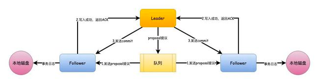
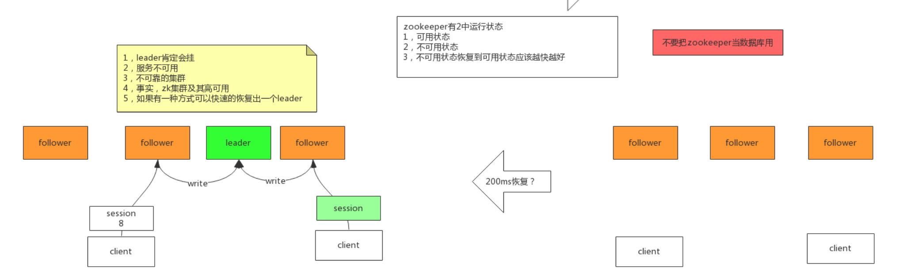
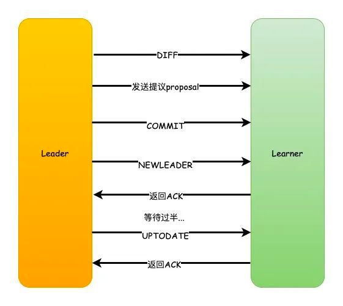

#临界知识
leader两阶段提交机制
leader全局事务id
leader写队列
选举期间leader,follow拒绝服务,observer可读
#ZAB共识算法

##过半机制
```asp
1.Leader收到请求之后，将它转换为一个proposal提议，并且为每个提议分配一个全局唯一递增的事务ID：zxid，然后把提议放入到一个FIFO的队列中，按照FIFO的策略发送给所有的Follower

2.Follower收到提议之后，以事务日志的形式写入到本地磁盘中，写入成功后返回ACK给Leader

3.Leader在收到超过半数的Follower的ACK之后，即可认为数据写入成功，就会发送commit命令给Follower告诉他们可以提交proposal了
```


#选举
[](https://www.163.com/dy/article/GC588PFS0518E0HL.html)
##节点状态与消息协议
zxid+myid

LEADING \ FOLLOWING \ LOOKING
##服务启动期间的选举
```asp
1.首先，每个节点都会对自己进行投票，然后把投票信息广播给集群中的其他节点

2.节点接收到其他节点的投票信息，然后和自己的投票进行比较，首先zxid较大的优先，如果zxid相同那么则会去选择myid更大者，此时大家都是LOOKING的状态

3.投票完成之后，开始统计投票信息，如果集群中过半的机器都选择了某个节点机器作为leader，那么选举结束

4.最后，更新各个节点的状态，leader改为LEADING状态，follower改为FOLLOWING状态
```
##leader & follow 数据同步
Zookeeper在选举之后，Follower和Observer（统称为Learner）就会去向Leader注册，然后就会开始数据同步的过程
```asp
数据同步包含3个主要值和4种形式。

PeerLastZxid：Learner服务器最后处理的ZXID

minCommittedLog：Leader提议缓存队列中最小ZXID

maxCommittedLog：Leader提议缓存队列中最大ZXID
```
###DIFF同步
```asp
如果PeerLastZxid在minCommittedLog和maxCommittedLog之间，那么则说明Learner服务器还没有完全同步最新的数据。

1.首先Leader向Learner发送DIFF指令，代表开始差异化同步，然后把差异数据（从PeerLastZxid到maxCommittedLog之间的数据）提议proposal发送给Learner

2.发送完成之后发送一个NEWLEADER命令给Learner，同时Learner返回ACK表示已经完成了同步

3.接着等待集群中过半的Learner响应了ACK之后，就发送一个UPTODATE命令，Learner返回ACK，同步流程结束
```

###TRUNC+DIFF 同步
```asp
如果Leader刚生成一个proposal，还没有来得及发送出去，此时Leader宕机，重新选举之后作为Follower，但是新的Leader没有这个proposal数据。

举个栗子：

假设现在的Leader是A，minCommittedLog=1，maxCommittedLog=3，刚好生成的一个proposal的ZXID=4，然后挂了。

重新选举出来的Leader是B，B之后又处理了2个提议，然后minCommittedLog=1，maxCommittedLog=5。

这时候A的PeerLastZxid=4，在(1,5)之间。

那么这一条只存在于A的提议怎么处理？

A要进行事务回滚，相当于抛弃这条数据，并且回滚到最接近于PeerLastZxid的事务，对于A来说，也就是PeerLastZxid=3。

流程和DIFF一致，只是会先发送一个TRUNC命令，然后再执行差异化DIFF同步。
```
###TRUNC 同步
```asp
针对PeerLastZxid大于maxCommittedLog的场景，流程和上述一致，事务将会被回滚到maxCommittedLog的记录。

这个其实就更简单了，也就是你可以认为TRUNC+DIFF中的例子，新的Leader B没有处理提议，所以B中minCommittedLog=1，maxCommittedLog=3。

所以A的PeerLastZxid=4就会大于maxCommittedLog了，也就是A只需要回滚就行了，不需要执行差异化同步DIFF了
```
###全量同步 SNAP 同步
```asp
适用于两个场景：

1.PeerLastZxid小于minCommittedLog

2.Leader服务器上没有提议缓存队列，并且PeerLastZxid不等于Leader的最大ZXID

这两种场景下，Leader将会发送SNAP命令，把全量的数据都发送给Learner进行同步
```
##服务运行期间的选举
  
#消息广播
[](https://www.douban.com/note/208430424/)

#数据不一致
#事务回滚
#会话事务
