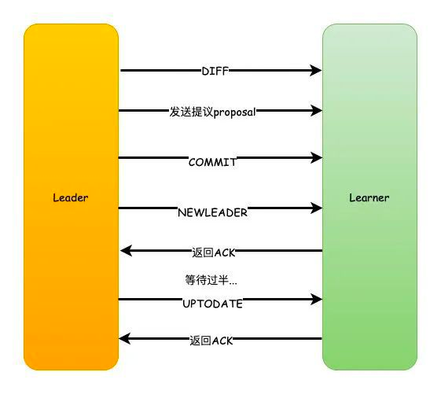
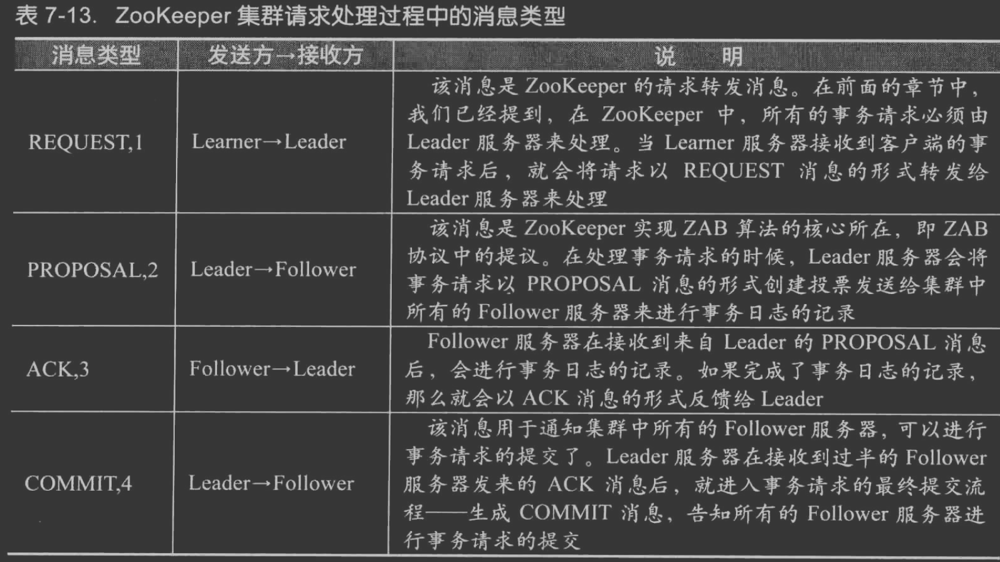

#临界知识
leader两阶段提交机制
leader全局事务id
leader事务提交队列
选举期间leader,follow拒绝服务,observer可读
#ZAB共识算法
zab和raft都是通过强领导者模型实现就多值达成共识的
##leader模式
能保证操作顺序性的，基于主备模式的原子广播协议，在 ZAB 中，写操作必须在主节点（比如节点 A）上执行。如果客户端访问的节点是备份节点（比如节点 B），它会将写请求转发给主节


##唯一ID事务标识符
zxid,事务标识符是 64 位的 long 型变量，有任期编号 epoch 和计数器 counter 两部分组成（为了形象和方便理解，我把 epoch 翻译成任期编号），格式为 ，高 32 位为任期编号，低 32 位为计数器
```asp
任期编号，就是创建提案时领导者的任期编号，需要你注意的是，当新领导者当选时，任期编号递增，计数器被设置为零。比如，前领导者的任期编号为 1，那么新领导者对应的任期编号将为 2。
计数器，就是具体标识提案的整数，需要你注意的是，每次领导者创建新的提案时，计数器将递增。比如，前一个提案对应的计数器值为 1，那么新的提案对应的计数器值将为 2。
为什么要设计的这么复杂呢？因为事务标识符必须按照顺序、唯一标识一个提案，也就是说，事务标识符必须是唯一的、递增的。
```


##过半机制
```asp
1.Leader收到请求之后，将它转换为一个proposal提议，并且为每个提议分配一个全局唯一递增的事务ID：zxid，然后把提议放入到一个FIFO的队列中，按照FIFO的策略发送给所有的Follower

2.Follower收到提议之后，以事务日志的形式写入到本地磁盘中，写入成功后返回ACK给Leader

3.Leader在收到超过半数的Follower的ACK之后，即可认为数据写入成功，就会发送commit命令给Follower告诉他们可以提交proposal了
```


当主节点接收到指定提案的“大多数”的确认响应后，该提案将处于提交状态（Committed），主节点会通知备份节点提交该提案
##顺序广播(leader节点给每个follow一个proposal队列,一个commit队列)
主节点提交提案是有顺序性的。主节点根据事务标识符大小，按照顺序提交提案，如果前一个提案未提交，此时主节点是不会提交后一个提案的。也就是说，指令 X 一定会在指令 Y 之前提交
主节点返回执行成功的响应给节点 B，节点 B 再转发给客户端。你看，这样我们就实现了操作的顺序性，保证了指令 X 一定在指令 Y 之前执行

#选举
[](https://www.163.com/dy/article/GC588PFS0518E0HL.html)
[](https://www.runoob.com/w3cnote/zookeeper-leader.html)
##
zxid+myid

LEADING \ FOLLOWING \ LOOKING
```asp
1.首先，每个节点都会对自己进行投票，然后把投票信息广播给集群中的其他节点

2.节点接收到其他节点的投票信息，然后和自己的投票进行比较，首先zxid较大的优先，如果zxid相同那么则会去选择myid更大者，此时大家都是LOOKING的状态

3.投票完成之后，开始统计投票信息，如果集群中过半的机器都选择了某个节点机器作为leader，那么选举结束

4.最后，更新各个节点的状态，leader改为LEADING状态，follower改为FOLLOWING状态
```


#leader & follow 数据同步
Zookeeper在选举之后，Follower和Observer（统称为Learner）就会去向Leader注册，然后就会开始数据同步的过程
```asp
数据同步包含3个主要值和4种形式。

PeerLastZxid：Learner服务器最后处理的ZXID

minCommittedLog：Leader提议缓存队列中最小ZXID

maxCommittedLog：Leader提议缓存队列中最大ZXID
```

###DIFF同步
```asp
如果PeerLastZxid在minCommittedLog和maxCommittedLog之间，那么则说明Learner服务器还没有完全同步最新的数据。

1.首先Leader向Learner发送DIFF指令，代表开始差异化同步，然后把差异数据（从PeerLastZxid到maxCommittedLog之间的数据）提议proposal发送给Learner

2.发送完成之后发送一个NEWLEADER命令给Learner，同时Learner返回ACK表示已经完成了同步

3.接着等待集群中过半的Learner响应了ACK之后，就发送一个UPTODATE命令，Learner返回ACK，同步流程结束
```

###TRUNC+DIFF 同步
```asp
如果Leader刚生成一个proposal，还没有来得及发送出去，此时Leader宕机，重新选举之后作为Follower，但是新的Leader没有这个proposal数据。

举个栗子：

假设现在的Leader是A，minCommittedLog=1，maxCommittedLog=3，刚好生成的一个proposal的ZXID=4，然后挂了。

重新选举出来的Leader是B，B之后又处理了2个提议，然后minCommittedLog=1，maxCommittedLog=5。

这时候A的PeerLastZxid=4，在(1,5)之间。

那么这一条只存在于A的提议怎么处理？

A要进行事务回滚，相当于抛弃这条数据，并且回滚到最接近于PeerLastZxid的事务，对于A来说，也就是PeerLastZxid=3。

流程和DIFF一致，只是会先发送一个TRUNC命令，然后再执行差异化DIFF同步。
```
###TRUNC 同步
```asp
针对PeerLastZxid大于maxCommittedLog的场景，流程和上述一致，事务将会被回滚到maxCommittedLog的记录。

这个其实就更简单了，也就是你可以认为TRUNC+DIFF中的例子，新的Leader B没有处理提议，所以B中minCommittedLog=1，maxCommittedLog=3。

所以A的PeerLastZxid=4就会大于maxCommittedLog了，也就是A只需要回滚就行了，不需要执行差异化同步DIFF了
```
###全量同步 SNAP 同步
```asp
适用于两个场景：

1.PeerLastZxid小于minCommittedLog

2.Leader服务器上没有提议缓存队列，并且PeerLastZxid不等于Leader的最大ZXID

这两种场景下，Leader将会发送SNAP命令，把全量的数据都发送给Learner进行同步
```

  
#请求处理事务(消息广播)


[](https://www.douban.com/note/208430424/)



```asp
消息广播
一个事务请求进来之后，Leader节点会将写请求包装成提议（Proposal）事务，并添加一个全局唯一的 64 位递增事务 ID，Zxid。
Leader 节点向集群中其他节点广播Proposal事务，Leader 节点和 Follower 节点是解耦的，通信都会经过一个 FIFO 的消息队列，Leader 会为每一个 Follower 节点分配一个单独的 FIFO 队列，然后把 Proposal 发送到队列中。
Follower 节点收到对应的Proposal之后会把它持久到磁盘上，当完全写入之后，发一个ACK给Leader。
当Leader节点收到超过半数Follower节点的ACK之后会提交本地机器上的事务，同时开始广播commit，Follower节点收到 commit 之后，完成各自的事务提交。
消息广播类似一个分布式事务的两阶段提交模式。在这种模式下，无法处理因Leader在发起事务请求后节点宕机带来的数据不一致问题。因此ZAB协议引入了崩溃恢复机制。
```
[](https://zhuanlan.zhihu.com/p/157317221)
##proposal
写日志
[](https://www.jianshu.com/p/2c5e36b81128)
##commit(proposal阶段，follow已经写入日志了，commit阶段做了什么)
根据日志txn更新内存Database

```asp
 protected void processCommitted() {
        Request request;
            ...
            request = committedRequests.poll();
            /*
             * We match with nextPending so that we can move to the
             * next request when it is committed. We also want to
             * use nextPending because it has the cnxn member set
             * properly.
             */
            Request pending = nextPending.get();
            if (pending != null &&
                pending.sessionId == request.sessionId &&
                pending.cxid == request.cxid) {
                pending.setHdr(request.getHdr());
                pending.setTxn(request.getTxn());
                pending.zxid = request.zxid;
                currentlyCommitting.set(pending);
                nextPending.set(null);
                sendToNextProcessor(pending);
            } else {
                currentlyCommitting.set(request);
                sendToNextProcessor(request);
            }
        }      
    }
```
##主节点反馈给客户端是否要直到comitted绝大多数才算OK
不一定是主节点，也不需要等到committed绝大多数，具体来说，当节点接收到COMMIT消息后，提交提案，如果是自己接收的写请求，那么这时返回成功响应给客户端
##第一个阶段提议ok之后，第二个committed阶段主节点挂了，那么在选举的时候这写未提交的提议咋处理？
因为提案已复制到大多数节点上，领导者选举能保证新的领导者一定包含这个未提交的提案，并最终将它提交
#服务运行期间的选举(崩溃恢复)
1、选举 zxid 最大的节点作为新的 leader
2、新 leader 将事务日志中尚未提交的消息进行处理
[](https://ask.csdn.net/questions/914703)
[](https://www.cnblogs.com/fanguangdexiaoyuer/p/10311228.html#_label3_0)
[](https://zhuanlan.zhihu.com/p/279955043)
##如果在leader发出了commit之后，各个follow收到commit之前，leader挂掉了，导致follow并没有执行已经提交的提案
解决方案 leader失效后，重新选举出来的leader肯定具备最大的zxid（不考虑这个zxid有没有被提交），只要zxid最大，那么就会被选为leader
(myid也得考虑，这里不是重点），zxid最大说明这个节点肯定包括了所有的最新的提案，当这个节点当选为leader之后，
新的leader会检查自身有没有未被提交的提案，如果有的，则会向集群中发送请求，询问其他follow节点是否存在其提案，
如果超过半数回复ok,则执行提交操作，之后进行数据同步操作，这样就保证了已经被提交的提案不会被丢失。
##奔溃后选leader
zxid最大说明这个节点肯定包括了所有的最新的提案，当这个节点当选为leader
##处理未提交的提案
新的leader会检查自身有没有未被提交的提案，如果有的，则会向集群中发送请求，询问其他follow节点是否存在其提案，
如果超过半数回复ok,则执行提交操作，之后进行数据同步操作
##没有被提交的提案应该被丢弃
假设有这种场景，如果在leader生成提案后，广播之前，leader崩溃了，这个时候的提案是应该被丢弃了，这个ZAB协议时如何解决的呢？

解决方案： Zab 通过巧妙的设计 zxid 来实现这一目的
zxid占据64位，高32位存储epoch编号，这个编号是每选举出一次leader之后都会加一，有种朝代的感觉哈，低32位从0开始，当有新的请求或出现新的提案时，
就会加1，但是重新选择leader之后，就会进行清零； 那么zab时如何借助zxid来解决没有被提交的提案应该丢弃的问题呢？
在旧的leader重启后，因为已经经过一次新的选举了，旧的leader所处的朝代已经落后了，新的leader会要求旧的leader将 它所处的朝代没有被提交 的提案清除，
重新同步最新的提案，这就保证了未被提交的提案进行丢弃；
#会话事务

