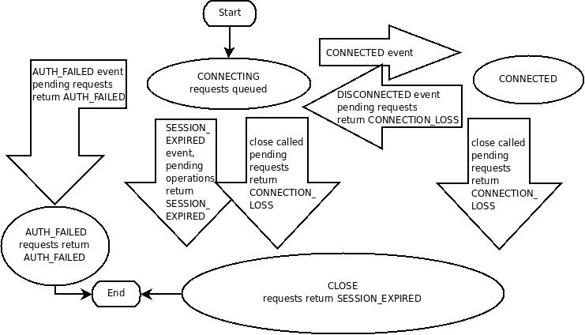
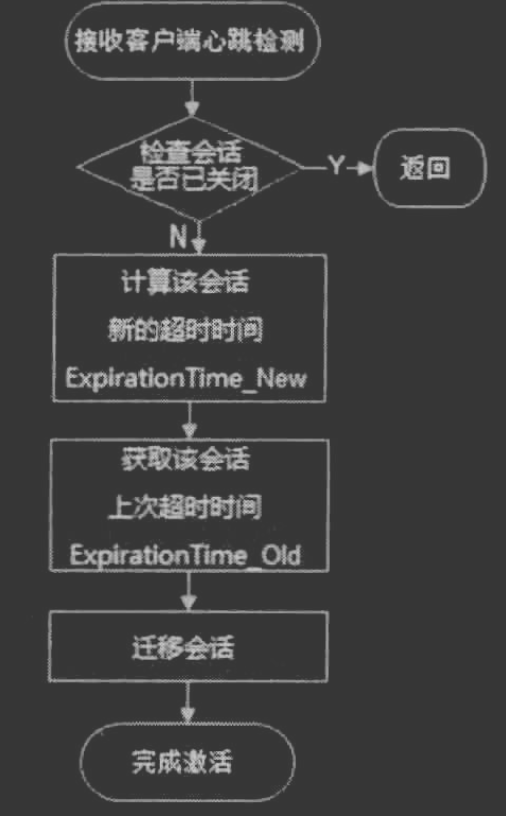
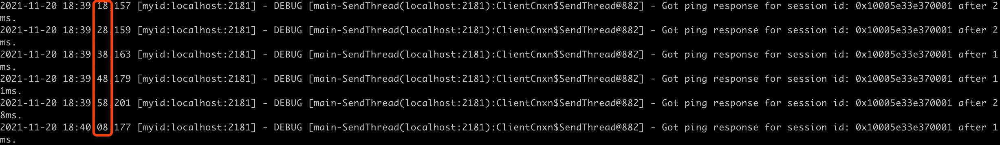
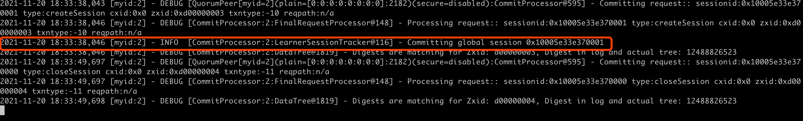
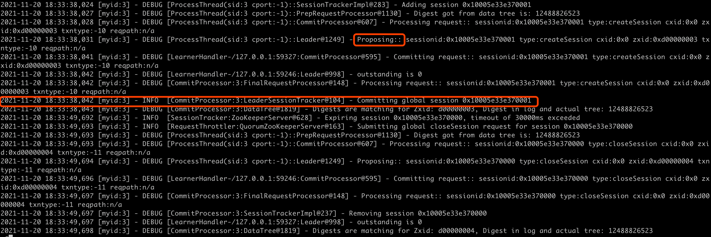
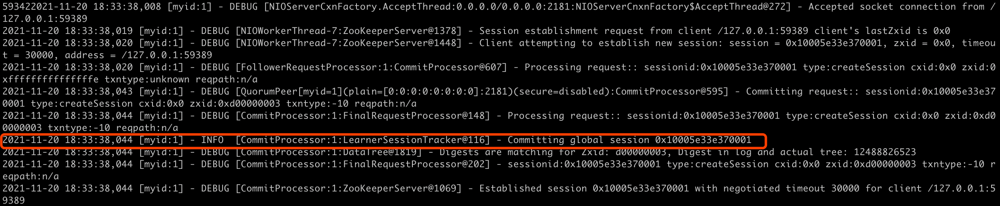
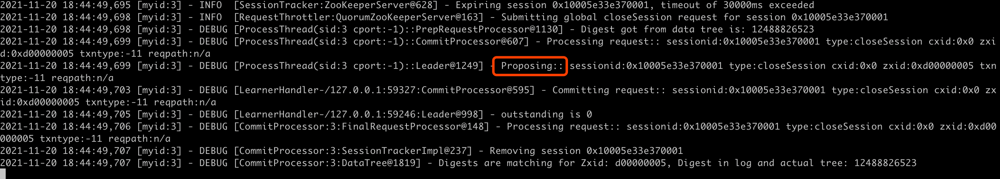
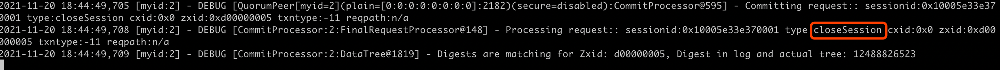
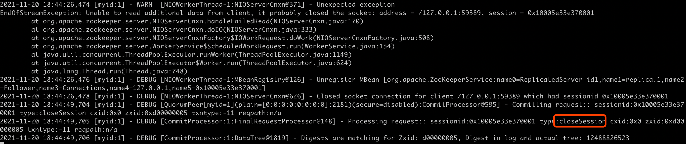
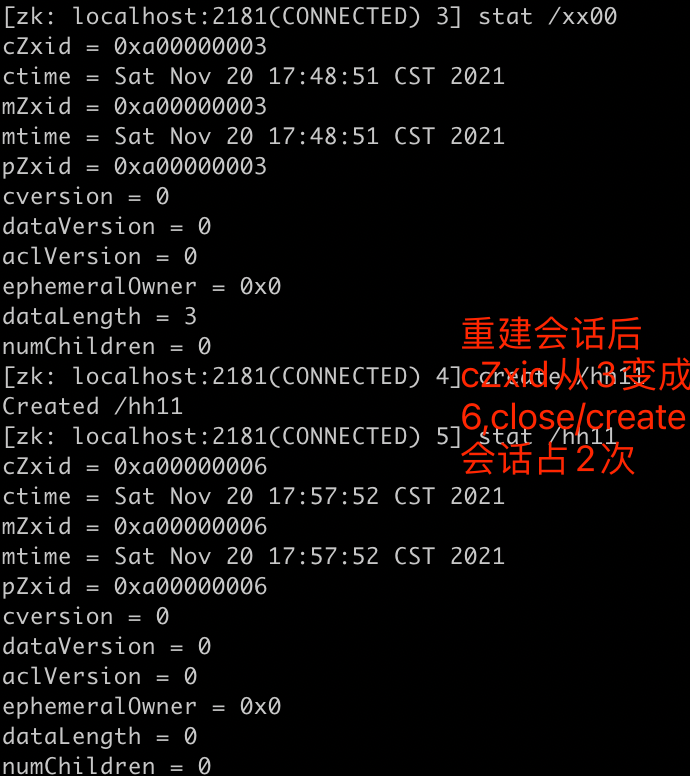

#临界知识
zookeeper单一视图确保
会话创建和关闭的定义
会话转移
#会话定义
```asp
创建:
客户端与服务端建立tcp连接

关闭:
客户端主动断开连接
客户端心跳超时被服务端剔除
发生不可恢复的错误，例如会话过期或身份验证失败，
会话将移动到 CLOSED 状态
```

客户端/主节点任意一个关闭,session就关闭，临时节点就删除,适合做分布式锁(思考与redis主从分布式锁的区别)
```asp
[SessionTracker:ZooKeeperServer@628] - Expiring session 0x100025a91530000, timeout of 30000ms exceeded
[RequestThrottler:QuorumZooKeeperServer@163] - Submitting global closeSession request for session 0x100025a91530000
[CommitProcessor:2:LeaderSessionTracker@104] - Committing global session 0x100025a91530001

[SessionTracker:ZooKeeperServer@628] - Expiring session 0x100025a91530001, timeout of 30000ms exceeded
[RequestThrottler:QuorumZooKeeperServer@163] - Submitting global closeSession request for session 0x100025a91530001
```
##sessionID
全局唯一
##TimeOut
会话超时
##TickTime
下次会话超时时间

#会话状态

#会话超时、过期
```asp
'connected' ：会话已建立，客户端正在与集群通信（客户端/服务器通信正常运行）

.... 客户端从集群中分区

'disconnected' : 客户端与集群失去连接

.... 时间过去了，在“超时”期后，集群使会话到期，客户端从集群断开连接时什么也看不到

.... 时间流逝，客户端重新获得与集群的网络级连接

'expired' ：最终客户端重新连接到集群，然后通知它过期
```
#会话激活
客户端会定期给服务端进行心跳,激活会话


#重连
##服务端连接断开

##会话失效
##会话转移
#会话统一视图
客户端与leader建立session,leader与follow进行会话事务同步

zk1(follow),zk2(follow),zk3(leader)
客户端连接zk2,请求建立session,将请求转发给leader

zk3(leader)处理这次会话事务,可以看到leader创建session时间最早

zk1同步session



客户端断开会话
zk3(leader)处理会话close

zk2关闭会话

zk1关闭会话




#临时节点
基于会话机制
