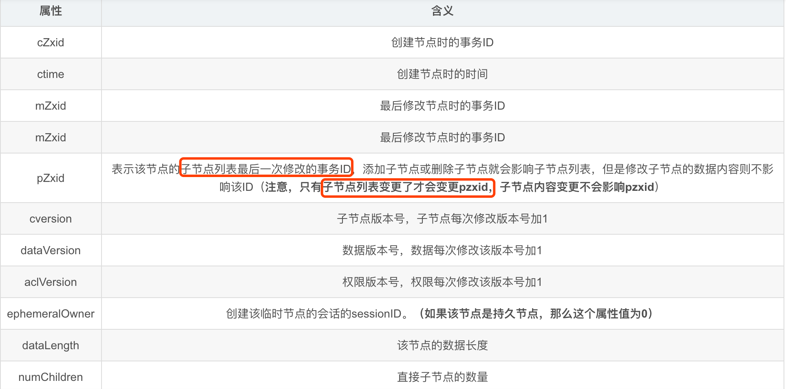

#session会话(内存中,不会持久化)
客户端/主节点任意一个关闭,session就关闭，临时节点就删除,适合做分布式锁(思考与redis主从分布式锁的区别)
```asp
[SessionTracker:ZooKeeperServer@628] - Expiring session 0x100025a91530000, timeout of 30000ms exceeded
[RequestThrottler:QuorumZooKeeperServer@163] - Submitting global closeSession request for session 0x100025a91530000
[CommitProcessor:2:LeaderSessionTracker@104] - Committing global session 0x100025a91530001

[SessionTracker:ZooKeeperServer@628] - Expiring session 0x100025a91530001, timeout of 30000ms exceeded
[RequestThrottler:QuorumZooKeeperServer@163] - Submitting global closeSession request for session 0x100025a91530001
```
#树状目录(模拟树,实际map)
1M大小
#顺序一致性
所有请求都通过master节点来处理
#cZxid & mZxid & pZxid

#原子性
过半机制,过半同意/过半拒绝
#最终一致性
过半机制
#可靠性
先持久化再返回
#心跳
tickTime
