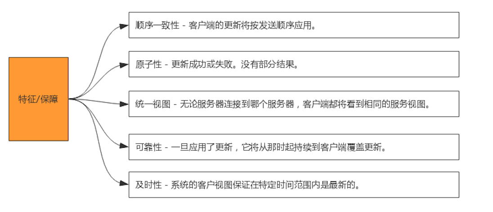

#树状目录(模拟树,实际map)
1M大小
#顺序一致性
所有请求都通过master节点来处理
#最终一致性
过半机制

#原子
过半机制,过半同意/过半拒绝,没有部分结果
#统一视图
无论连接哪台服务器,看到的服务视图都相同
[](http://zookeeper.apache.org/doc/r3.4.6/zookeeperProgrammers.html#ch_zkGuarantees)
##数据同步sync
```asp
Sometimes developers mistakenly assume one other guarantee that ZooKeeper does not in fact make. This is:

Simultaneously Consistent Cross-Client Views
ZooKeeper does not guarantee that at every instance in time, two different clients will have identical views of ZooKeeper data. 
Due to factors like network delays, one client may perform an update before another client gets notified of the change. 
Consider the scenario of two clients, A and B. If client A sets the value of a znode /a from 0 to 1, then tells client B to read /a, 
client B may read the old value of 0, depending on which server it is connected to. If it is important that Client A and Client B read the same value,
 Client B should should call the sync() method from the ZooKeeper API method before it performs its read.

So, ZooKeeper by itself doesn't guarantee that changes occur synchronously across all servers, but ZooKeeper primitives 
can be used to construct higher level functions that provide useful client synchronization. (For more information, 
see the ZooKeeper Recipes. [tbd:..]).
```
