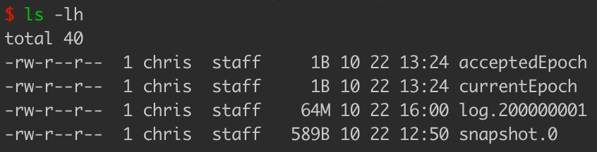
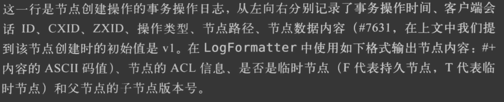
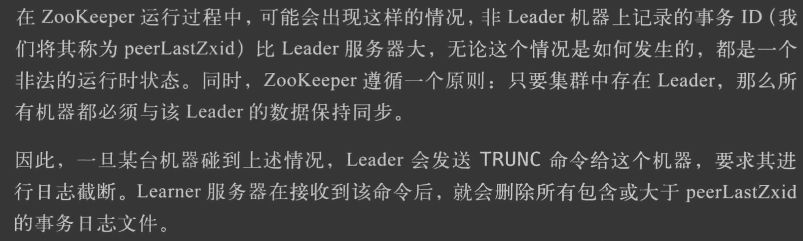
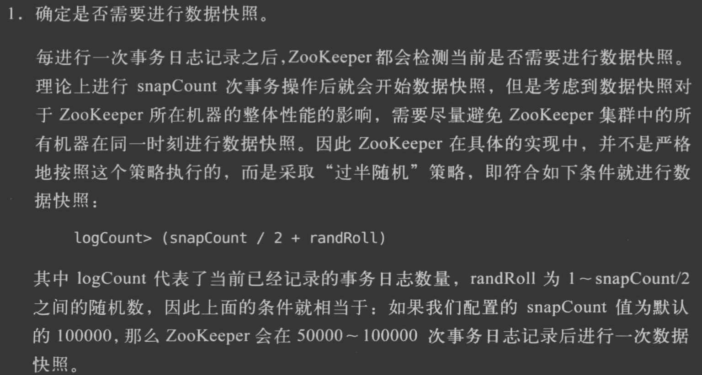
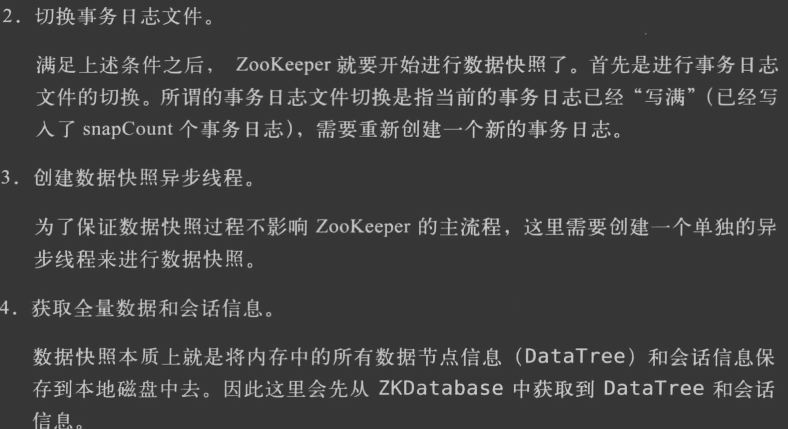

##事务日志
集群过半节点持久化日志,才会返回结果给客户端
```asp
日志格式:
***.zxid
zxid,高32位epoch,低32序列号
```

epoch=2

  
查看事务日志,运行org.apache.zookeeper.server.LogFormatter,程序参数:事务日志目录
```asp
ZooKeeper Transactional Log File with dbid 0 txnlog format version 2
21-10-22 下午03时59分38秒 session 0x100089ee73a0000 cxid 0x0 zxid 0x200000001 createSession 30000
```

```asp
21-10-22 下午04时12分05秒 session 0x100089ee73a0000 cxid 0x5 zxid 0x200000006 create '/test1,#74657374,v{s{31,s{'world,'anyone}}},F,2
```

不会记录读操作的日志

###刷盘策略
集群过半节点持久化日志,才会返回结果给客户端,强制刷盘
###磁盘预留
开启事务文件后,预留64m,避免每次事务写需要磁盘寻址
###日志截断

##快照日志
执行完定量事务后持久化一次内存,保存为快照日志,全量内存数据
格式化工具:SnapshotFormatter
```asp
ZNode Details (count=5):
----
/zookeeper
  cZxid = 0x00000000000000
  ctime = Thu Jan 01 08:00:00 CST 1970
  mZxid = 0x00000000000000
  mtime = Thu Jan 01 08:00:00 CST 1970
  pZxid = 0x00000000000000
  cversion = 0
  dataVersion = 0
  aclVersion = 0
  ephemeralOwner = 0x00000000000000
  dataLength = 0
----
/zookeeper/config
  cZxid = 0x00000000000000
  ctime = Thu Jan 01 08:00:00 CST 1970
  mZxid = 0x00000000000000
  mtime = Fri Oct 22 12:50:00 CST 2021
  pZxid = 0x00000000000000
  cversion = 0
  dataVersion = -1
  aclVersion = -1
  ephemeralOwner = 0x00000000000000
  dataLength = 132
----
/zookeeper/quota
  cZxid = 0x00000000000000
  ctime = Thu Jan 01 08:00:00 CST 1970
  mZxid = 0x00000000000000
  mtime = Thu Jan 01 08:00:00 CST 1970
  pZxid = 0x00000000000000
  cversion = 0
  dataVersion = 0
  aclVersion = 0
  ephemeralOwner = 0x00000000000000
  dataLength = 0
----
Session Details (sid, timeout, ephemeralCount):
```
###快照刷盘机制


##磁盘
使用单独的磁盘
避免内存过小使用swap
预留文件空间
