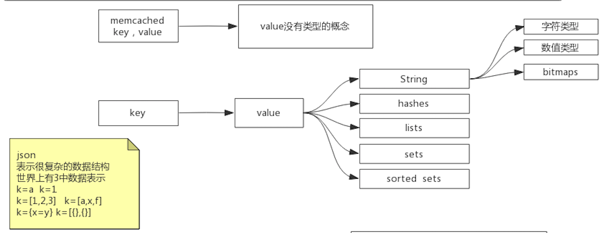
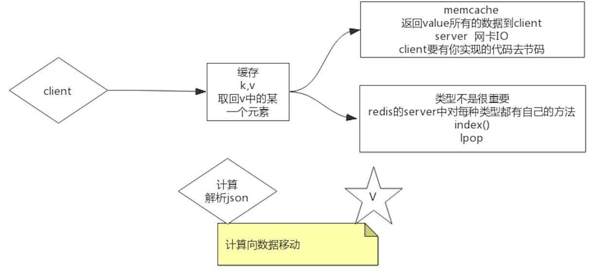

##临界知识
计算向数据移动
##redis定位
Redis is an open source (BSD licensed), in-memory data structure store, used as a database, cache, and message broker. 
Redis provides data structures such as strings, hashes, lists, sets, sorted sets with range queries, 
bitmaps, hyperloglogs, geospatial indexes, and streams. 
Redis has built-in replication, Lua scripting, LRU eviction, transactions, and different levels of on-disk persistence,
 and provides high availability via Redis Sentinel and automatic partitioning with Redis Cluster
 [](https://redis.io/)
##redis vs memcached
```asp
1.redis支持string,hashes,lists,sets,sorted数据结构,memcached只支持key,value
2.redis有高可用,支持持久化AOF,RDB持久化3.
3.redis支持集群模式
4.redis支持lua,事务
```

##json也可以表示hash,list,为啥redis还需要支持?
```asp
计算向数据移动,每个类型都有自己的操作方式,在redis服务端计算可以减少数据的网络传输
```

