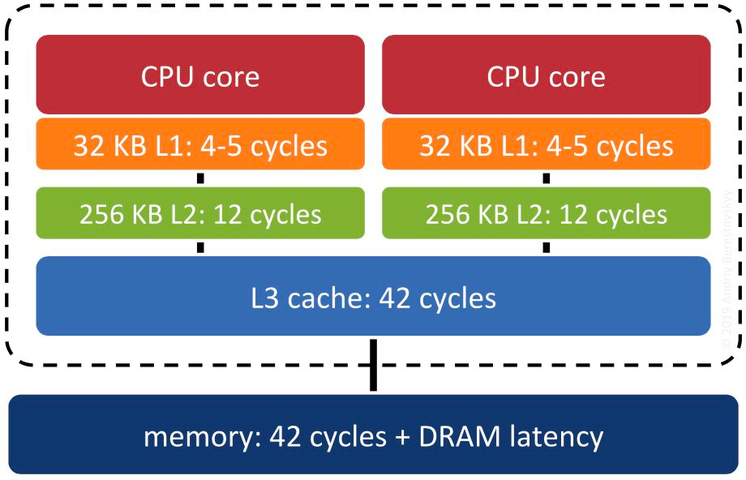

#CPU 亲和性
```asp
首先是 CPU 高速缓存（这里讨论的是 L1 Cache 和 L2 Cache 都集成在 CPU 中的硬件架构），这里想象一种场景：Redis 主进程正在 CPU-1 上运行，
给客户端提供数据服务，此时 Redis 启动了子进程进行数据持久化（BGSAVE 或者 AOF），系统调度之后子进程抢占了主进程的 CPU-1，主进程被调度到 
CPU-2 上去运行，导致之前 CPU-1 的高速缓存里的相关指令和数据被汰换掉，CPU-2 需要重新加载指令和数据到自己的本地高速缓存里，浪费 CPU 资源，
降低性能

Redis 通过设置 CPU 亲和性，可以将主进程/线程和子进程/线程绑定到不同的核隔离开来，使之互不干扰，能有效地提升系统性能
```

