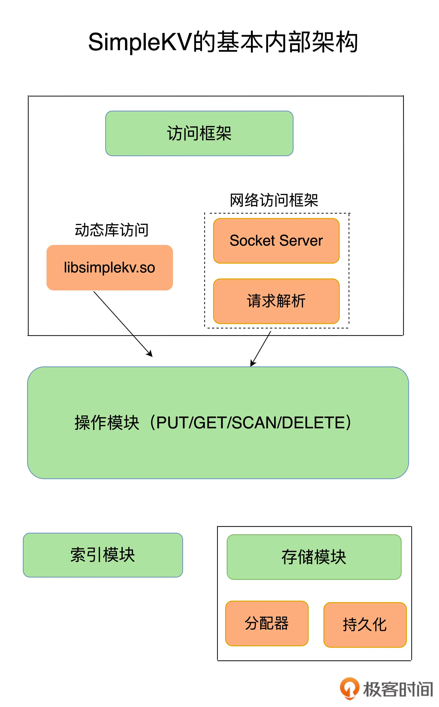
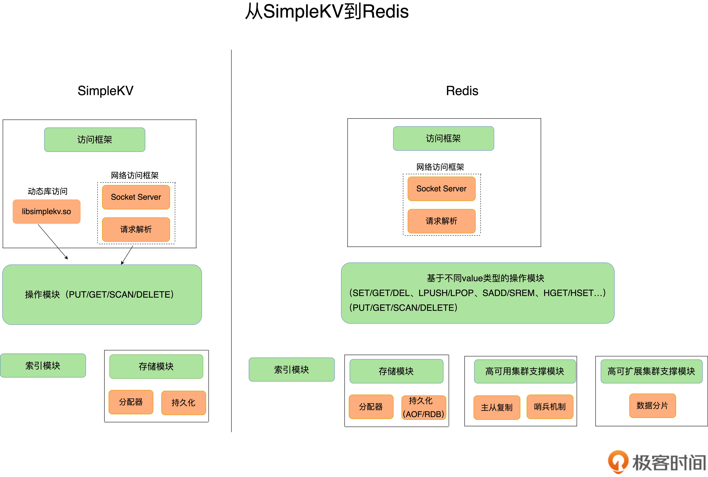

##分层架构

###网络层
socket
####I/O模型
###操作层
对于 GET/SCAN 操作而言，此时根据 value 的存储位置返回 value 值即可；  
对于 PUT 一个新的键值对数据而言，SimpleKV 需要为该键值对分配内存空间；  
对于 DELETE 操作，SimpleKV 需要删除键值对，并释放相应的内存空间，这个过程由分配器完成。
###索引层,key
哈希表、B+ 树、字典树
####value数据结构
###数据模型
KV
###存储层
####内存分配器
####数据持久化
####持久化机制
日志（AOF）和快照（RDB）

#客户端交互模型
