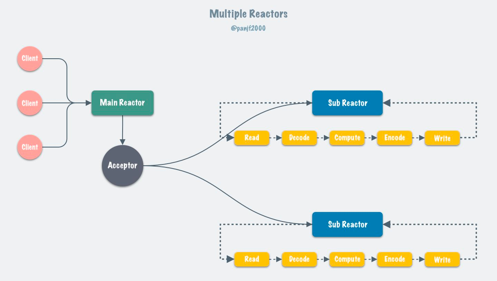
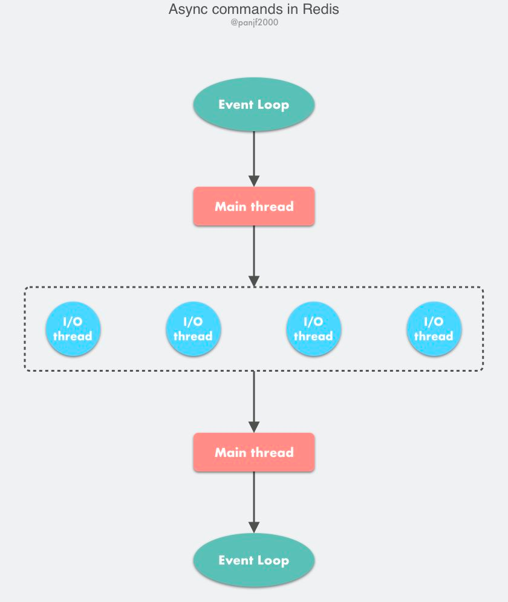
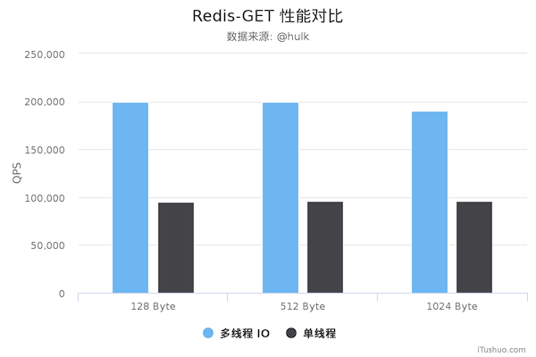
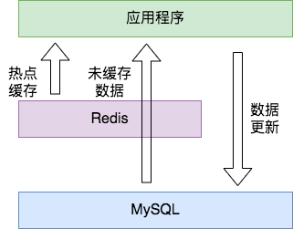
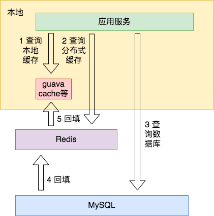
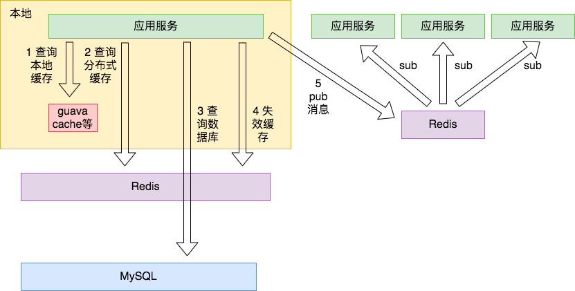
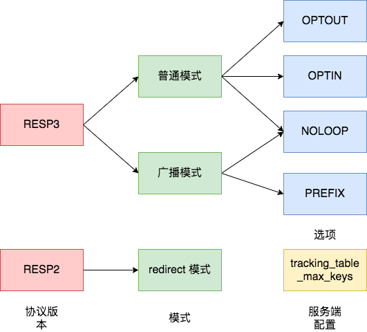
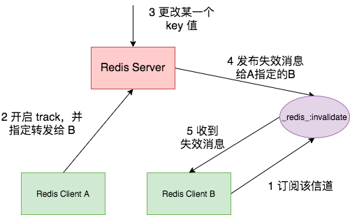
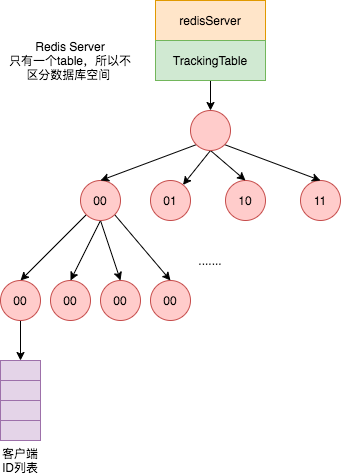

#多线程模型

[](https://zhuanlan.zhihu.com/p/356059845)
##多线程io原因
随着网络硬件的性能提升，Redis 的性能瓶颈有时会出现在网络 IO 的处理上，
也就是说，单个主线程处理网络请求的速度跟不上底层网络硬件的速度

##方案
采用多个 IO 线程来处理网络请求，提高网络请求处理的并行度
```asp
但是，Redis 的多 IO 线程只是用来处理网络请求的，对于读写命令，Redis 仍然使用单线程来处理。这是因为，Redis 处理请求时，网络处理经常是瓶颈，
通过多个 IO 线程并行处理网络操作，可以提升实例的整体处理性能。而继续使用单线程执行命令操作，就不用为了保证 Lua 脚本、事务的原子性，
额外开发多线程互斥机制了。这样一来，Redis 线程模型实现就简单了
```
[](https://time.geekbang.org/column/article/310838)
##中io线程数配置几个线程
比cpu核数少2个比较好,1个主线程,1个异步线程
```asp
似乎并没有对数据进行锁保护，事实上 Redis 的多线程模型是全程无锁（Lock-free）的，这是通过原子操作+交错访问来实现的，主线程和 I/O 线程之间共享的变量有三个：
io_threads_pending 计数器、io_threads_op I/O 标识符和 io_threads_list 线程本地任务队列。

io_threads_pending 是原子变量，不需要加锁保护，io_threads_op 和 io_threads_list 这两个变量则是通过控制主线程和 I/O 线程交错访问来规避共享数据竞争问题：
I/O 线程启动之后会通过忙轮询和锁休眠等待主线程的信号，在这之前它不会去访问自己的本地任务队列 io_threads_list[id]，而主线程会在分配完所有任务到各个 I/O 
线程的本地队列之后才去唤醒 I/O 线程开始工作，并且主线程之后在 I/O 线程运行期间只会访问自己的本地任务队列 io_threads_list[0] 而不会再去访问 I/O 线程的本地队列，
这也就保证了主线程永远会在 I/O 线程之前访问 io_threads_list 并且之后不再访问，保证了交错访问。io_threads_op 同理，主线程会在唤醒 I/O 线程之前先设置好
 io_threads_op 的值，并且在 I/O 线程运行期间不会再去访问这个变量。
```
##io多线程会存在并发问题吗?
不会,主要涉及全局等待队列,每个io线程本地队列,本地队列和等待队列都是单线程执行

利用原子操作+交错访问实现无锁的多线程模型
##性能测试
Redis 在使用多线程模式之后性能大幅提升，达到了一倍


##与标准reactor模型的区别
使用 I/O 线程实现网络 I/O 多线程化，I/O 线程只负责网络 I/O 和命令解析，不执行客户端命令。
```asp
首先第一个就是我前面提到过的，Redis 的多线程网络模型实际上并不是一个标准的 Multi-Reactors/Master-Workers 模型，和其他主流的开源网络
服务器的模式有所区别，最大的不同就是在标准的 Multi-Reactors/Master-Workers 模式下，Sub Reactors/Workers 会完成 网络读 -> 数据解析 -> 
命令执行 -> 网络写 整套流程，Main Reactor/Master 只负责分派任务，而在 Redis 的多线程方案中，I/O 线程任务仅仅是通过 socket 读取客户端
请求命令并解析，却没有真正去执行命令，所有客户端命令最后还需要回到主线程去执行，因此对多核的利用率并不算高，而且每次主线程都必须在分配完任务
之后忙轮询等待所有 I/O 线程完成任务之后才能继续执行其他逻辑


Redis 之所以如此设计它的多线程网络模型，我认为主要的原因是为了保持兼容性，因为以前 Redis 是单线程的，所有的客户端命令都是在单线程的事件循环里执行的，
也因此 Redis 里所有的数据结构都是非线程安全的，现在引入多线程，如果按照标准的 Multi-Reactors/Master-Workers 模式来实现，
则所有内置的数据结构都必须重构成线程安全的，这个工作量无疑是巨大且麻烦的。

所以，在我看来，Redis 目前的多线程方案更像是一个折中的选择：既保持了原系统的兼容性，又能利用多核提升 I/O 性能
```

#客户端缓存 tracking
[](http://remcarpediem.net/article/e3e7a535/)
##本地缓存加速


##本地缓存+订阅发布

##redis客户端缓存

###普通模式
 Redis 服务端记录的客户端 track 信息只生效一次，发送过失效消息后就会删除，只有下次客户端再次执行只读命令被 track，才会进行下一次消息通知
###广播模式
 Redis 服务端不再消耗过多内存存储信息，而是发送更多的失效消息给客户端
广播模式下，只要键被修改或删除，符合规则的客户端都会收到失效消息，而且是可以多次获取的
###转发模式

###选择性的开启
###基数树



#resp3
REdis Serialization Protocol
