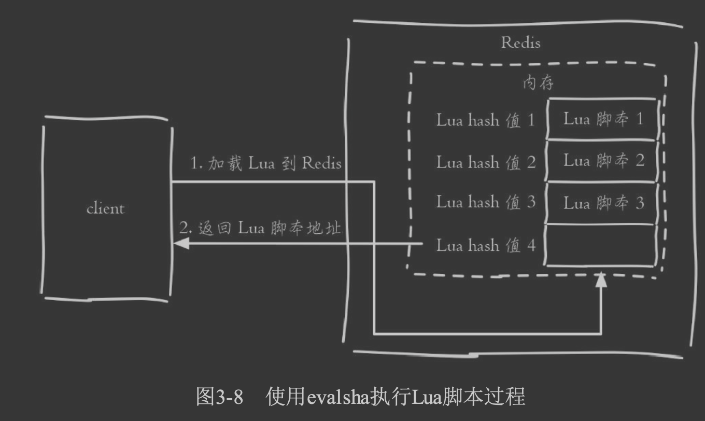
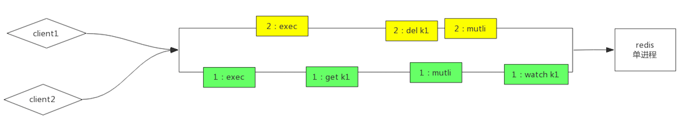

#临界知识
网络传输RTT时间(往返时间)
pipeline,批量发送,流水线,redis处理第一个时同时在发送第二个
pipeline让多个指令传输时不需要等待每条指令的RTT结束
事务会将指令放在一个事务队列,原子执行,但是指令发送过程可能被其他客户端先发送
lua会将指令放在一个事务队列,原子执行
redis使用RESP通信协议,同步等待,通信方式这块不是Redis使用上的性能瓶颈，这一点很重要
[](http://www.redis.cn/documentation.html)
#批量操作


mset,mget,getset
#pipeline
pipeline可能穿插执行,不具有原子性

```$xslt
需要实现Pipeline 功能，需要客户端和服务器端的支持。
Redis 服务器端支持处理一个客户端通过同一个 TCP 连接发来的多个命令。可以理解为，这里将多个命令切分，和处理单个命令一样，
处理完成后会将处理结果缓存起来，所有命令执行完毕后统一打包返回。
```

```$xslt
 原生批量命令是原子的，Pipeline是非原子的。 
·原生批量命令是一个命令对应多个key，Pipeline支持多个命令。
·原生批量命令是Redis服务端支持实现的，而Pipeline需要服务端和客户 端的共同实现。
```
```asp
echo 'set hh 111\r\nsadd nn 1 2 3 4 5\r\nsmembers nn\r\n' | nc 127.0.0.1 6379//非管道
echo -en '*3\r\n$3\r\nSET\r\n$5\r\nhello\r\n$5\r\nworld\r\n*2\r\n$4\r\nincr\r\ n$7\r\ncounter\r\n' | redis-cli --pipe//管道
```
#原子操作lua
脚本和Redis事务一样保证了原子性，执行脚本时不会执行其他脚本或Redis命令（所以不要让脚本运行时间过长），
同样脚本也没有回滚机制，当脚本中出现lua的异常，或者Redis命令错误，也无法保证全部执行成功
[](https://www.jianshu.com/p/88e433ca845b)

```$xslt
Redis 是使用单线程来串行处理客户端的请求操作命令的，所以，当 Redis 执行某个命令操作时，其他命令是无法执行的，这相当于命令操作是互斥执行的。
当然，Redis 的快照生成、AOF 重写这些操作，可以使用后台线程或者是子进程执行，也就是和主线程的操作并行执行。不过，这些操作只是读取数据，
不会修改数据，所以，我们并不需要对它们做并发控制。

你可能也注意到了，虽然 Redis 的单个命令操作可以原子性地执行，但是在实际应用中，数据修改时可能包含多个操作，至少包括读数据、数据增减、
写回数据三个操作，这显然就不是单个命令操作了

Redis 在执行 Lua 脚本时，是可以保证原子性的，lua可以原子的执行多个命令,类似事务
```
DECR id
Lua 脚本

###lua持久化
```$xslt
把这段Lua脚本持久化到AOF文件中，保证Redis重启时可以回放执行过的Lua脚本。

把这段Lua脚本复制给备库执行，保证主备库的数据一致性

Redis要求Lua脚本必须是纯函数的形式了，想象一下给定一段Lua脚本和输入参数却得到了不同的结果，这就会造成重启前后和主备库之间的数据不一致
```
[](http://mysql.taobao.org/monthly/2019/01/06/)
###lua复用
```
eval
evalsha
```
```$xslt
除了使用eval，Redis还提供了evalsha命令来执行Lua脚本。如图3-8所 示，首先要将Lua脚本加载到Redis服务端，得到该脚本的SHA1校验和，
 evalsha命令使用SHA1作为参数可以直接执行对应Lua脚本，避免每次发送 Lua脚本的开销。这样客户端就不需要每次执行脚本内容，而脚本也会常驻 在服务端，脚本功能得到了复用
```



##pipeline vs lua
lua原子执行,pipeline不会原子执行

#事务
multi命令代表事务开始，exec命令代表事务结束,watch乐观锁
```asp
所有的指令在 exec 之前不执行，而是缓存在 服务器的一个事务队列中，服务器一旦收到 exec 指令，
才开执行整个事务队列，执行完毕 后一次性返回所有指令的运行结果。
因为 Redis 的单线程特性，它不用担心自己在执行队列 的时候被其它指令打搅，可以保证他们能得到的「原子性」执行
```
Redis 的事务根本不能算「原子性」，而仅仅是满足了事务的「隔 离性」


##命令语法错误事务不会执行
[](https://time.geekbang.org/column/article/301491)
第一种情况是，在执行 EXEC 命令前，客户端发送的操作命令本身就有错误（比如语法错误，使用了不存在的命令），在命令入队时就被 Redis 实例判断出来了
##运行时错误不回滚
事务操作入队时，命令和操作的数据类型不匹配，但 Redis 实例没有检查出错误。但是，在执行完 EXEC 命令以后，Redis 实际执行这些事务操作时，
就会报错。不过，需要注意的是，虽然 Redis 会对错误命令报错，但还是会把正确的命令执行完。在这种情况下，事务的原子性就无法得到保证了
Redis并不支持回滚功能
[redis深度历险原理5]

##redis与pipeline
当一个事 务内部的指令较多时，需要的网络 IO 时间也会线性增长。所以通常 Redis 的客户端在执行 
事务时都会结合 pipeline 一起使用，这样可以将多次 IO 操作压缩为单次 IO 操作
##watch
确保事务中的key没有被其他客户端修 改过，才执行事务，否则不执行(类似乐观锁)

WATCH 机制的作用是，在事务执行前，监控一个或多个键的值变化情况，当事务调用 EXEC 命令执行时，WATCH 机制会先检查监控的键是否被其它客户端修改了。
如果修改了，就放弃事务执行，避免事务的隔离性被破坏。然后，客户端可以再次执行事务，此时，如果没有并发修改事务数据的操作了，事务就能正常执行，隔离性也得到了保证。
##为什么 Redis 不支持回滚（roll back）


##ACID
A:原子性,不能,运行时异常会继续
C:一致性,不能
I:能,pipeline 
D:不能,异步写入
