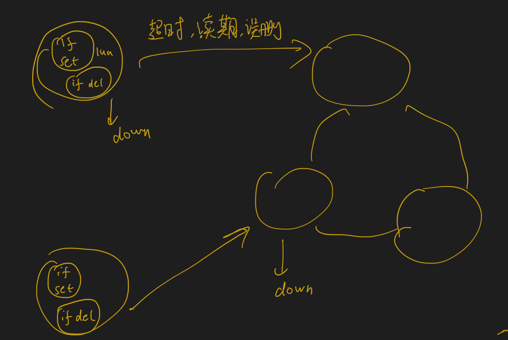
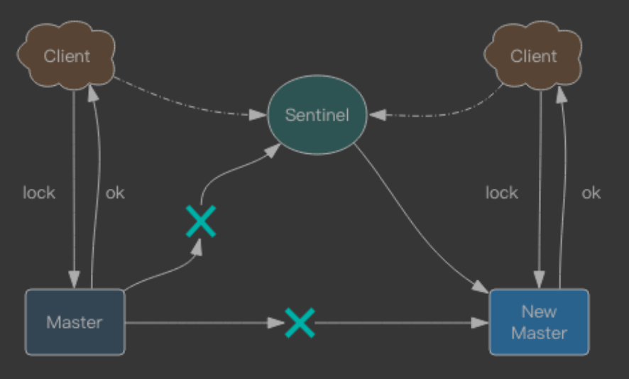
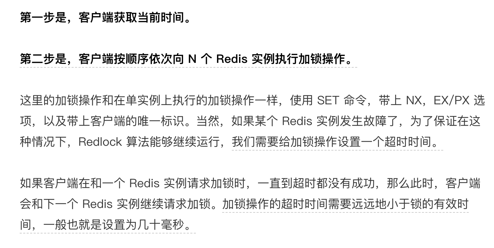
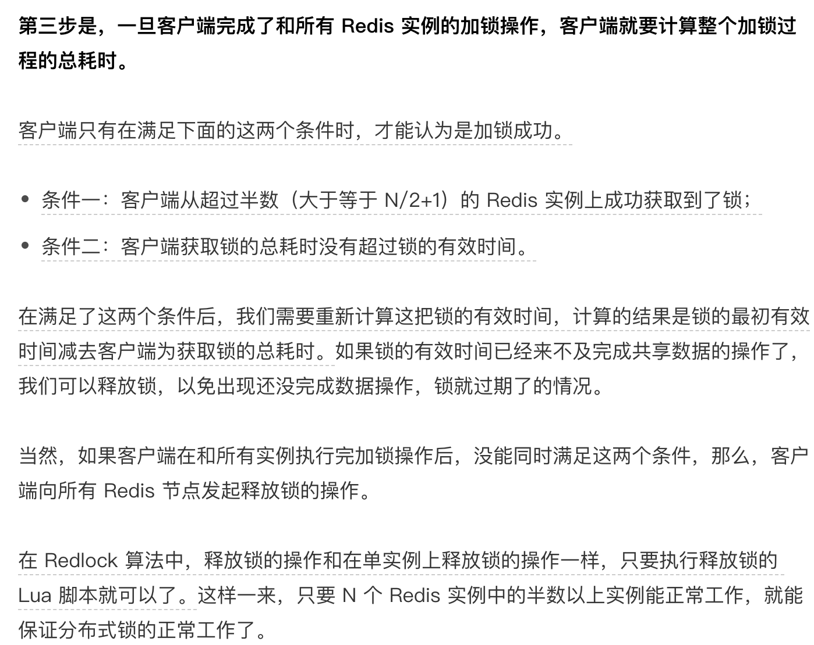

##redis分布式互斥锁

redisson
[](https://time.geekbang.org/column/article/301092)
[](http://zhangtielei.com/posts/blog-redlock-reasoning.html)
###分布式锁实现
而这个外部系统，必须要实现「互斥」的能力，即两个请求同时进来，只会给一个进程返回成功，另一个返回失败（或等待）。
[分布式锁](https://zhuanlan.zhihu.com/p/378797329)
###锁结构
SETNX key value
del
```asp

// 加锁
SETNX lock_key 1
// 业务逻辑
DO THINGS
// 释放锁
DEL lock_key
```
```asp

SET key value [EX seconds | PX milliseconds]  [NX]
```
###应用挂了过期时间
过期时间5s
###续期
watchdog
[](https://www.cnblogs.com/jelly12345/p/14699492.html)
redis分布式锁，看门狗线程挂了怎么办
看门狗异常回调机制,升级为mysql锁?
###超时误删(随机数+lua)
B删除了A的锁:
A锁sleep,
A,B被JVM GC

```asp
1：A客户端先持有锁，但执行业务比较慢；导致超时，服务端认为A已经挂了，释放锁，这时B请求并持有了锁，执行完释放，此时A还持有锁。
2：B先持有锁，超时以后服务端自动释放了锁，A随后获取到了锁，在执行业务过程中，B业务执行完毕，释放锁，此时A还持有锁。
 
如果客户端 A 执行了 SETNX 命令加锁后，假设客户端 B 执行了 DEL 命令释放锁，此时，客户端 A 的锁就被误释放了。如果客户端 C 正好也在申请加锁，
就可以成功获得锁，进而开始操作共享数据。这样一来，客户端 A 和 C 同时在对共享数据进行操作，数据就会被修改错误，这也是业务层不能接受的
```
能区分来自不同客户端的锁操作

我们在加锁操作时，可以让每个客户端给锁变量设置一个唯一值，这里的唯一值就可以用来标识当前操作的客户端。在释放锁操作时，客户端需要判断，
当前锁变量的值是否和自己的唯一标识相等，只有在相等的情况下，才能释放锁。这样一来，就不会出现误释放锁的问题了
```asp

// 加锁, unique_value作为客户端唯一性的标识
SET lock_key unique_value NX PX 10000


//释放锁 比较unique_value是否相等，避免误释放
if redis.call("get",KEYS[1]) == ARGV[1] then
    return redis.call("del",KEYS[1])
else
    return 0
end
```
###可重入
Redis 分 布式锁如果要支持可重入，需要对客户端的 set 方法进行包装，使用线程的 Threadlocal 变量 存储当前持有锁的计数。

###redis服务节点挂了(高可靠的分布式锁)
```asp
在 Sentinel 集群中，主节点挂掉时，从节点会取而代之，客户端上却并没有明显感 知。原先第一个客户端在主节点中申请成功了一把锁，
但是这把锁还没有来得及同步到从节 点，主节点突然挂掉了。然后从节点变成了主节点，这个新的节点内部没有这个锁，所以当 另一个客户端过来请求加锁时，
立即就批准了。这样就会导致系统中同样一把锁被两个客户 端同时持有，不安全性由此产生

使用redlock
会向过半节点发送 set(key, value, nx=True, ex=xxx) 指令，只要过半节点 set 成功，那就认为加锁成功。释放锁时，需要向所有节点发送 del 指令。
不过 Redlock 算法还 需要考虑出错重试、时钟漂移等很多细节问题，同时因为 Redlock 需要向多个节点进行读 写，意味着相比单实例 Redis 性能会下降一些
```

####客户端按顺序依次向 N 个 Redis 实例执行加锁操作
如果客户端在和一个 Redis 实例请求加锁时，一直到超时都没有成功，那么此时，客户端会和下一个 Redis 实例继续请求加锁。加锁操作的超时时间需要远远地小于锁的有效时间，一般也就是设置为几十毫秒。
```asp
第三步是，一旦客户端完成了和所有 Redis 实例的加锁操作，客户端就要计算整个加锁过程的总耗时。客户端只有在满足下面的这两个条件时，
才能认为是加锁成功。条件一：客户端从超过半数（大于等于 N/2+1）的 Redis 实例上成功获取到了锁；条件二：客户端获取锁的总耗时没有超过锁的有效时间。
```


###红锁
##redis阻塞锁(pull vs push)
[](https://blog.csdn.net/ai_xao/article/details/106282538)
push+阻塞队列+订阅发布
后台线程补偿机制
这个线程定时（redis key的过期时间）检测该进程持有的阻塞线程，是否在队列中存在，存在则代表仍然有机会被唤醒，不存在的话，可以考虑中断该线程（除非该线程调用了响应中断的获取锁方法）

double check判断资源加载情况
```asp
lpop()

lock

if(isEmpty())pull

unlock
```
##redis读写锁
##redis可重复锁
