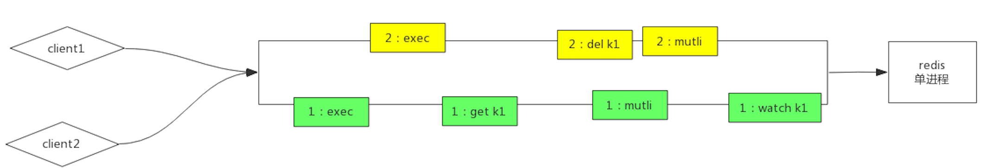

#事务
multi命令代表事务开始，exec命令代表事务结束,watch乐观锁
```asp
所有的指令在 exec 之前不执行，而是缓存在 服务器的一个事务队列中，服务器一旦收到 exec 指令，
才开执行整个事务队列，执行完毕 后一次性返回所有指令的运行结果。
因为 Redis 的单线程特性，它不用担心自己在执行队列 的时候被其它指令打搅，可以保证他们能得到的「原子性」执行
```
Redis 的事务根本不能算「原子性」，而仅仅是满足了事务的「隔 离性」

##命令语法错误事务不会执行
##运行时错误不回滚
Redis并不支持回滚功能
##watch
确保事务中的key没有被其他客户端修 改过，才执行事务，否则不执行(类似乐观锁)
##为什么 Redis 不支持回滚（roll back）
