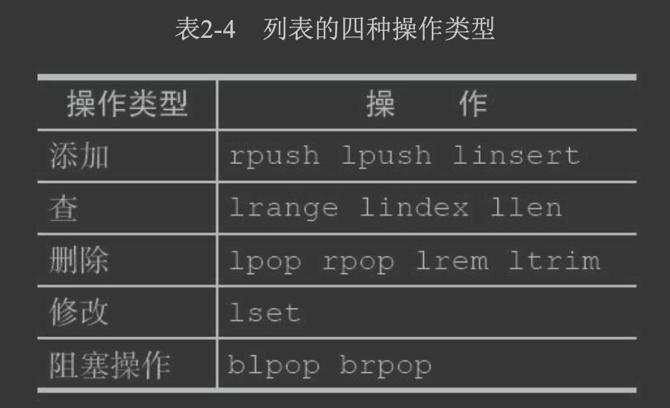
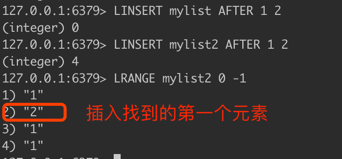
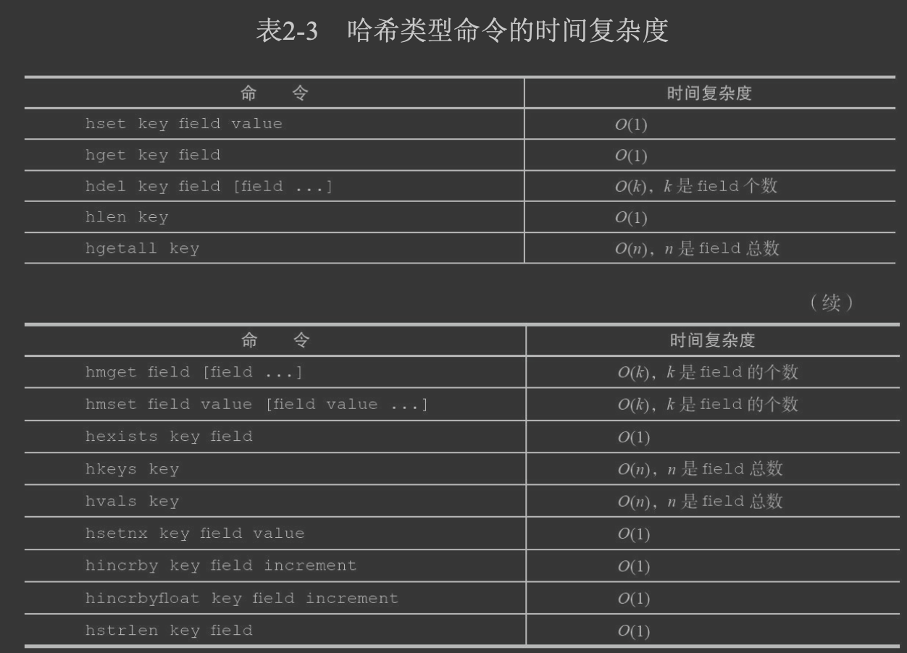
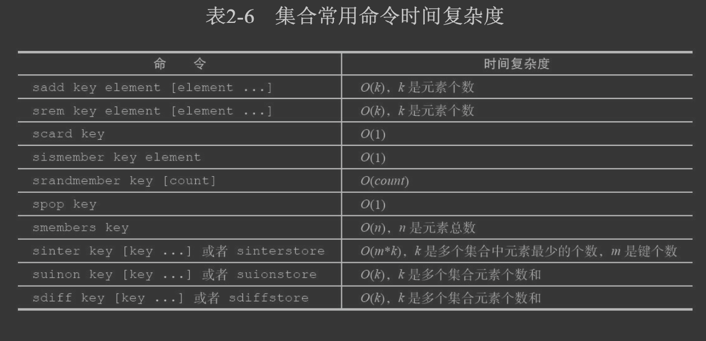
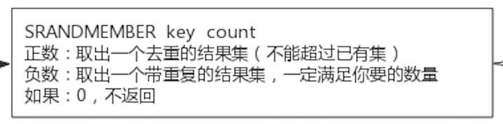
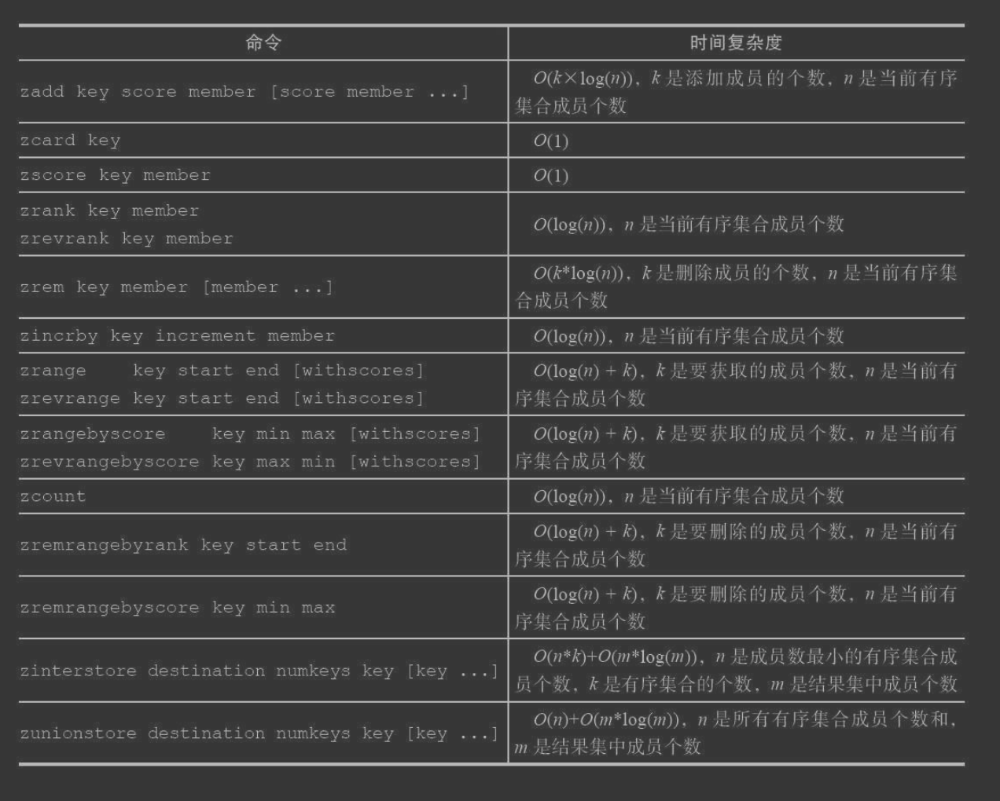
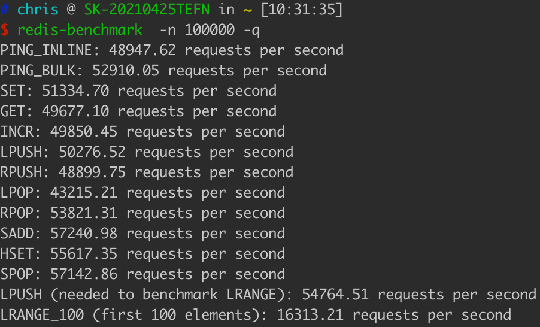

##临界知识
帮助文档
redis组合命令减少网络传输,计算向数据移动(sinter vs sinterstore)
#redis help
127.0.0.1:6379> redis help
help @generic
help @string
#当前对象类型&编码存储方式
type key
object encoding key
debug object programmings
#string操作
[redis开发与运维][2.2.1]
set key value
setnx key value//不存在则创建
setex key  time value//过期时间
MSET
MGET
GETRANGE
APPEND
strlen
incr key//计数
setbit key offset 1,//offset位设置为1
bitcount key,//key中bit=1的个数
bitpos key bit start end,//start到end的字节范围中中,第一个bit的位置
bitop operation destkey key [key ...]//位运算
set key h,//批量设置位图值,h为自己计算出来对应的ascii 

bitfield w get u3 2 (integer) 5//# 从第一个位开始取 4 个位，结果是无符号数 (u)
bitfield w set u8 8 97 # 从第 8 个位开始，将接下来的 8 个位用无符号数 97 替换
#list操作
栈:lpush,lpop; rpush,rpop
队列:lpush,rpop; rpush,lpop
LRANGE key start end
LINDEX key index单播
LREM key count value,
BLPOP key [key ...] timeout，阻塞队列FIFO
BLPOP mylist 30//阻塞30s
BLPOP mylist 0//一直阻塞直到有数据

#hash
HSET key field value [field value ...]
hget key field
hdel key field [field ...]
hexists key field
hgetall key
 
#set

SRANDMEMBER set 8//随机选择8个
SPOP set//随机移除一个

sadd key element [element ...]
srem key element [element ...]
sismember key element
sinter key [key ...]
sdiff key [key ...]
sinterstore destination key [key ...] 
suionstore destination key [key ...] 
sdiffstore destination key [key ...]
#sorted_set
zadd key score member [score member ...]
zrank key member
zincrby key increment member
zrange key start end [withscores]
zrevrange key start end [withscores]
zinterstore destination numkeys key [key ...] [weights weight [weight ...]][aggregate sum|min|max]
zunionstore destination numkeys key [key ...] [weights weight [weight ...]] [aggregate sum|min|max]
zinterstore destset 2 sortedset sortedset weights 1 0.5 aggregate min

#集群操作
##redis服务端
redis-server start
##redis客户端
redis-cli -h 127.0.0.1 -p 6379
##redis压测
redis-benchmark -q -n 100000

redis-benchmark -t set -P 2 -q,管道可以发送的命令数为2
不通过网卡请求数15w/s
通过网卡请求数6w/s
##redis切片集群

[redis开发与运维10.2.3]
cluster meet 127.0.0.1 6381
cluster nodes,集群节点
cluster keyslot key,查看key对应的slot
redis-cli -h 127.0.0.1 -p 6379 cluster addslots {0...5461}
cluster replicate cfb28ef1deee4e0fa78da86abe5d24566744411e

#db
CONFIG GET databases//数据库多少个
flushdb/flushall//清除数据库
dbsize//当前数据库
select 1 //选择数据库
