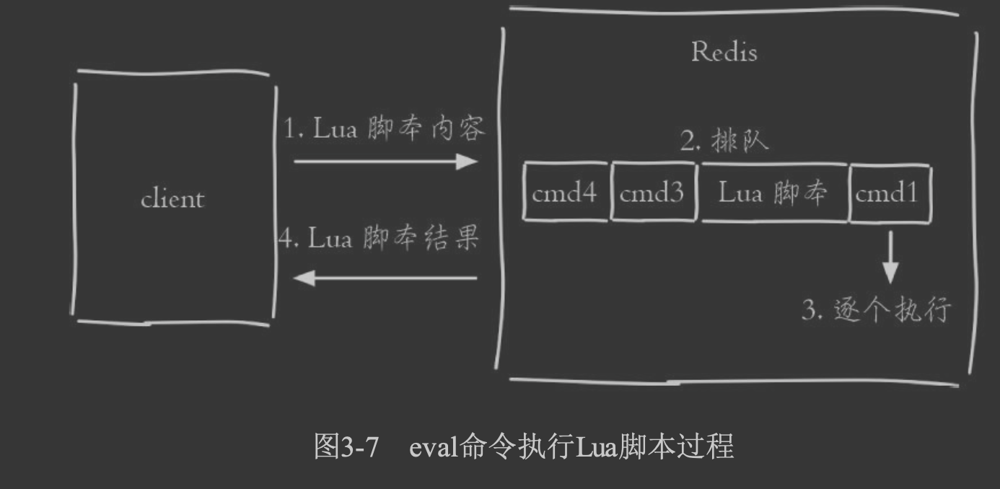

##临界知识
pipeline批量发送命令
非重点知识非重点了解
##参考
[](https://time.geekbang.org/column/article/299806)
##增删改查
PUT
GET
DELETE
范围查询SCAN
存在EXISTS
##数据类型
String  
List  
Hash  
Set  
Sorted Set

##常见操作时间复杂度
###单元素操作HGET,HSET,HDEL
O(1)
###范围操作SCAN
O(n)
Redis 从 2.8 版本开始提供了 SCAN 系列操作（包括 HSCAN，SSCAN 和 ZSCAN），这类操作实现了渐进式遍历，每次只返回有限数量的数据。这样一来，相比于 HGETALL、SMEMBERS 这类操作来说，就避免了一次性返回所有元素而导致的 Redis 阻塞。
###统计操作
O(1)
是指集合类型对集合中所有元素个数的记录，例如 LLEN 和 SCARD。这类操作复杂度只有 O(1)，这是因为当集合类型采用压缩列表、双向链表、整数数组这些数据结构时，这些结构中专门记录了元素的个数统计
###首尾操作
指某些数据结构的特殊记录，例如压缩列表和双向链表都会记录表头和表尾的偏移量。这样一来，对于 List 类型的 LPOP、RPOP、LPUSH、RPUSH 这四个操作来说，它们是在列表的头尾增删元素，这就可以通过偏移量直接定位，所以它们的复杂度也只有 O(1)，可以实现快速操作

##查看redis持久化信息
AOF

##pipeline vs 批量
```$xslt
需要实现Pipeline 功能，需要客户端和服务器端的支持。
Redis 服务器端支持处理一个客户端通过同一个 TCP 连接发来的多个命令。可以理解为，这里将多个命令切分，和处理单个命令一样，处理完成后会将处理结果缓存起来，所有命令执行完毕后统一打包返回。
```

```$xslt
 原生批量命令是原子的，Pipeline是非原子的。 
·原生批量命令是一个命令对应多个key，Pipeline支持多个命令。
·原生批量命令是Redis服务端支持实现的，而Pipeline需要服务端和客户 端的共同实现。
```

##原子操作lua
```$xslt
Redis 是使用单线程来串行处理客户端的请求操作命令的，所以，当 Redis 执行某个命令操作时，其他命令是无法执行的，这相当于命令操作是互斥执行的。
当然，Redis 的快照生成、AOF 重写这些操作，可以使用后台线程或者是子进程执行，也就是和主线程的操作并行执行。不过，这些操作只是读取数据，
不会修改数据，所以，我们并不需要对它们做并发控制。

你可能也注意到了，虽然 Redis 的单个命令操作可以原子性地执行，但是在实际应用中，数据修改时可能包含多个操作，至少包括读数据、数据增减、
写回数据三个操作，这显然就不是单个命令操作了

Redis 在执行 Lua 脚本(lua脚本语言,魔兽世界用到)时，是可以保证原子性的，lua可以原子的执行多个命令
```
DECR id
Lua 脚本

###lua持久化
```$xslt
把这段Lua脚本持久化到AOF文件中，保证Redis重启时可以回放执行过的Lua脚本。

把这段Lua脚本复制给备库执行，保证主备库的数据一致性

Redis要求Lua脚本必须是纯函数的形式了，想象一下给定一段Lua脚本和输入参数却得到了不同的结果，这就会造成重启前后和主备库之间的数据不一致
```
[](http://mysql.taobao.org/monthly/2019/01/06/)
###lua复用
```
eval
evalsha
```
```$xslt
除了使用eval，Redis还提供了evalsha命令来执行Lua脚本。如图3-8所 示，首先要将Lua脚本加载到Redis服务端，得到该脚本的SHA1校验和，
 evalsha命令使用SHA1作为参数可以直接执行对应Lua脚本，避免每次发送 Lua脚本的开销。这样客户端就不需要每次执行脚本内容，而脚本也会常驻 在服务端，脚本功能得到了复用
```


##pipeline vs lua
lua原子执行,pipeline不会原子执行
