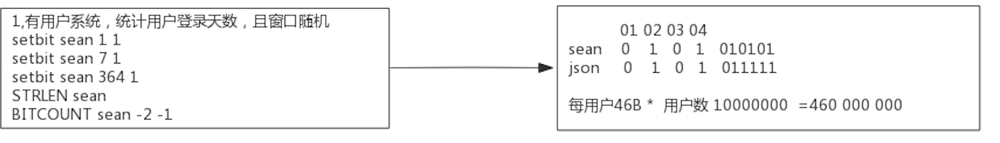
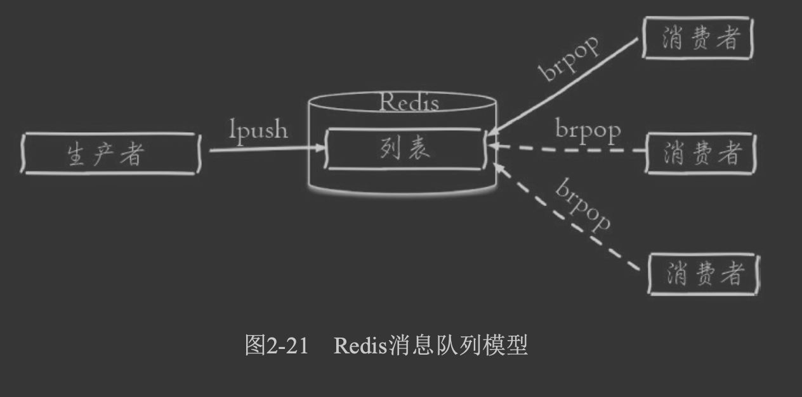

##临界知识
redis的应用场景:缓存,有mysql数据库娄底方案
redis消息队列订阅发布:数据分析类功能,用户链路追踪
redis雪崩穿透问题,基于最终请求都落在mysql,mysql支持的并发就是1000/s
##2核CPU、4GB内存、500G磁盘，Redis实例占用2GB，写读比例为8:2，此时做RDB持久化，产生的风险
```asp
a、内存资源风险：Redis fork子进程做RDB持久化，由于写的比例为80%，那么在持久化过程中，“写实复制”会重新分配整个实例80%的内存副本，大约需要重新分配1.6GB内存空间，
这样整个系统的内存使用接近饱和，如果此时父进程又有大量新key写入，很快机器内存就会被吃光，如果机器开启了Swap机制，那么Redis会有一部分数据被换到磁盘上，当Redis访问这部分在磁盘上的数据时，性能会急剧下降，已经达不到高性能的标准（可以理解为武功被废）。
如果机器没有开启Swap，会直接触发OOM，父子进程会面临被系统kill掉的风险。

b、CPU资源风险：虽然子进程在做RDB持久化，但生成RDB快照过程会消耗大量的CPU资源，虽然Redis处理处理请求是单线程的，但Redis Server还有其他线程在后台工作，例如AOF每秒刷盘、异步关闭文件描述符这些操作。
由于机器只有2核CPU，这也就意味着父进程占用了超过一半的CPU资源，此时子进程做RDB持久化，可能会产生CPU竞争，导致的结果就是父进程处理请求延迟增大，子进程生成RDB快照的时间也会变长，整个Redis Server性能下降。

c、另外，可以再延伸一下，老师的问题没有提到Redis进程是否绑定了CPU，如果绑定了CPU，那么子进程会继承父进程的CPU亲和性属性，子进程必然会与父进程争夺同一个CPU资源，整个Redis Server的性能必然会受到影响！所以如果Redis需要开启定时RDB和AOF重写，进程一定不要绑定CPU。
```
##为什么要用 Redis

内存缓存(效率快),nio(连接数多)
MySQL 这类的数据库的 QPS 大概都在 1w 左右（4 核 8g） ，但是使用 Redis 缓存之后很容易达到 10w+


##自己在项目中使用场景
###思路
5大value类型
基本上就是缓存
为的是服务无状态，延申思考
###string
string:redis缓存,推荐活动的起始时间,从zookeeper读取,缓存到redis中
```asp
redisClient.setex(BEGIN_TIME, EXPIRE_TIME, Long.toString(startByTime));//设置活动开始时间
```
###set
set:服务启动预热sadd,saddExpire缓存常用的用户规则表,服务冷启动时,从redis中获取当天所有已使用的规则(smembers),进行规则表和流程表预热,无需在执行时从文件读取,加快速度,
```asp
saddExpire(RULE_PREFIX + monthDate, ruleSet, 24*60*60);
ruleset<groupId,artifactId,version>,缓存版本信息
服务重启后预加载smembers RULE_PREFIX
```
###sorted_set
sorted_set:记录用户执行的链路节点信息,延时队列,插入某个用户在流程中用到的流程节点信息(统计数据,可丢失)
zadd,延时一秒
```asp
long timeToConsume = System.currentTimeMillis() + (long)delaySeconds * 1000L;
this.jedis.zadd(this.queueName, (double)timeToConsume, member);
```
zremByScore
```asp
Thread consumer = new Thread(() -> {
      while(!this.stop) {
        try {
          if (this.needWaitConsume()) {
            Thread.sleep(1000L);
          } else {
            Set<String> msgs = this.jedis.zremByScore(this.queueName, 0.0D, (double)System.currentTimeMillis(), 16);
            if (msgs.isEmpty()) {
              Thread.sleep(1000L);
            } else {
              Iterator var2 = msgs.iterator();

              while(var2.hasNext()) {
                String msg = (String)var2.next();
                this.threadPoolExecutor.submit(() -> {
                  log.debug("trying to process msg {}", msg);
                  Object o = this.gson.fromJson(msg, this.processor.messageType());
                  this.processor.process(o, Maps.newHashMap());
                });
              }
            }
          }
        } catch (Exception var4) {
        }
      }
      
      
public Set<String> zremByScore(String key, double rangeMin, double rangeMax, int count) {
    List result = (List)this.jc.eval("local expiredValues = redis.call('zrangebyscore', KEYS[1], ARGV[1], ARGV[2], 'limit', 0, ARGV[3]);  if #expiredValues > 0 then     redis.call('zrem', KEYS[1], unpack(expiredValues));  end;return expiredValues;", Collections.singletonList(key), Lists.newArrayList(new String[]{"" + rangeMin, "" + rangeMax, "" + count}));
    return Sets.newHashSet(result);
  }
```
zrangebyscore 和 zrem 一同挪到服务器端进行原子化操作，这样多个进程之间争抢任务时就不 会出现这种浪费了
####为啥延时
延时避免mysql连接数飙升,击穿mysql
###list
list:消息队列:执行6s超时告警太多,为了优化执行,将用户链路追踪的sql异步化处理(规则流程节点太多时,插入sql次数很多,耗时太多),使用redis消息队列(统计数据,可丢失,用户历史记录不需要保证可靠性)
lpush,rpop,
BRPOP mylist 0
###hash
hash:统计流程节点链路执行次数,按小时建立hash表(方便按时间删除),每个key是processId+nodeId,val是计数,定时异步刷新流程节点数据到数据库,优化流程执行速度(统计数据,可丢失,)
hincr key field value
hgetAll key 
hdel key field
####为啥用hash?直接用string也可以?
string:每个字符串额外占用16B+3B+1B=20B
```asp
struct RedisObject {
    int4 type; // 4bits
    int4 encoding; // 4bits
    int24 lru; // 24bits
    int32 refcount; // 4bytes,4字节
    void *ptr; // 8bytes,8字节,64-bit system
} robj;

struct SDS<T> {
    T capacity; // 数组容量
    T len; // 数组长度
    byte flags; // 特殊标识位，不理睬它 byte[] content; // 数组内容
}
```
hash < 64B * 512时,头部占用16B+4B+4B+2B+1B=27B,每个占用4B,远小于单独用string
```asp
struct ziplist<T> {
    int32 zlbytes; // 整个压缩列表占用字节数
    int32 zltail_offset; // 最后一个元素距离压缩列表起始位置的偏移量，用于快速定位到最后一个
    节点
    int16 zllength; // 元素个数
    T[] entries; // 元素内容列表，挨个挨个紧凑存储 
    int8 zlend; // 标志压缩列表的结束，值恒为 0xFF
}

struct entry {
    int<var> prevlen; // 前一个 entry 的字节长度 int<var> encoding; // 元素类型编码
    optional byte[] content; // 元素内容
}
```
##string应用场景
###数值
数值:播放量,点赞数,评论数
###位图bitmap
bitmap:统计用户登录天数,统计某时间段活跃用户数,用户签到次数


###bitmap如何保证签到事务性?
##list应用场景
消息队列,单播


文章列表
##hash应用场景

##set
随机事件,抽奖
人少奖品多,人多奖品少
SRANDMEMBER set 8//抽到8个不重复的
SPOP set//抽到一个并移除
```asp
集合类型比较典型的使用场景是标签(tag)。例如一个用户可能对娱 乐、体育比较感兴趣，另一个用户可能对历史、新闻比较感兴趣，这些兴趣 点就是标签。
有了这些数据就可以得到喜欢同一个标签的人，以及用户的共 同喜好的标签，
这些数据对于用户体验以及增强用户黏度比较重要。例如一 个电子商务的网站会对不同标签的用户做不同类型的推荐，
比如对数码产品 比较感兴趣的人，在各个页面或者通过邮件的形式给他们推荐最新的数码产 品，通常会为网站带来更多的利益。
```
##sorted set应用场景
```asp
有序集合比较典型的使用场景就是排行榜系统。例如视频网站需要对用 户上传的视频做排行榜，榜单的维度可能是多个方面的:
按照时间、按照播 放数量、按照获得的赞数

zset 还可以用来存储学生的成绩，value 值是学生的 ID，score 是他的考试成绩。
我们 可以对成绩按分数进行排序就可以得到他的名次。

```
##redis原子操作
##redis分布式锁
##消息队列
##发布订阅
##公司redis双集群互通吗?如何切换集群?
c3:切片集群+一主一备?
双机房,LVS切割?
#redis穿透(mysql无数据)
redis&mysql体系,将复杂度和成本前置

1.能承受的qps:redis,10w/s;mysql,1000/s
2.redis串行,即使访问mysql无数据(1000/s)后设置redis占位符,也是串行执行,此时可能redis(10w/s)排队了几千个请求,仍会打到mysql
放大前置环节的复杂度,当redis取不到数据(取到不加锁)时,进行加分布式redis锁请求mysql,然后更新redis的占位符,未抢到锁的阻塞
[z_04_分布式_redis_01_缓存问题_缓存一致性_缓存穿透_缓存击穿_缓存雪崩_布隆过滤器&优化.md]


#redis击穿
热点key没有被缓存,或者过期,大量并发过来


#redis双写一致性问题?


#redis雪崩
不同key在不同分片


#redis是单线程还是多线程?
#redis存在线程安全的问题吗?为什么?
#redis渐进式hash
原理
