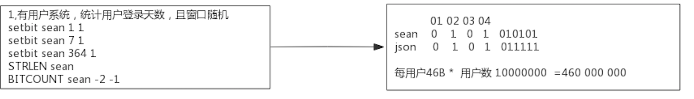
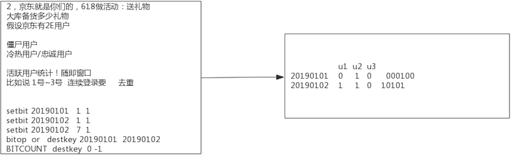
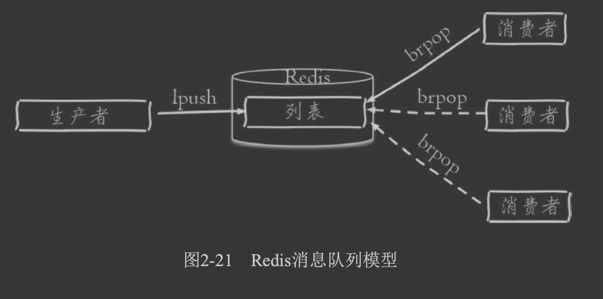
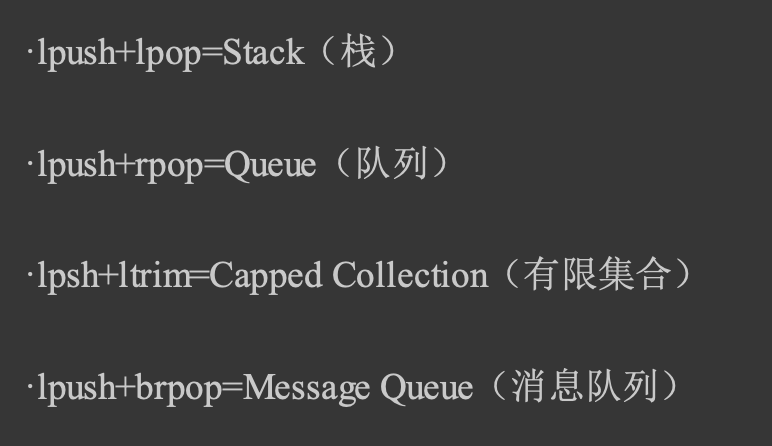
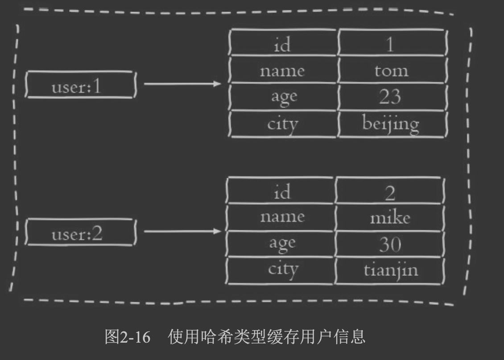
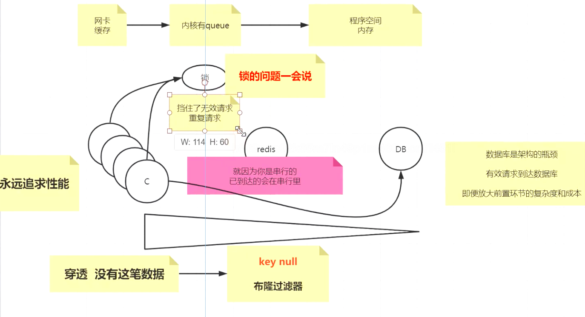
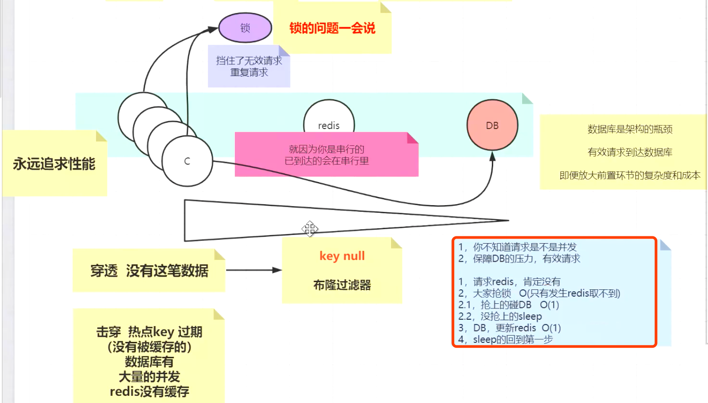

##临界知识
redis的应用场景:缓存,有mysql数据库娄底方案
redis消息队列订阅发布:数据分析类功能,用户链路追踪
redis雪崩穿透问题,基于最终请求都落在mysql,mysql支持的并发就是1000/s
##2核CPU、4GB内存、500G磁盘，Redis实例占用2GB，写读比例为8:2，此时做RDB持久化，产生的风险
```asp
a、内存资源风险：Redis fork子进程做RDB持久化，由于写的比例为80%，那么在持久化过程中，“写实复制”会重新分配整个实例80%的内存副本，大约需要重新分配1.6GB内存空间，
这样整个系统的内存使用接近饱和，如果此时父进程又有大量新key写入，很快机器内存就会被吃光，如果机器开启了Swap机制，那么Redis会有一部分数据被换到磁盘上，当Redis访问这部分在磁盘上的数据时，性能会急剧下降，已经达不到高性能的标准（可以理解为武功被废）。
如果机器没有开启Swap，会直接触发OOM，父子进程会面临被系统kill掉的风险。

b、CPU资源风险：虽然子进程在做RDB持久化，但生成RDB快照过程会消耗大量的CPU资源，虽然Redis处理处理请求是单线程的，但Redis Server还有其他线程在后台工作，例如AOF每秒刷盘、异步关闭文件描述符这些操作。
由于机器只有2核CPU，这也就意味着父进程占用了超过一半的CPU资源，此时子进程做RDB持久化，可能会产生CPU竞争，导致的结果就是父进程处理请求延迟增大，子进程生成RDB快照的时间也会变长，整个Redis Server性能下降。

c、另外，可以再延伸一下，老师的问题没有提到Redis进程是否绑定了CPU，如果绑定了CPU，那么子进程会继承父进程的CPU亲和性属性，子进程必然会与父进程争夺同一个CPU资源，整个Redis Server的性能必然会受到影响！所以如果Redis需要开启定时RDB和AOF重写，进程一定不要绑定CPU。
```
##为什么要用 Redis

内存缓存(效率快),nio(连接数多)
MySQL 这类的数据库的 QPS 大概都在 1w 左右（4 核 8g） ，但是使用 Redis 缓存之后很容易达到 10w+


##自己在项目中使用场景
###思路
5大value类型
基本上就是缓存
为的是服务无状态，延申思考
###例子
string:redis缓存,活动推广短连接:setExpire
string:redis分布式锁,多个客户端去服务端拿token并缓存token,token拿到会使老的token过期,需要避免同时拿token
```$xslt
2个客户端
判断token是否过期
过期则去拿锁
拿到锁判断是否过期
过期则请求刷新token
请求token失败,释放锁重试三次(避免网络延时)，三次仍失败打点
```
set:缓存常用的用户规则,saddExpire服务冷启动时,从redis中获取所有已加载的规则(smembers)

sorted_set:延时队列,批量插入某个用户在流程中用到的所有变量(统计数据,可丢失)

list:消息队列:执行6s超时告警太多,为了优化执行,将用户链路追踪的sql异步化处理(规则流程节点太多时,插入sql次数很多,耗时太多),使用redis消息队列(统计数据,可丢失,用户历史记录不需要保证可靠性)

hash:按小时建立hash表(方便按时间删除),每个key是processId+nodeId,val是计数,定时异步刷新流程节点数据到数据库,优化流程执行速度(统计数据,可丢失,)
##string应用场景
###数值
数值:播放量,点赞数,评论数
###位图bitmap
bitmap:统计用户登录天数,统计某时间段活跃用户数,用户签到次数


###bitmap如何保证签到事务性?
##list应用场景
消息队列,单播


文章列表
##hash应用场景

##set
随机事件,抽奖
人少奖品多,人多奖品少
SRANDMEMBER set 8//抽到8个不重复的
SPOP set//抽到一个并移除
```asp
集合类型比较典型的使用场景是标签(tag)。例如一个用户可能对娱 乐、体育比较感兴趣，另一个用户可能对历史、新闻比较感兴趣，这些兴趣 点就是标签。
有了这些数据就可以得到喜欢同一个标签的人，以及用户的共 同喜好的标签，
这些数据对于用户体验以及增强用户黏度比较重要。例如一 个电子商务的网站会对不同标签的用户做不同类型的推荐，
比如对数码产品 比较感兴趣的人，在各个页面或者通过邮件的形式给他们推荐最新的数码产 品，通常会为网站带来更多的利益。
```
##sorted set应用场景
```asp
有序集合比较典型的使用场景就是排行榜系统。例如视频网站需要对用 户上传的视频做排行榜，榜单的维度可能是多个方面的:
按照时间、按照播 放数量、按照获得的赞数

zset 还可以用来存储学生的成绩，value 值是学生的 ID，score 是他的考试成绩。
我们 可以对成绩按分数进行排序就可以得到他的名次。

```
##redis原子操作
##redis分布式锁
redisson
[](https://github.com/redis/redis-doc/blob/master/topics/distlock.md)
[](https://time.geekbang.org/column/article/301092)
[](http://zhangtielei.com/posts/blog-redlock-reasoning.html)
setnx,del
###应用挂了
过期时间5s

###A超时误删B的锁
```asp
Redis 的分布式锁不能解决超时问题，如果在加锁和释放锁之间的逻辑执行的太长，以至 于超出了锁的超时限制，就会出现问题。
因为这时候锁过期了，第二个线程重新持有了这把锁， 但是紧接着第一个线程执行完了业务逻辑，就把锁给释放了，第三个线程就会在第二个线程逻 辑执行完之间拿到了锁

tag = random.nextint() # 随机数 if redis.set(key, tag, nx=True, ex=5)://setnx,SET if Not eXists
do_something()
redis.delifequals(key, tag) # 假象的 delifequals 指令
有一个更加安全的方案是为 set 指令的 value 参数设置为一个随机数，释放锁时先匹配 随机数是否一致，然后再删除 key。但是匹配 value 和删除 key 不是一个原子操作，
Redis 也 没有提供类似于 delifequals 这样的指令，这就需要使用 Lua 脚本来处理了，因为 Lua 脚本可 以保证连续多个指令的原子性执行。

# delifequals
if redis.call("get",KEYS[1]) == ARGV[1] then
return redis.call("del",KEYS[1])
else
return 0
end
```
###可重入
Redis 分 布式锁如果要支持可重入，需要对客户端的 set 方法进行包装，使用线程的 Threadlocal 变量 存储当前持有锁的计数。

###redis服务挂了
```asp
在 Sentinel 集群中，主节点挂掉时，从节点会取而代之，客户端上却并没有明显感 知。原先第一个客户端在主节点中申请成功了一把锁，
但是这把锁还没有来得及同步到从节 点，主节点突然挂掉了。然后从节点变成了主节点，这个新的节点内部没有这个锁，所以当 另一个客户端过来请求加锁时，
立即就批准了。这样就会导致系统中同样一把锁被两个客户 端同时持有，不安全性由此产生

使用redlock
会向过半节点发送 set(key, value, nx=True, ex=xxx) 指令，只要过半节点 set 成功，那就认为加锁成功。释放锁时，需要向所有节点发送 del 指令。
不过 Redlock 算法还 需要考虑出错重试、时钟漂移等很多细节问题，同时因为 Redlock 需要向多个节点进行读 写，意味着相比单实例 Redis 性能会下降一些
```

##消息队列
##发布订阅
##公司redis双集群互通吗?如何切换集群?
c3:切片集群+一主一备?
双机房,LVS切割?

#redis穿透(mysql无数据)
redis&mysql体系,将复杂度和成本前置

1.能承受的qps:redis,10w/s;mysql,1000/s
2.redis串行,即使访问mysql无数据(1000/s)后设置redis占位符,也是串行执行,此时可能redis(10w/s)排队了几千个请求,仍会打到mysql
    放大前置环节的复杂度,当redis取不到数据(取到不加锁)时,进行加分布式redis锁请求mysql,然后更新redis的占位符,未抢到锁的阻塞
[z_04_分布式_redis_01_缓存问题_缓存一致性_缓存穿透_缓存击穿_缓存雪崩_布隆过滤器&优化.md]
#redis击穿
热点key没有被缓存,或者过期,大量并发过来


#redis雪崩
不同key在不同分片
#常见面试题
```asp
1. 说一下你在项目中的redis的应用场景？

   ```
   1，5大value类型：根据我的redis课有场景的介绍
   2，基本上就是缓存~！
   3，为的是服务无状态，延申思考，看你的项目有哪些数据结构或对象，在单机里需要单机锁，在多机需要分布式锁，抽出来放入redis中；
   4，无锁化
   ```

2. redis是单线程还是多线程？

   ```
   1，无论什么版本，工作线程就是一个
   2，6.x高版本出现了IO多线程
   3，使用上来说，没有变化
   ------
   3，[去学一下系统IO课]，你要真正的理解面向IO模型编程的时候，有内核的事，从内核把数据搬运到程序里这是第一步，然后，搬运回来的数据做的计算式第二步，netty
   4，单线程，满足redis的串行原子，只不过IO多线程后，把输入/输出放到更多的线程里去并行，好处如下：1，执行时间缩短，更快；2，更好的压榨系统及硬件的资源(网卡能够高效的使用)；
   *，客户端被读取的顺序不能被保障
   那个顺序时可以被保障的：在一个连接里，socket里
   ```

3. redis存在线程安全的问题吗？为什么？

   ```
   重复2中的单线程串行
   redis可以保障内部串行
   外界使用的时候要保障，业务上要自行保障顺序~！
   ```

4. 遇到过缓存穿透吗？详细描述一下。

5. 遇到过缓存击穿吗？详细描述一下。

6. 如何避免缓存雪崩？

   ```
   以上问题，核心就是避免DB无效/重复请求，结合图去理解
   涉及一些架构思想上的提升
   ```

7. Redis是怎么删除过期key的？

8. 缓存如何回收的？

   ```
   1，后台在轮询，分段分批的删除哪些过期的key
   2，请求的时候判断时候已经过期了
   尽量的把内存无用空间回收回来~！
   ```

9. 缓存是如何淘汰的

   ```
   0，内存空间不足的情况下：
   1，淘汰机制里有不允许淘汰
   2，lru/lfu/random/TTL
   3，全空间
   4，设置过过期的key的集合中
   ```

10. 如何进行缓存预热？

    ```
    1，提前把数据塞入redis，(你知道那些是热数据吗？肯定不知道，会造成上线很多数据没有缓存命中)
    2，开发逻辑上也要规避差集(你没缓存的)，会造成击穿，穿透，雪崩，实施456中的锁方案
    3，一劳永逸，未来也不怕了
    *，结合4，5，6点去看，看图理解
    ```

11. 数据库与缓存不一致如何解决？

    ```
    1，恶心点的，我们可以使用分布式事务来解决，（意义不大），顶多读多，写稀有情况下
    结合图去思考
    1，redis是缓存，更倾向于稍微的有时差
    2，还是减少DB的操作
    3，真的要落地，咱就canal吧
    ```

12. 简述一下主从不一致的问题？

    ```
    1，redis的确默认是弱一致性，异步的同步
    2，锁不能用主从(单实例/分片集群/redlock)==>redisson
    3，在配置中提供了必须有多少个Client连接能同步，你可以配置同步因子，趋向于强制一性
    4，wait 2 0  小心
    5，34点就有点违背redis的初衷了
    ```

13. 描述一下redis持久化原理？

    ```
    当前线程阻塞服务 不聊
    异步后台进程完成持久
    fork  +  cow
    ```

14. Redis有哪些持久化方式？

    ```
    1，RDB，AOF；主从同步也算持久化；
    2，高版本：开启AOF，AOF是可以通过执行日志得到全部内存数据的方式，但是追求性能：
    2.1，体积变大，重复无效指令  重写，后台用线程把内存的kv生成指令写个新的aof
    2.2，4.x 新增更有性能模式：把重写方式换成直接RDB放到aof文件的头部，比2.1的方法快了，再追加日志
    ```

15. Redis也打不住了，万级流量会打到DB上，该怎么处理？

    ```
    见456
    ```

16. redis中的事务三条指令式什么，第三条指令到达后执行失败了，怎么处理

    ```
    见图
    ```

17. redis实现分布式锁的指令

18. 为什么使用setnx？

    ```
    1，好东西，原子（不存在的情况下完成创建）
    2，如果要做分布式锁，就要用set k v nx ex  (不存在，过期时间，避免死锁)
    ```

19. 分布式锁实现，理论：
```
