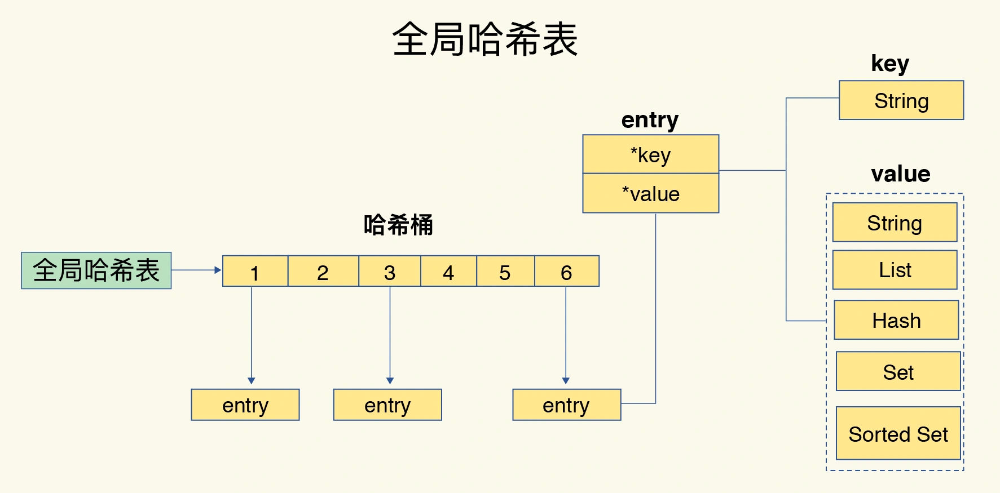
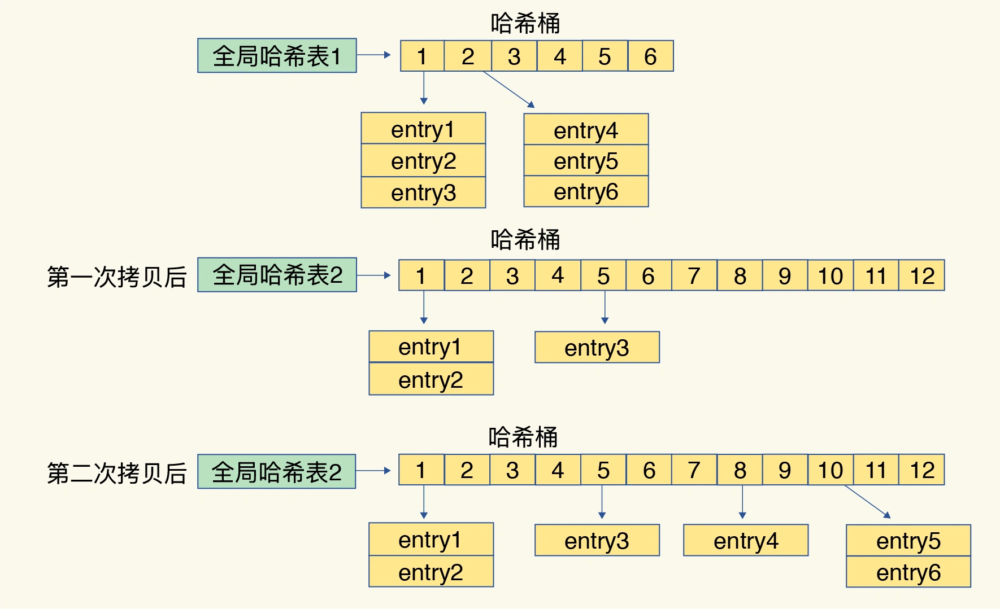
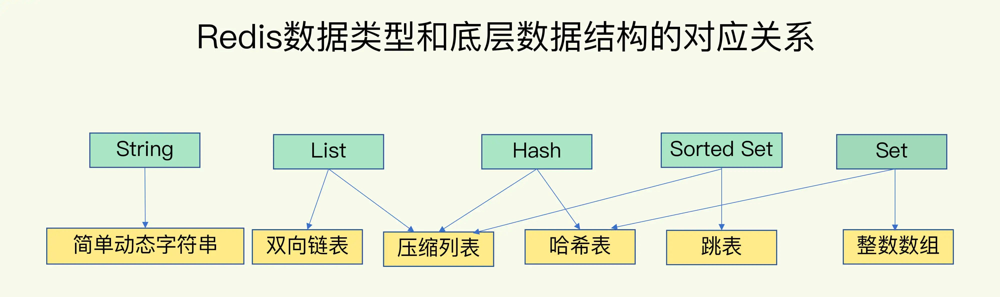
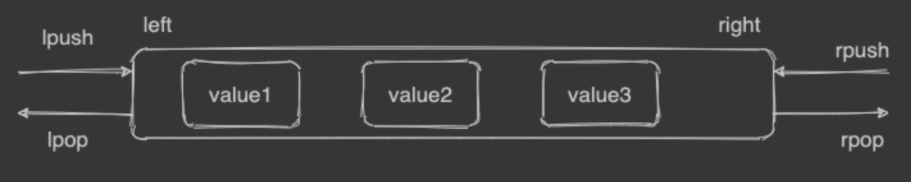
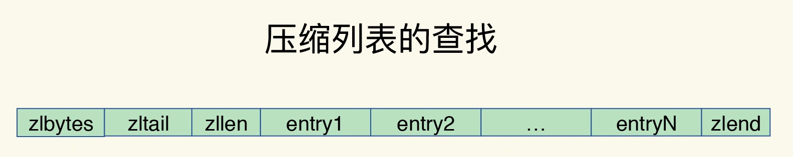
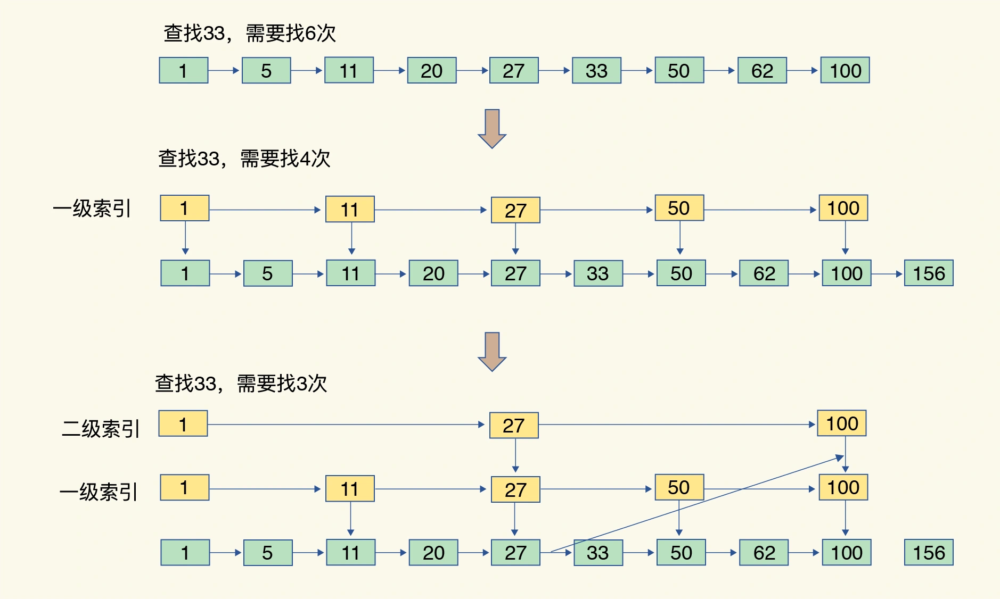
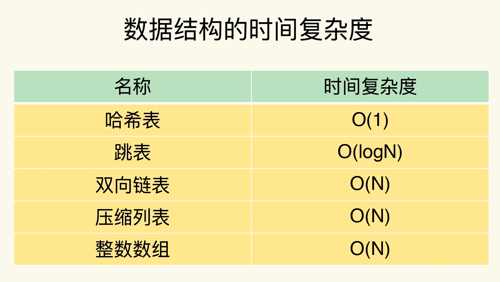

##key value数据结构
###hash表
哈希表来保存所有键值对
哈希桶中的元素保存的并不是值本身，而是指向具体值的指针。这也就是说，不管值是 String，还是集合类型，哈希桶中的元素都是指向它们的指针

###hash冲突
链式哈希

###渐进式rehash过程
```asp
给哈希表 2 分配更大的空间，例如是当前哈希表 1 大小的两倍；
把哈希表 1 中的数据重新映射并拷贝到哈希表 2 中；
释放哈希表 1 的空间。
```

这样就巧妙地把一次性大量拷贝的开销，分摊到了多次处理请求的过程中，避免了耗时操作，保证了数据的快速访问。
##value的数据结构

###哈希表
###双向链表

###压缩数组

###跳表
[](https://zhuanlan.zhihu.com/p/101143158/)

O(logN)


##list/hash/set/sorted set使用数组原因
```asp
1、内存利用率，数组和压缩列表都是非常紧凑的数据结构，它比链表占用的内存要更少。Redis是内存数据库，大量数据存到内存中，此时需要做尽可能的优化，提高内存的利用率。

2、数组对CPU高速缓存支持更友好，所以Redis在设计时，集合数据元素较少情况下(64B)，默认采用内存紧凑排列的方式存储，同时利用CPU高速缓存不会降低访问速度。当数据元素超过设定阈值后，避免查询时间复杂度太高，转为哈希和跳表数据结构存储，保证查询效率。
```
###基数树
字典树(Trie Tree)就是n=26的基数树。或者说基数树是字典树的一个扩展
[](https://cloud.tencent.com/developer/article/1597128)
[](https://juejin.cn/post/6933244263241089037)
####为啥不用hashmap，不用红黑树?
key比较多,hashmap会产生大量hash冲突和扩容
红黑树,不节省空间,不支持前缀查找
####前缀树/字典树
1.多叉查找树
2.将每个key拆分成每个单位长度字符，然后对应到每个分支,分支所在的节点对应为从根节点到当前节点的拼接出的key的值
3.公共前缀共享,避免了很多重复的存储
####压缩后的前缀树
有些单位字符没必要拆分,这样压缩后，不可分叉的分支高度也变矮
```asp
  这是最基本的表示方式:
 
               (f) ""
                 \
                 (o) "f"
                   \
                   (o) "fo"
                     \
                   [t   b] "foo"
                   /     \
          "foot" (e)     (a) "foob"
                 /         \
       "foote" (r)         (r) "fooba"
               /             \
     "footer" []             [] "foobar"
 

```
#常见操作时间复杂度
##string

###单元素操作HGET,HSET,HDEL
O(1)
###范围操作SCAN
O(n)
Redis 从 2.8 版本开始提供了 SCAN 系列操作（包括 HSCAN，SSCAN 和 ZSCAN），这类操作实现了渐进式遍历，每次只返回有限数量的数据。这样一来，相比于 HGETALL、SMEMBERS 这类操作来说，就避免了一次性返回所有元素而导致的 Redis 阻塞。
###统计操作
O(1)
是指集合类型对集合中所有元素个数的记录，例如 LLEN 和 SCARD。这类操作复杂度只有 O(1)，这是因为当集合类型采用压缩列表、双向链表、整数数组这些数据结构时，这些结构中专门记录了元素的个数统计
###首尾操作
指某些数据结构的特殊记录，例如压缩列表和双向链表都会记录表头和表尾的偏移量。这样一来，对于 List 类型的 LPOP、RPOP、LPUSH、RPUSH 这四个操作来说，它们是在列表的头尾增删元素，这就可以通过偏移量直接定位，所以它们的复杂度也只有 O(1)，可以实现快速操作
