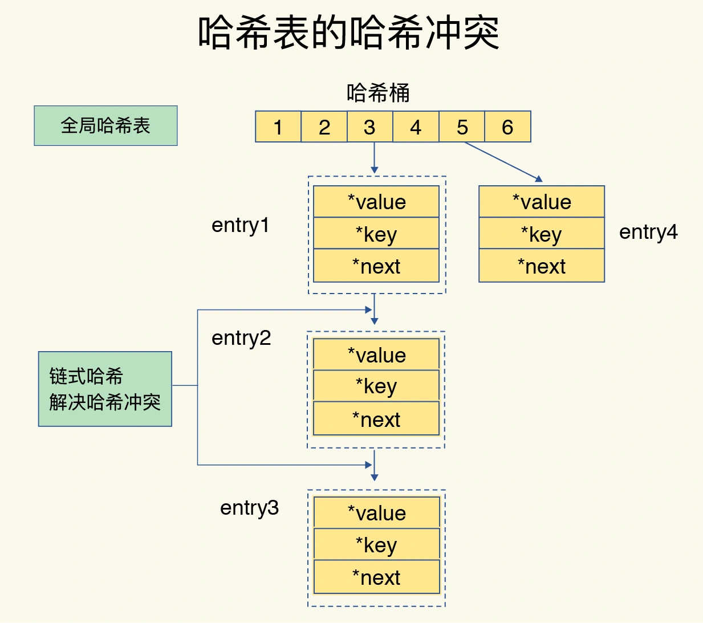
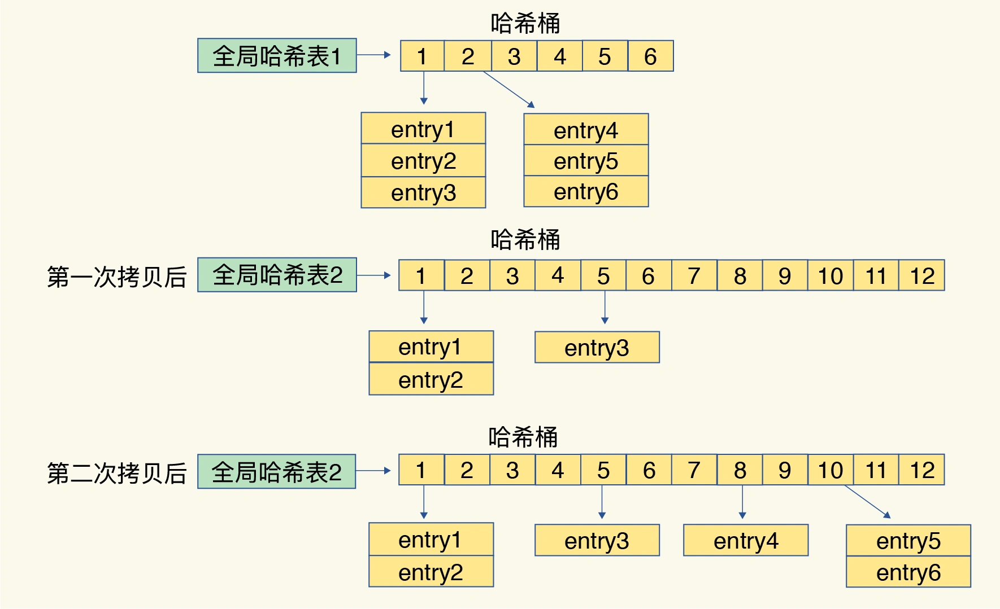
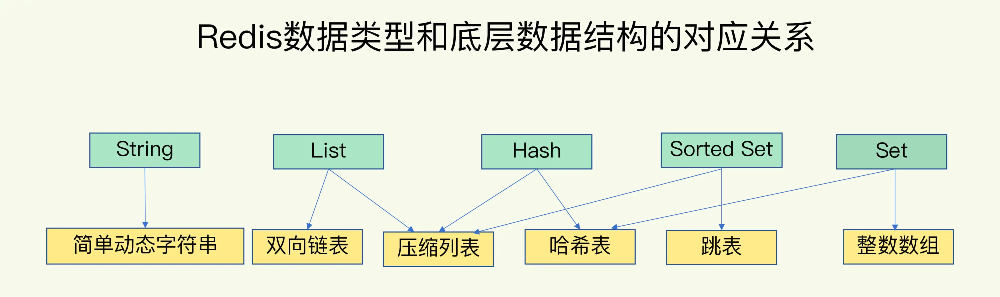
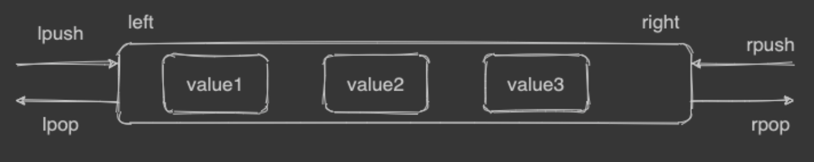
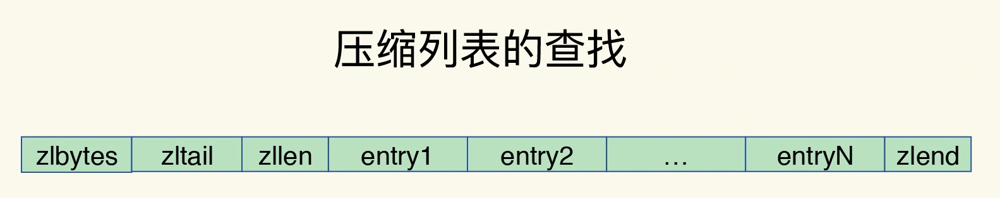
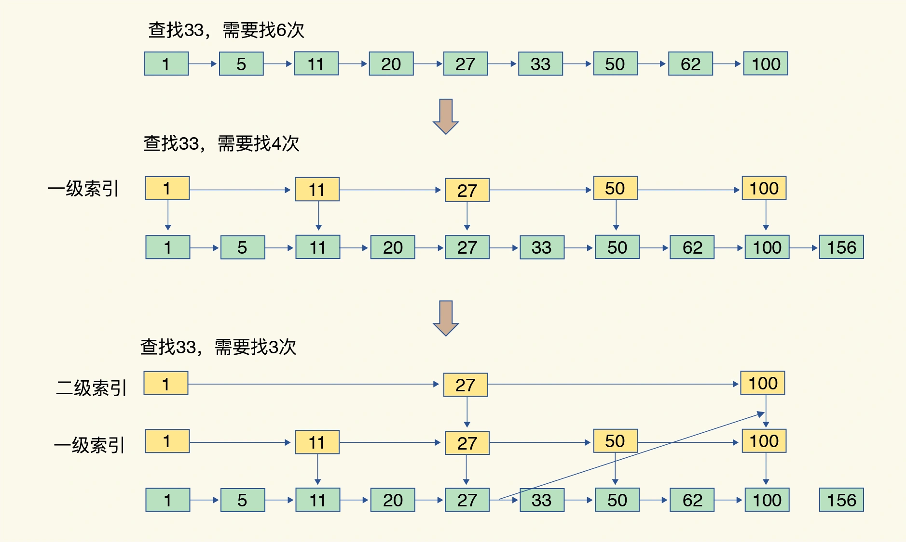
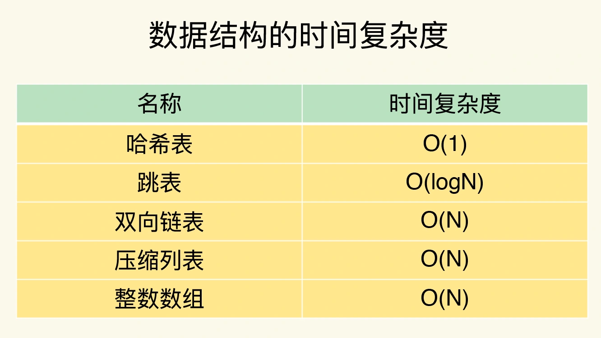

##key value数据结构
###hash表
哈希表来保存所有键值对
哈希桶中的元素保存的并不是值本身，而是指向具体值的指针。这也就是说，不管值是 String，还是集合类型，哈希桶中的元素都是指向它们的指针

###hash冲突
链式哈希

###渐进式rehash过程
```asp
给哈希表 2 分配更大的空间，例如是当前哈希表 1 大小的两倍；
把哈希表 1 中的数据重新映射并拷贝到哈希表 2 中；
释放哈希表 1 的空间。
```

这样就巧妙地把一次性大量拷贝的开销，分摊到了多次处理请求的过程中，避免了耗时操作，保证了数据的快速访问。
##value的数据结构

###哈希表
###双向链表

###压缩数组

###跳表

O(logN)


##list/hash/set/sorted set使用数组原因
```asp
1、内存利用率，数组和压缩列表都是非常紧凑的数据结构，它比链表占用的内存要更少。Redis是内存数据库，大量数据存到内存中，此时需要做尽可能的优化，提高内存的利用率。

2、数组对CPU高速缓存支持更友好，所以Redis在设计时，集合数据元素较少情况下(64B)，默认采用内存紧凑排列的方式存储，同时利用CPU高速缓存不会降低访问速度。当数据元素超过设定阈值后，避免查询时间复杂度太高，转为哈希和跳表数据结构存储，保证查询效率。
```
