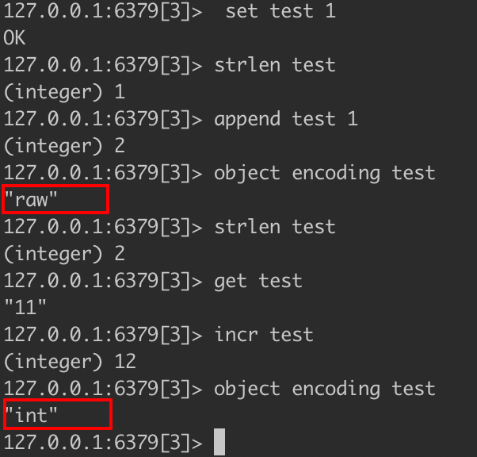

##临界知识
redis对象结构体,type配置数据类型,encoding配套每个数据类型下的多种存储方式
字符串由动态数组组成,每次扩容*2
字符串embstr不可变,int(append)->raw,embstr(append)->raw
bitmap应用场景
pipeline批量发送命令,减少网络数据传输
redis组合操作减少网络传输,计算向数据移动(sinter vs sinterstore)
非重点知识非重点了解
二进制编码解码
每个数据结构都有两种切换模式:数据少时使用结构紧凑型减少空间占用,数据多时使用数据结构加快增删改查效率
##参考
[](https://time.geekbang.org/column/article/299806)
##二进制安全问题

redis只存储原始字节数据,不对数据进行编码解码,编码解码过程发生在客户端,因此客户端之间需要协商好
##Redis对象头结构体
```asp
所有的 Redis 对象都有 下面的这个结构头:
struct RedisObject {
    int4 type; // 4bits
    int4 encoding; // 4bits
    int24 lru; // 24bits
    int32 refcount; // 4bytes
    void *ptr; // 8bytes，64-bit system
} robj;
不同的对象具有不同的类型 type(4bit)，同一个类型的 type 会有不同的存储形式 encoding(4bit)，
为了记录对象的 LRU 信息，使用了 24 个 bit 来记录 LRU 信息。每个对 象都有个引用计数，当引用计数为零时，
对象就会被销毁，内存被回收。ptr 指针将指向对 象内容 (body) 的具体存储位置。这样一个 RedisObject 对象头需要占据 16 字节的存储空 间。
```

type对应group,group和操作配套，比如string配套的操作为set


相同的type使用的encoding也不一定相同
#string
##String 数据结构
[redis深度历险][源码1]
[redis开发与运维]
字符串类型的值实际可以 是字符串(简单的字符串、复杂的字符串(例如JSON、XML))、数字 (整数、浮点数)，甚至是二进制(图片、音频、视频)，但是值最大不能 超过512MB。
 

```asp
struct SDS<T> {
    T capacity; // 数组容量
    T len; // 数组长度
    byte flags; // 特殊标识位，不理睬它 byte[] content; // 数组内容
}
Redis 的字符串叫着「SDS」，也就是 Simple Dynamic String。它的结构是一个带长度信息的字节数组
SDS 结构使用了范型 T，为什么不直接用 int 呢，这是因为当字符串比较短 时，len 和 capacity 可以使用 byte 和 short 来表示，
Redis 为了对内存做极致的优化，不同 长度的字符串使用不同的结构体来表示
```
##string编码&编码转换(int/embstr->raw)
```asp
字符串类型的内部编码有3种:
·int:8个字节的长整型。 
·embstr:小于等于39个字节的字符串。 
·raw:大于39个字节的字符串。
```

embstr是只读的，任何修改操作都会转换成raw

[redis设计与实现]8.2
##string扩容
```asp
底层是字节,Redis 的字符串是动态字符串，是可以修改的字符串，内部结构实现上类似于 Java 的 ArrayList，采用预分配冗余空间的方式来减少内存的频繁分配，
如图中所示，内部为当前字 符串实际分配的空间 capacity 一般要高于实际字符串长度 len。当字符串长度小于 1M 时， 扩容都是加倍现有的空间，
如果超过 1M，扩容时一次只会多扩 1M 的空间。需要注意的是 字符串最大长度为 512M
```
```asp
struct SDS {
    int8 capacity; // 1byte
    int8 len; // 1byte
    int8 flags; // 1byte
    byte[] content; // 内联数组，长度为 capacity
}
在字符串比较小时，SDS 对象头的大小是
capacity+3，至少是 3。意味着分配一个字符串的最小空间占用为 19 字节 (16+3)

```


##string计数
int->append->raw
##string bitmap

##优势

###局限

#List
##数据结构

##时间复杂度


##ziplist
```asp
为了节约内存空间使用，list,zset 和 hash 容器对象在元素个数较少的时候，采用压
缩列表 (ziplist) 进行存储。压缩列表是一块连续的内存空间，元素之间紧挨着存储，没有任
何冗余空隙
struct ziplist<T> {
    int32 zlbytes; // 整个压缩列表占用字节数
    int32 zltail_offset; // 最后一个元素距离压缩列表起始位置的偏移量，用于快速定位到最后一个
    节点
    int16 zllength; // 元素个数
    T[] entries; // 元素内容列表，挨个挨个紧凑存储 int8 zlend; // 标志压缩列表的结束，值恒为 0xFF
}
```
```asp
entry 块随着容纳的元素类型不同，也会有不一样的结构。
struct entry {
    int<var> prevlen; // 前一个 entry 的字节长度 int<var> encoding; // 元素类型编码
    optional byte[] content; // 元素内容
}
```

##linkedlist
```asp
// 链表的节点
struct listNode<T> {
    listNode* prev; listNode* next; T value;
}
// 链表
struct list {
    listNode *head;
    listNode *tail;
    long length; 
}
考虑到链表的附加空间相对太高，prev 和 next 指针就要占去 16 个字节 (64bit 系统的
指针是 8 个字节)，另外每个节点的内存都是单独分配，会加剧内存的碎片化，影响内存管
理效率。后续版本对列表数据结构进行了改造，使用 quicklist 代替了 ziplist 和 linkedlist。
```
##quicklist
```asp
struct ziplist { ...
}
struct ziplist_compressed {
    int32 size;
    byte[] compressed_data; 
}
struct quicklistNode {
    quicklistNode* prev;
    quicklistNode* next;
    ziplist* zl; // 指向压缩列表
    int32 size; // ziplist 的字节总数
    int16 count; // ziplist 中的元素数量
    int2 encoding; // 存储形式 2bit，原生字节数组还是 LZF 压缩存储 ...
}
struct quicklist {
    quicklistNode* head;
    quicklistNode* tail;
    long count; // 元素总数
    int nodes; // ziplist 节点的个数
    int compressDepth; // LZF 算法压缩深度 ...
}

quicklist 是 ziplist 和 linkedlist 的混合体，它 将 linkedlist 按段切分，每一段使用 ziplist 来紧凑存储，多个 ziplist 之间使用双向指针串 接起来。
quicklist 内部默认单个 ziplist 长度为 8k 字节，超出了这个字节数，就会新起一个 ziplist。ziplist 的长度由配置参数 list-max-ziplist-size 决定
```

###压缩深度
```asp
quicklist 默认的压缩深度是 0，也就是不压缩。压缩的实际深度由配置参数 list- compress-depth决定。为了支持快速的 push/pop 操作，
quicklist 的首尾两个 ziplist 不压 缩，此时深度就是 1。如果深度为 2，就表示 quicklist 的首尾第一个 ziplist 以及首尾第二 个 ziplist 都不压缩
```
###LZF 算法
#Hash  
##ziplist(hash过程?)
```asp
使用ziplist编码方式的哈希对象不能实现O(1)复杂度的基本操作，而是通过遍历来查找元素。不过，ziplist编码方式只有在所有键值长度小于64字节，
且哈希对象保存的键值对数量小于512个时才使用，因此，它对效率的影响并没有想象中的那么大
```
[](https://blog.csdn.net/zhoucheng05_13/article/details/79864568)
##hashtable
```asp
整个 Redis 数据库的所有 key 和 value 也组成了一个全局字典，还有带过期时间
的 key 集合也是一个字典。zset 集合中存储 value 和 score 值的映射关系也是通过 dict 结
构实现的。
struct RedisDb {
    dict* dict; // all keys key=>value
    dict* expires; // all expired keys key=>long(timestamp) ...
}
struct zset {
    dict *dict; // all values zskiplist *zsl;
}

```
```asp
struct dict { ...
    dictht ht[2]; 
}
dict 结构内部包含两个 hashtable，通常情况下只有一个 hashtable 是有值的。但是在
dict 扩容缩容时，需要分配新的 hashtable，然后进行渐进式搬迁，这时候两个 hashtable 存
储的分别是旧的 hashtable 和新的 hashtable。待搬迁结束后，旧的 hashtable 被删除，新的
hashtable 取而代之。
struct dictEntry { void* key;
    void* val;
    dictEntry* next; // 链接下一个 entry 
}
struct dictht {
    dictEntry** table; // 二维
    long size; // 第一维数组的长度 long used; // hash 表中的元素个数 ...
}
```


##扩容
```asp
当 hash 表中元素的个数等于第一维数组的长度时，就会开始扩容，扩容 的新数组是原数组大小的 2 倍。不过如果 Redis 正在做 bgsave，
为了减少内存页的过多分 离 (Copy On Write)，Redis 尽量不去扩容 (dict_can_resize)，但是如果 hash 表已经非常满 了，
元素的个数已经达到了第一维数组长度的 5 倍 (dict_force_resize_ratio)，说明 hash 表 已经过于拥挤了，这个时候就会强制扩容
```
##渐进式 rehash
```
搬迁操作埋伏在当前字典的后续指令中(来自客户端的 hset/hdel 指令等)，但是有可能客
户端闲下来了，没有了后续指令来触发这个搬迁，那么 Redis 就置之不理了么?当然不会，
优雅的 Redis 怎么可能设计的这样潦草。Redis 还会在定时任务中对字典进行主动搬迁
```
##hash 函数
```asp
Redis 的字典默认的 hash 函数是 siphash。siphash 算法即使在输入 key 很小的情况下，也可以产生随机性特别好的输出，
而 且它的性能也非常突出。对于 Redis 这样的单线程来说，字典数据结构如此普遍，字典操作 也会非常频繁，hash 函数自然也是越快越好。
```
##hash攻击
```asp
如果 hash 函数存在偏向性，黑客就可能利用这种偏向性对服务器进行攻击。存在偏向 性的 hash 函数在特定模式下的输入会导致 hash 第二维链表长度极为不均匀，
甚至所有的 元素都集中到个别链表中，直接导致查找效率急剧下降，从 O(1)退化到 O(n)。有限的服务器 计算能力将会被 hashtable 的查找效率彻底拖垮。
这就是所谓 hash 攻击
```
#Set 
集合中的元素是无序的，不能通过 索引下标获取元素
Redis除了支持集合内的增删改查，同时还支持多个集合取交集、并 集、差集
## intset
```asp
struct intset<T> {
    int32 encoding; // 决定整数位宽是 16 位、32 位还是 64 位 int32 length; // 元素个数
    int<T> contents; // 整数数组，可以是 16 位、32 位和 64 位
}
```

当元素个数较少且都为整数时，内部编码为intset

## hashtable
当某个元素不为整数时，内部编码也会变为hashtable
##为什么 set 集合在数量很小的时候不使用 ziplist 来存储?

1.ziplist支持字符串类型,ziplist通过遍历方式查找,o(n)
2.set支持交集并集等操作,这些操作使用ziplist耗时长
#Sorted Set
按score分数排序
##ziplist
```asp
当有序集合的元素个数小于zset-max-ziplist- entries配置(默认128个)，同时每个元素的值都小于zset-max-ziplist-value配 置(默认64字节)时，
Redis会用ziplist来作为有序集合的内部实现，ziplist 可以有效减少内存的使用
```
##skiplist+hash
[](https://zhuanlan.zhihu.com/p/101143158/)


```asp
一方面它需要一个 hash 结构来存储 value 和 score 的 对应关系，
另一方面需要提供按照 score 来排序的功能，还需要能够指定 score 的范围来获 取 value 列表的功能，这就需要另外一个结构「跳跃列表」
zset 的内部实现是一个 hash 字典加一个跳跃列表 (skiplist)。hash 结构在讲字典结构时 已经详细分析过了，它很类似于 Java 语言中的 HashMap 结构。
```
```asp
struct zslforward { 
    zslnode* item;
    long span; // 跨度
}

struct zsl {
    String value;
    double score;
    zslforward*[] forwards;
    zslnode* backward; // 回溯指针
}

struct zsl {
    zslnode* header;
    int maxLevel;
    map<string, zslnode*> ht; // hash 结构的所有键值对
}
```

##随机层数
```asp
每一个新插入的节点，都需要调用一个随机算法给它分配一个合理的层数。直观上
期望的目标是 50% 的 Level1，25% 的 Level2，12.5% 的 Level3，一直到最顶层 2^-63，
因为这里每一层的晋升概率是 50%

不过 Redis 标准源码中的晋升概率只有 25%，也就是代码中的 ZSKIPLIST_P 的值。所 以官方的跳跃列表更加的扁平化，层高相对较低，在单个层上需要遍历的节点数量会稍多一 点。
```
##如果 score 值都一样呢?
```asp
zset 的排序元素不只看 score 值，如果 score 值相同还需要再比较 value 值 (字符串比较)。
```
##为啥redis sorted set选择跳表?
[](https://zhuanlan.zhihu.com/p/101143158/)
```asp
There are a few reasons:
1.They are not very memory intensive. It’s up to you basically. Changing parameters about the probability of a node to have a given number of levels will make then less memory intensive than btrees.
2.A sorted set is often target of many ZRANGE or ZREVRANGE operations, that is, traversing the skip list as a linked list. With this operation the cache locality of skip lists is at least as good as with other kind of balanced trees.
3.They are simpler to implement, debug, and so forth. For instance thanks to the skip list simplicity I received a patch (already in Redis master) with augmented skip lists implementing ZRANK in O(log(N)). It required little changes to the code.
```
#查看redis持久化信息
AOF

#pipeline vs 批量
```$xslt
需要实现Pipeline 功能，需要客户端和服务器端的支持。
Redis 服务器端支持处理一个客户端通过同一个 TCP 连接发来的多个命令。可以理解为，这里将多个命令切分，和处理单个命令一样，处理完成后会将处理结果缓存起来，所有命令执行完毕后统一打包返回。
```

```$xslt
 原生批量命令是原子的，Pipeline是非原子的。 
·原生批量命令是一个命令对应多个key，Pipeline支持多个命令。
·原生批量命令是Redis服务端支持实现的，而Pipeline需要服务端和客户 端的共同实现。
```

##原子操作lua
```$xslt
Redis 是使用单线程来串行处理客户端的请求操作命令的，所以，当 Redis 执行某个命令操作时，其他命令是无法执行的，这相当于命令操作是互斥执行的。
当然，Redis 的快照生成、AOF 重写这些操作，可以使用后台线程或者是子进程执行，也就是和主线程的操作并行执行。不过，这些操作只是读取数据，
不会修改数据，所以，我们并不需要对它们做并发控制。

你可能也注意到了，虽然 Redis 的单个命令操作可以原子性地执行，但是在实际应用中，数据修改时可能包含多个操作，至少包括读数据、数据增减、
写回数据三个操作，这显然就不是单个命令操作了

Redis 在执行 Lua 脚本(lua脚本语言,魔兽世界用到)时，是可以保证原子性的，lua可以原子的执行多个命令
```
DECR id
Lua 脚本

###lua持久化
```$xslt
把这段Lua脚本持久化到AOF文件中，保证Redis重启时可以回放执行过的Lua脚本。

把这段Lua脚本复制给备库执行，保证主备库的数据一致性

Redis要求Lua脚本必须是纯函数的形式了，想象一下给定一段Lua脚本和输入参数却得到了不同的结果，这就会造成重启前后和主备库之间的数据不一致
```
[](http://mysql.taobao.org/monthly/2019/01/06/)
###lua复用
```
eval
evalsha
```
```$xslt
除了使用eval，Redis还提供了evalsha命令来执行Lua脚本。如图3-8所 示，首先要将Lua脚本加载到Redis服务端，得到该脚本的SHA1校验和，
 evalsha命令使用SHA1作为参数可以直接执行对应Lua脚本，避免每次发送 Lua脚本的开销。这样客户端就不需要每次执行脚本内容，而脚本也会常驻 在服务端，脚本功能得到了复用
```


##pipeline vs lua
lua原子执行,pipeline不会原子执行
#数据库
Redis只是用数 字作为多个数据库的实现。Redis默认配置中是有16个数据库

###数据库废弃
Redis是单线程的。如果使用多个数据库，那么这些数据库仍然是使用 一个CPU，彼此之间还是会受到影响的
