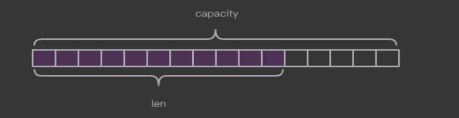

##临界知识
redis对象结构体,type配置数据类型,encoding配套每个数据类型下的多种存储方式
字符串由动态数组组成,每次扩容*2
字符串embstr不可变,int(append)->raw,embstr(append)->raw
pipeline批量发送命令
非重点知识非重点了解
二进制编码解码
##参考
[](https://time.geekbang.org/column/article/299806)
##二进制安全问题

redis只存储原始字节数据,不对数据进行编码解码,编码解码过程发生在客户端,因此客户端之间需要协商好
##Redis对象头结构体
```asp
所有的 Redis 对象都有 下面的这个结构头:
struct RedisObject {
    int4 type; // 4bits
    int4 encoding; // 4bits
    int24 lru; // 24bits
    int32 refcount; // 4bytes
    void *ptr; // 8bytes，64-bit system
} robj;
不同的对象具有不同的类型 type(4bit)，同一个类型的 type 会有不同的存储形式 encoding(4bit)，
为了记录对象的 LRU 信息，使用了 24 个 bit 来记录 LRU 信息。每个对 象都有个引用计数，当引用计数为零时，
对象就会被销毁，内存被回收。ptr 指针将指向对 象内容 (body) 的具体存储位置。这样一个 RedisObject 对象头需要占据 16 字节的存储空 间。
```

type对应group,group和操作配套，比如string配套的操作为set


相同的type使用的encoding也不一定相同
#string
##String 数据结构
[redis深度历险][源码1]
[redis开发与运维]
字符串类型的值实际可以 是字符串(简单的字符串、复杂的字符串(例如JSON、XML))、数字 (整数、浮点数)，甚至是二进制(图片、音频、视频)，但是值最大不能 超过512MB。
 

```asp
struct SDS<T> {
    T capacity; // 数组容量
    T len; // 数组长度
    byte flags; // 特殊标识位，不理睬它 byte[] content; // 数组内容
}
Redis 的字符串叫着「SDS」，也就是 Simple Dynamic String。它的结构是一个带长度信息的字节数组
SDS 结构使用了范型 T，为什么不直接用 int 呢，这是因为当字符串比较短 时，len 和 capacity 可以使用 byte 和 short 来表示，
Redis 为了对内存做极致的优化，不同 长度的字符串使用不同的结构体来表示
```
##string编码&编码转换(int/embstr->raw)
```asp
字符串类型的内部编码有3种:
·int:8个字节的长整型。 
·embstr:小于等于39个字节的字符串。 
·raw:大于39个字节的字符串。
```

embstr是只读的，任何修改操作都会转换成raw

[redis设计与实现]8.2
##string扩容
```asp
底层是字节,Redis 的字符串是动态字符串，是可以修改的字符串，内部结构实现上类似于 Java 的 ArrayList，采用预分配冗余空间的方式来减少内存的频繁分配，
如图中所示，内部为当前字 符串实际分配的空间 capacity 一般要高于实际字符串长度 len。当字符串长度小于 1M 时， 扩容都是加倍现有的空间，
如果超过 1M，扩容时一次只会多扩 1M 的空间。需要注意的是 字符串最大长度为 512M
```
```asp
struct SDS {
    int8 capacity; // 1byte
    int8 len; // 1byte
    int8 flags; // 1byte
    byte[] content; // 内联数组，长度为 capacity
}
在字符串比较小时，SDS 对象头的大小是
capacity+3，至少是 3。意味着分配一个字符串的最小空间占用为 19 字节 (16+3)

```


##string计数
int->append->raw
##string bitmap

##优势

###局限

#List,双向链表 ,lpush,lpop,rpush,rpop,lrange 
Hash  
Set  
Sorted Set

#常见操作时间复杂度
##string

###单元素操作HGET,HSET,HDEL
O(1)
###范围操作SCAN
O(n)
Redis 从 2.8 版本开始提供了 SCAN 系列操作（包括 HSCAN，SSCAN 和 ZSCAN），这类操作实现了渐进式遍历，每次只返回有限数量的数据。这样一来，相比于 HGETALL、SMEMBERS 这类操作来说，就避免了一次性返回所有元素而导致的 Redis 阻塞。
###统计操作
O(1)
是指集合类型对集合中所有元素个数的记录，例如 LLEN 和 SCARD。这类操作复杂度只有 O(1)，这是因为当集合类型采用压缩列表、双向链表、整数数组这些数据结构时，这些结构中专门记录了元素的个数统计
###首尾操作
指某些数据结构的特殊记录，例如压缩列表和双向链表都会记录表头和表尾的偏移量。这样一来，对于 List 类型的 LPOP、RPOP、LPUSH、RPUSH 这四个操作来说，它们是在列表的头尾增删元素，这就可以通过偏移量直接定位，所以它们的复杂度也只有 O(1)，可以实现快速操作

#查看redis持久化信息
AOF

#pipeline vs 批量
```$xslt
需要实现Pipeline 功能，需要客户端和服务器端的支持。
Redis 服务器端支持处理一个客户端通过同一个 TCP 连接发来的多个命令。可以理解为，这里将多个命令切分，和处理单个命令一样，处理完成后会将处理结果缓存起来，所有命令执行完毕后统一打包返回。
```

```$xslt
 原生批量命令是原子的，Pipeline是非原子的。 
·原生批量命令是一个命令对应多个key，Pipeline支持多个命令。
·原生批量命令是Redis服务端支持实现的，而Pipeline需要服务端和客户 端的共同实现。
```

##原子操作lua
```$xslt
Redis 是使用单线程来串行处理客户端的请求操作命令的，所以，当 Redis 执行某个命令操作时，其他命令是无法执行的，这相当于命令操作是互斥执行的。
当然，Redis 的快照生成、AOF 重写这些操作，可以使用后台线程或者是子进程执行，也就是和主线程的操作并行执行。不过，这些操作只是读取数据，
不会修改数据，所以，我们并不需要对它们做并发控制。

你可能也注意到了，虽然 Redis 的单个命令操作可以原子性地执行，但是在实际应用中，数据修改时可能包含多个操作，至少包括读数据、数据增减、
写回数据三个操作，这显然就不是单个命令操作了

Redis 在执行 Lua 脚本(lua脚本语言,魔兽世界用到)时，是可以保证原子性的，lua可以原子的执行多个命令
```
DECR id
Lua 脚本

###lua持久化
```$xslt
把这段Lua脚本持久化到AOF文件中，保证Redis重启时可以回放执行过的Lua脚本。

把这段Lua脚本复制给备库执行，保证主备库的数据一致性

Redis要求Lua脚本必须是纯函数的形式了，想象一下给定一段Lua脚本和输入参数却得到了不同的结果，这就会造成重启前后和主备库之间的数据不一致
```
[](http://mysql.taobao.org/monthly/2019/01/06/)
###lua复用
```
eval
evalsha
```
```$xslt
除了使用eval，Redis还提供了evalsha命令来执行Lua脚本。如图3-8所 示，首先要将Lua脚本加载到Redis服务端，得到该脚本的SHA1校验和，
 evalsha命令使用SHA1作为参数可以直接执行对应Lua脚本，避免每次发送 Lua脚本的开销。这样客户端就不需要每次执行脚本内容，而脚本也会常驻 在服务端，脚本功能得到了复用
```


##pipeline vs lua
lua原子执行,pipeline不会原子执行
#数据库
Redis只是用数 字作为多个数据库的实现。Redis默认配置中是有16个数据库

###数据库废弃
Redis是单线程的。如果使用多个数据库，那么这些数据库仍然是使用 一个CPU，彼此之间还是会受到影响的
