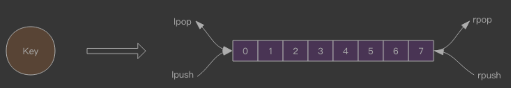
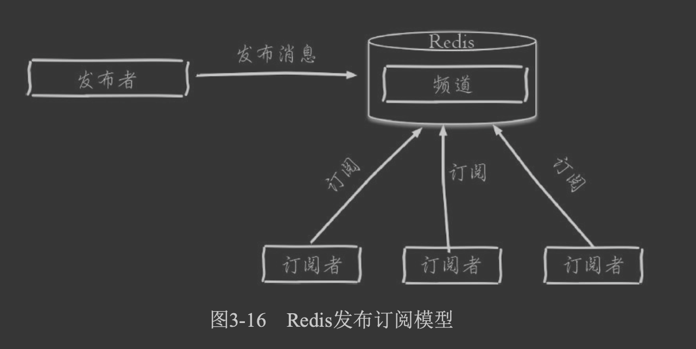
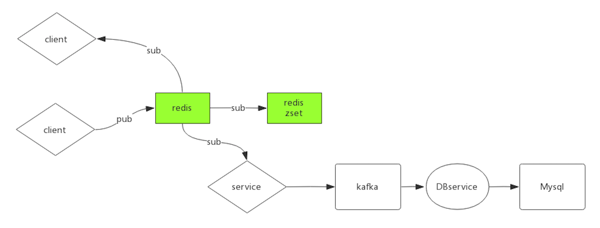

#消息队列(阻塞)

##空闲连接自动断开
如果线程一直阻塞在哪里，Redis 的客户端连接就成了闲置连接，闲置过久，服务器一般
会主动断开连接，减少闲置资源占用。这个时候 blpop/brpop 会抛出异常来
#发布订阅

新开启的订阅客户端，无法收到该频道之前的消息，因为Redis不会对 发布的消息进行持久化。
聊天室、公告牌、服务之间利用消息解耦都可以使用发布订阅模式
PubSub 的消息是不会持久化的,它几乎找不到合适的应用场景(即时消息,哨兵和主库的通信使用了Pubsub)

#stream
#延时队列

zadd
zrangebyscore
zrem
##lua脚本优化
lua执行zrangebyscore+zrem
