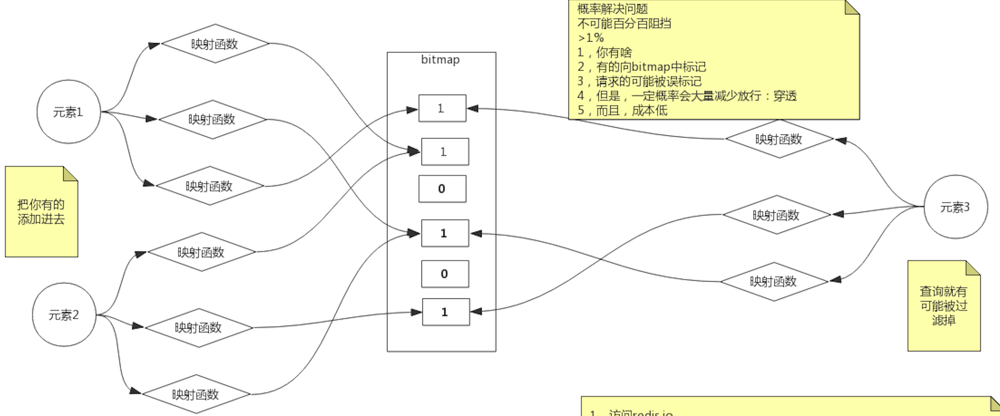
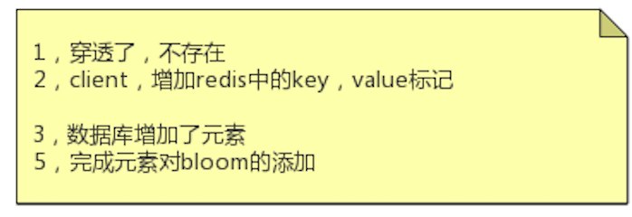

#缓存穿透
redis做缓存,但是可能出现大量请求穿透redis,直接到达mysql，导致mysql扛不住太多连接(bio)
但是如果mysql也不存在这些请求的内容,则属于无效穿透,屏蔽这些无效穿透可以避免mysql被击穿
#布隆过滤器
[T_02_BloomFilter布隆过滤器_CountingFilter_CukcooFilter布谷鸟过滤器.md]
缓存mysql中的内容hash,直接通过redis就可以判断内容不存在,避免客户端请求mysql中也不存在的内容

