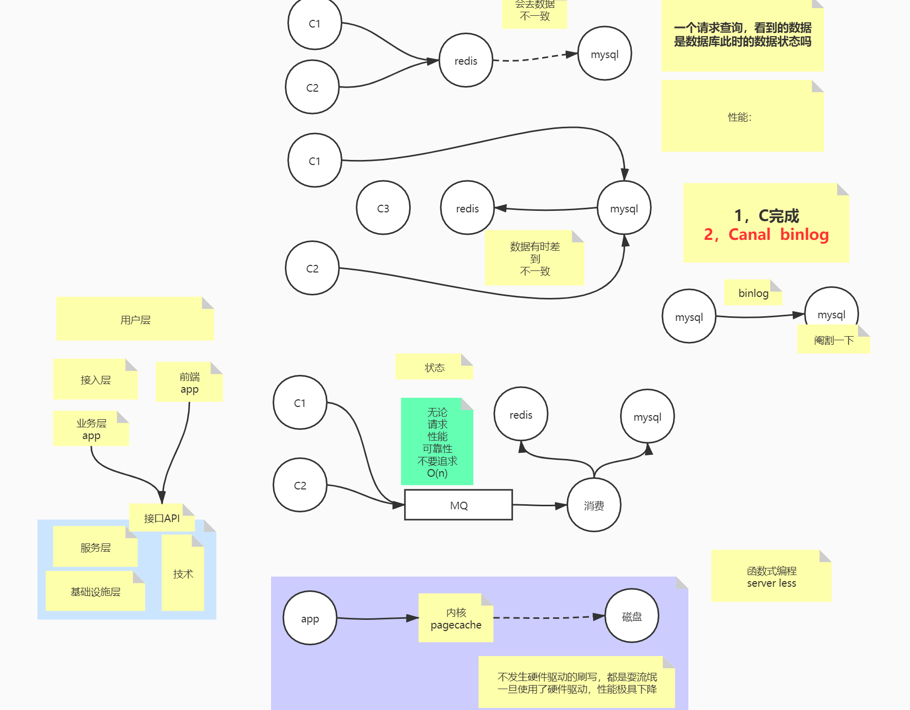
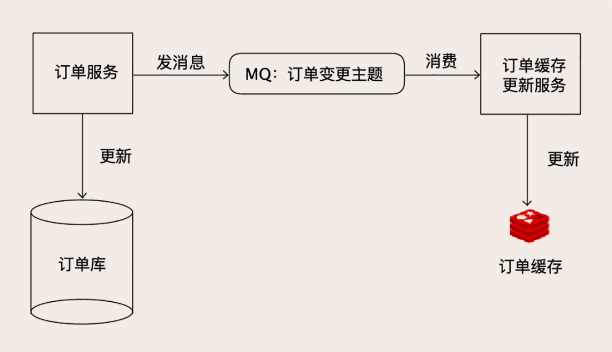
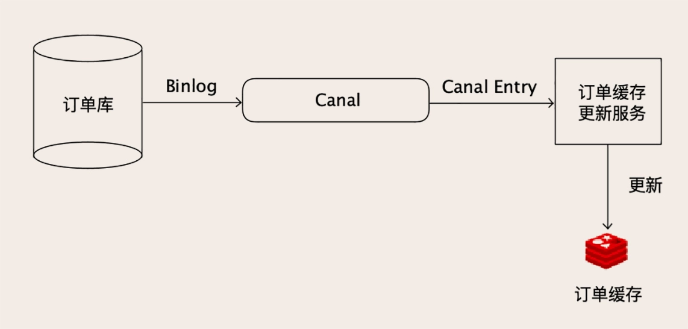
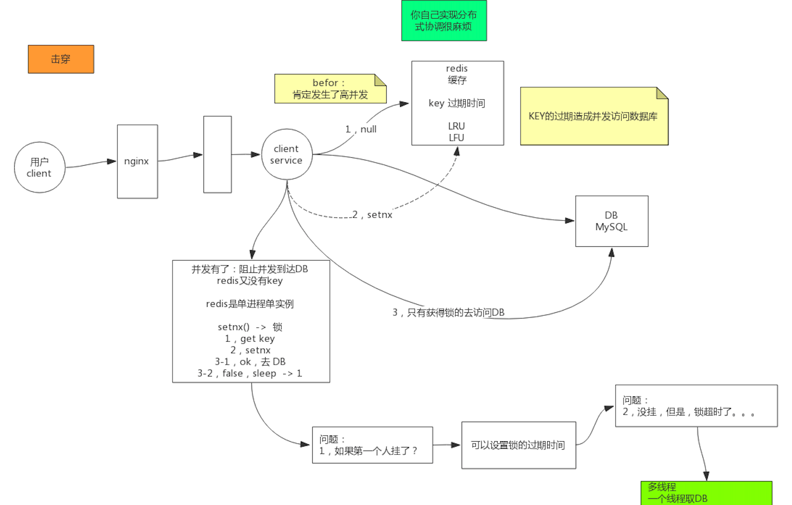
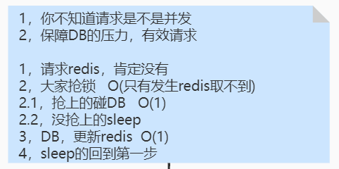
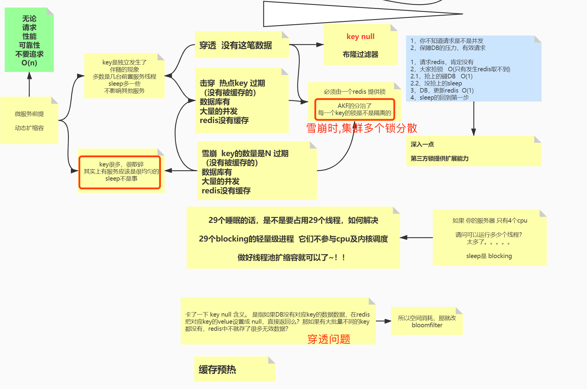
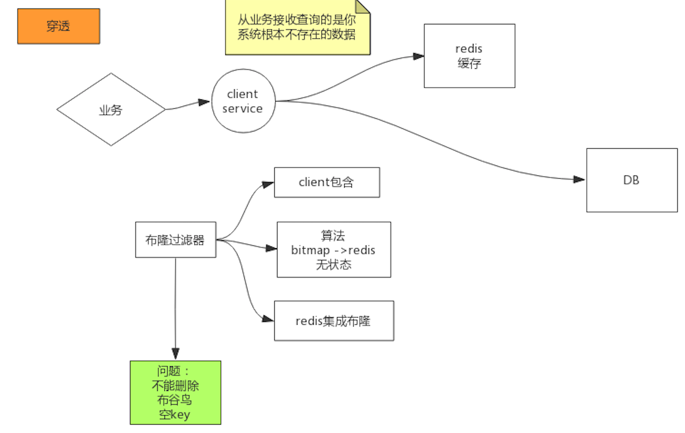
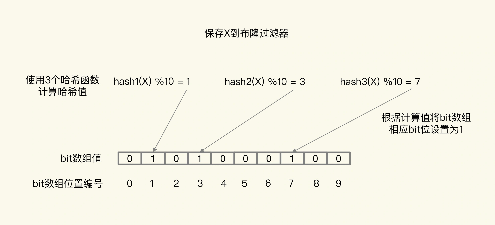

#临界知识
redis两大功能:缓存,数据库
redis模块化module组件概念
redis缓存一致性更新cache还是淘汰cache:读多还是写多
redis缓存一致性速度:redis查询更新<1ms,mysql查询更新<100ms
每台主机线程数5W,32核,128GB,1T
#redis缓存一致性(Cache Aside 模式 vs Read/Write Through 模式)
[](https://time.geekbang.org/column/article/213230)
性能,缓存利用率、并发、缓存 + 数据库

##核心问题
```asp
1、先更新缓存，再更新数据库；
2、先更新数据库，再更新缓存；
3、先淘汰缓存，再更新数据库；
4、先更新数据库，再淘汰缓存
```
##更新cache还是淘汰cache
主要取决于更新缓存的复杂度
数据库写入的结果是中间值，缓存的结果是计算结果
```asp
有如下两种不适合场景 更新cache
如果你是一个写数据库场景比较多，而读数据场景比较少的业务需求，采用这种方案就会导致，数据压根还没读到，缓存就被频繁的更新，浪费性能
如果你写入数据库的值，并不是直接写入缓存的，而是要经过一系列复杂的计算再写入缓存。那么，每次写入数据库后，都再次计算写入缓存的值，无疑是也浪费性能的
```
```asp
淘汰cache
不过大部分场景下删除缓延迟删除存操作简单，并且带来的副作用只是增加了一次Cache Miss，建议作为通用的处理方式
```
```asp
线程 A 更新数据库（X = 1）
线程 B 更新数据库（X = 2）
线程 B 更新缓存（X = 2）
线程 A 更新缓存（X = 1）
最终 X 的值在缓存中是 1，在数据库中是 2，发生不一致,更新数据库删除redis不会发生此情况
```

##更新数据库再删除缓存vs删除缓存后更新数据库
都可能造成数据不一致,看谁的影响最小

更新数据库再删除缓存出现脏数据概率是更小点
数据库查询更新耗时<100ms
缓存查询更新耗时<1ms

缓存和数据库不一致,一般是查旧数据库,更新回旧缓存导致,删除缓存<查库<更新数据库

```asp
请求缓存刚好失效
请求A查询数据库，得一个旧值
请求B将新值写入数据库
请求B删除缓存
请求A将查到的旧值写入缓存
```
[](https://note.dolyw.com/cache/00-DataBaseConsistency.html#%E5%85%88%E6%9B%B4%E6%96%B0%E6%95%B0%E6%8D%AE%E5%BA%93-%E5%86%8D%E5%88%A0%E9%99%A4%E7%BC%93%E5%AD%98)
##写数据库成功，第二步删除缓存失败
异步消息队列重试 延时策略 双删策略,mysql中间件canal
[](https://developer.aliyun.com/article/712285)
[](https://mp.weixin.qq.com/s/4W7vmICGx6a_WX701zxgPQ)
##可以做到强一致吗？
所以如果非要追求强一致，那必须要求所有更新操作完成之前期间，不能有「任何请求」进来。
虽然我们可以通过加「分布锁」的方式来实现，但我们要付出的代价，很可能会超过引入缓存带来的性能提升。
##消息队列 vs binlog canal(ke,nel)


[](https://time.geekbang.org/column/article/217593)
#缓存击穿(高并发,redis无缓存)
[](https://segmentfault.com/a/1190000039300423)
[](https://juejin.cn/post/6844903986475057165)
少量key过期,高并发,

1.为了避免缓存击穿给数据库带来的激增压力，我们的解决方法也比较直接，对于访问特别频繁的热点数据，我们就不设置过期时间了
可以采用定时任务在redis从节点上运营monitor命令，统计出热点key，然后将热点key对应的缓存时间延长
2.
3.sentinel热点参数流量控制

#缓存雪崩(整体大量过期)
1.Redis 缓存实例发生故障宕机了
2.大量key过期,缓存在同一时间大面积的失效，后面的请求都直接落到了数据库上，造成数据库短时间内承受大量请求
##针对 Redis 服务不可用的情况：

采用 Redis 集群，避免单机出现问题整个缓存服务都没办法使用。
限流，避免同时处理大量的请求。
服务熔断、服务降级、请求限流的作用是，当系统内部发生故障或潜在问题时，为了防止系统内部的问题进一步恶化，所以会采用这些方式对系统增加保护，
待系统内部故障恢复后，可以依旧继续对外提供服务，这些方法属于服务治理的范畴，在任何可能导致系统故障的场景下，都可以选择性配合使用。
sentinel熔断降级控制
数据源服务请求模型参数超时,请求数上来,导致资源占满
```asp
当业务应用访问的是非核心数据（例如电商商品属性）时，暂时停止从缓存中查询这些数据，而是直接返回预定义信息、空值或是错误信息；
当业务应用访问的是核心数据（例如电商商品库存）时，仍然允许查询缓存，如果缓存缺失，也可以继续通过数据库读取。
```
我们就避免了大量请求因缓存缺失，而积压到数据库系统，保证了数据库系统的正常运行
我们使用这两个机制，来降低雪崩对数据库和整个业务系统的影响。

使用redis cluster集群模式,
raft协议自动从节点还可以切换成为主节点
hash缓存一致性
##针对热点缓存失效的情况
###随机过期时间
###不能随机时间
使用多个redis锁,均匀分布在redis分片集群

#缓存穿透(数据库无数据)
redis做缓存,但是可能出现大量请求穿透redis,直接到达mysql，导致mysql扛不住太多连接(bio)
但是如果mysql也不存在这些请求的内容,则属于无效穿透,屏蔽这些无效穿透可以避免mysql被击穿

##缓存空值或缺省值
```asp
一旦发生缓存穿透，我们就可以针对查询的数据，在 Redis 中缓存一个空值或是和业务层协商确定的缺省值（例如，库存的缺省值可以设为 0）。
紧接着，应用发送的后续请求再进行查询时，就可以直接从 Redis 中读取空值或缺省值，返回给业务应用了，避免了把大量请求发送给数据库处理，保持了数据库的正常运行。
```
redis&mysql体系,将复杂度和成本前置

1.能承受的qps:redis,10w/s;mysql,1000/s
2.redis串行,即使访问mysql无数据(1000/s)后设置redis占位符,也是串行执行,此时可能redis(10w/s)排队了几千个请求,仍会打到mysql
    放大前置环节的复杂度,当redis取不到数据(取到不加锁)时,进行加分布式redis锁请求mysql,然后更新redis的占位符,未抢到锁的阻塞
[z_04_分布式_redis_01_常见问题_常见应用场景_redis分布式锁_原子操作_公司集群_项目常用_简单限流.md]
##布隆过滤器
[T_02_BloomFilter布隆过滤器_CountingFilter_CukcooFilter布谷鸟过滤器.md]
缓存mysql中的内容hash,直接通过redis就可以判断内容不存在,避免客户端请求mysql中也不存在的内容


[](https://github.com/RedisBloom/RedisBloom#use-redisbloom-with-redis-cli)
当需要查询某个数据时，我们就执行刚刚说的计算过程，先得到这个数据在 bit 数组中对应的 N 个位置。紧接着，我们查看 bit 数组中这 N 个位置上的 bit 值。
只要这 N 个 bit 值有一个不为 1，这就表明布隆过滤器没有对该数据做过标记，所以，查询的数据一定没有在数据库中保存

##布隆过滤器无法删除
[z_10_BloomFilter布隆过滤器_CountingFilter_CukcooFilter布谷鸟过滤器.md]
计数布隆过滤器
##计数布隆过滤器太大
布谷鸟过滤器
[z_10_BloomFilter布隆过滤器_CountingFilter_CukcooFilter布谷鸟过滤器.md]


#预热
##发现热数据
```asp
1. 缓存预热的思路

a.提前给redis中嵌入部分数据，再提供服务

b.肯定不可能将所有数据都写入redis，因为数据量太大了，第一耗费的时间太长了，第二redis根本就容纳不下所有的数据

c.需要更具当天的具体访问情况，试试统计出频率较高的热数据

d.然后将访问频率较高的热数据写入到redis，肯定是热数据也比较多，我们也得多个服务并行的读取数据去写，并行的分布式的缓存预热

e.然后将嵌入的热数据的redis对外提供服务，这样就不至于冷启动，直接让数据库奔溃了

```

##方案
日志打入kafka+spark计算+打回kafka+定时刷新热点数据
日志记录,es filebeat收集,后台服务定时拉取es中最新数据,刷新redis热点

##规避差集
加锁,服务治理熔断降级
#热key处理
[](https://help.aliyun.com/document_detail/353223.html)
