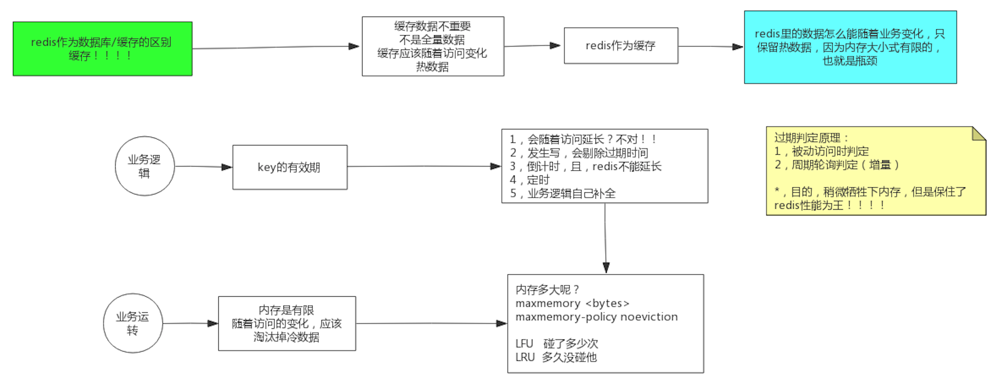

##临界知识
redis过期清理策略,性能至上
Redis过期清理线程,支持异步线程(大对象清理慢)
c语言free函数释放对象详情
淘汰机制性能至上的处理方案,随机采样出 5(可以配置) 个 key淘汰最旧的key

#删除策略
##清理线程
Redis核心流程是单线程执行的，它基本上是处理完一条请求再出处理另外一条请求，
处理请求的过程并不仅仅是响应用户发起的请求，Redis也会做好多其他的工作，当前其中就包括数据的过期。

Redis 从 4.0 版本开始，能够支持后台异步执行任务，比如异步删除数据，不是所有的 unlink 操作都会延后处理，如果对应 key 所占用的内存很小，
延后处理就 没有必要了，这时候 Redis 会将对应的 key 内存立即回收，跟 del 指令一样
##定时删除策略
redis 会将每个设置了过期时间的 key 放入到一个独立的字典中，以后会定时遍历这个 字典来删除到期的 key,异步删除
```asp
Redis 默认会每秒进行十次过期扫描，过期扫描不会遍历过期字典中所有的 key，而是
采用了一种简单的贪心策略。
1、从过期字典中随机 20 个 key;
2、删除这 20 个 key 中已经过期的 key; 3、如果过期的 key 比率超过 1/4，那就重复步骤 1;
3.为了保证过期扫描不会出现循环过度，导致线程卡死现象，算法还增加了扫描时 间的上限，默认不会超过 25ms

```

##惰性删除策略
在客户端访问这个 key 的时候，redis 对 key 的过期时间进行检查，如果过期了就立即删除,异步删除
##从库过期删除
```asp
因为指令同步是异步进行的，所以主库过期的 key 的 del 指令没有及时同步到从库的 话，会出现主从数据的不一致，主库没有的数据在从库里还存在
```
#淘汰策略

默认淘汰策略
```asp
127.0.0.1:6379> config get maxmemory-policy
1) "maxmemory-policy"
2) "noeviction"
```
##volatile-lru/allkeys-lru
```asp
Redis 使用的是一种近似 LRU 算法，它跟 LRU 算法还不太一样。之所以不使用 LRU
算法，是因为需要消耗大量的额外的内存，需要对现有的数据结构进行较大的改造。近似
LRU 算法则很简单，在现有数据结构的基础上使用随机采样法来淘汰元素，能达到和 LRU 算法非常近似的效果。Redis 为实现近似 LRU 算法，
它给每个 key 增加了一个额外的小字 段，这个字段的长度是 24 个 bit，也就是最后一次被访问的时间戳。
上一节提到处理 key 过期方式分为集中处理和懒惰处理，LRU 淘汰不一样，它的处理 方式只有懒惰处理。当 Redis 执行写操作时，
发现内存超出 maxmemory，就会执行一次 LRU 淘汰算法。这个算法也很简单，就是随机采样出 5(可以配置) 个 key，然后淘汰掉最 旧的 key，
如果淘汰后内存还是超出 maxmemory，那就继续随机采样淘汰，直到内存低于 maxmemory 为止。
如何采样就是看 maxmemory-policy 的配置，如果是 allkeys 就是从所有的 key 字典中 随机，如果是 volatile 就从带过期时间的 key 字典中随机。
每次采样多少个 key 看的是 maxmemory_samples 的配置，默认为 5。

淘汰池是一个数组，它的大小是 maxmemory_samples，在每一次淘汰循环中，新随机出 来的 key 列表会和淘汰池中的 key 列表进行融合，
淘汰掉最旧的一个 key 之后，保留剩余 较旧的 key 列表放入淘汰池中留待下一个循环
```
##volatile-lfu/allkeys-lfu
[](https://redis.io/topics/lru-cache)
最近最少使用，跟使用的次数有关，淘汰使用次数最少的
```asp
同样是之前的24位的lru字段，在lfu算法下，前16位将会存放最后一次访问的时间，精确到分钟，而后八位将会记录一个couter频率值，作为判定的依据

16bit 部分怎么用呢？保存的是时间戳的后16位（分钟），表示上一次递减的时间，算法是这样执行，随机采样N个key(与原来的版本一样)，
检查递减时间，如果距离现在超过 N 分钟（可配置），则递减或者减半（如果访问次数数值比较大）。

此外，由于新加入的 key 访问次数很可能比不被访问的老 key小，为了不被马上淘汰，新key访问次数设为 5。
```
##选型
```asp
allkeys-xxx 策略会对所有的
key 进行淘汰。如果你只是拿 Redis 做缓存，那应该使用 allkeys-xxx，客户端写缓存时 不必携带过期时间。如果你还想同时使用 Redis 的持久化功能，
那就使用 volatile-xxx 策略，这样可以保留没有设置过期时间的 key，它们是永久的 key 不会被 LRU 算法淘 汰。
```
