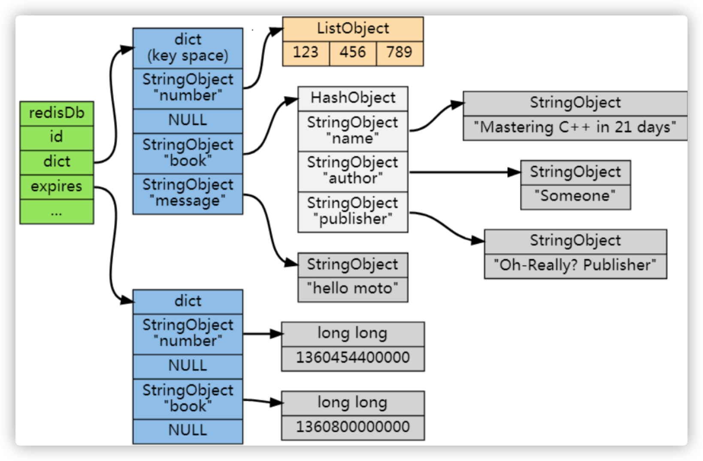

##临界知识
redis过期清理策略(主动,被动),性能至上
Redis过期清理线程,支持异步线程(大对象清理慢)
redis淘汰策略(maxmemory,maxmemory-policy,LFU,LRU)
c语言free函数释放对象详情
淘汰机制性能至上的处理方案,随机采样出 5(可以配置) 个 key淘汰最旧的key
redis删除原理,redis主库从库的删除,redis aof和rdb的删除

#删除策略(原理,几种策略,问题)
##原理
###过期字典(过期时间数据结构)
来保存数据过期的时间。过期字典的键指向 Redis 数据库中的某个 key(键)，过期字典的值是一个 long long 类型的整数，这个整数保存了 key 所指向的数据库键的过期时间

```asp
typedef struct redisDb {  
    dict *dict;                 /* The keyspace for this DB */  
    dict *expires;              /* Timeout of keys with a timeout set */  
    dict *blocking_keys;        /* Keys with clients waiting for data (BLPOP) */  
    dict *io_keys;              /* Keys with clients waiting for VM I/O */  
    dict *watched_keys;         /* WATCHED keys for MULTI/EXEC CAS */  
    int id;  
} redisDb; 

仅关注 dict 和 expires ，分别来存 key-value 和它的超时，也就是说如果一个 key-value 是有超时的，那么它会存在 dict 里，同时也存到 
expires 里，类似这样的形式：dict[key]:value,expires[key]:timeout.

当然 key-value 没有超时， expires 里就不存在这个 key 。 剩下 setKey 和 setExpire 两个函数无非是插数据到两个字典里
```
[](https://github.com/Snailclimb/JavaGuide/blob/main/docs/database/redis/redis%E7%9F%A5%E8%AF%86%E7%82%B9&%E9%9D%A2%E8%AF%95%E9%A2%98%E6%80%BB%E7%BB%93.md)
###清理线程
Redis核心流程是单线程执行的，它基本上是处理完一条请求再出处理另外一条请求，
处理请求的过程并不仅仅是响应用户发起的请求，Redis也会做好多其他的工作，当前其中就包括数据的过期。

key的定期删除会在Redis的周期性执行任务（serverCron，默认每100ms执行一次）中进行，而且是发生Redis的master节点，因为slave节点会通过主节点的DEL命令同步过来达到删除key的目的

Redis 从 4.0 版本开始，能够支持后台异步执行任务，比如异步删除数据，不是所有的 unlink 操作都会延后处理，如果对应 key 所占用的内存很小，
延后处理就 没有必要了，这时候 Redis 会将对应的 key 内存立即回收，跟 del 指令一样
##策略
###定期删除策略(优缺点)
redis 会将每个设置了过期时间的 key 放入到一个独立的字典中，以后会定时遍历这个 字典来删除到期的 key,异步删除
```asp
Redis 默认会每秒进行十次过期扫描，过期扫描不会遍历过期字典中所有的 key，而是
采用了一种简单的贪心策略。
1、从过期字典中随机 20 个 key;
2、删除这 20 个 key 中已经过期的 key; 3、如果过期的 key 比率超过 1/4，那就重复步骤 1;
3.为了保证过期扫描不会出现循环过度，导致线程卡死现象，算法还增加了扫描时 间的上限，默认不会超过 25ms

```
```asp
由于定时删除会占用太多cpu时间，影响服务器的响应时间和吞吐量以及惰性删除浪费太多内存，有内存泄露的危险，所以出现一种整合和折中这两种策略的定期删除策略。

定期删除策略每隔一段时间执行一次删除过期键操作，并通过限制删除操作执行的时长和频率来减少删除操作对CPU时间的影响。
定时删除策略有效地减少了因为过期键带来的内存浪费
```
###惰性删除策略(优缺点)
```asp
在客户端访问这个 key 的时候，redis 对 key 的过期时间进行检查，如果过期了就立即删除,异步删除

优点： 对cpu时间友好，在每次从键空间获取键时进行过期键检查并是否删除，删除目标也仅限当前处理的键，这个策略不会在其他无关的删除任务上花费任何cpu时间。
缺点： 对内存不友好，过期键过期也可能不会被删除，导致所占的内存也不会释放。甚至可能会出现内存泄露的现象，当存在很多过期键，而这些过期键又没有被访问到，这会可能导致它们会一直保存在内存中，造成内存泄露
```
##问题

#淘汰策略
Redis 是用 RedisObject 结构来保存数据的，RedisObject 结构中设置了一个 lru 字段，用来记录数据的访问时间戳

默认淘汰策略
```asp
127.0.0.1:6379> config get maxmemory-policy
1) "maxmemory-policy"
2) "noeviction"
```
##volatile-lru/allkeys-lru
```asp

如果没有设置有效期，即使内存用完，redis 自动回收机制也是看设置了有效期的，不会动没有设定有效期的，如果清理后内存还是满的，就不再接受写操作

Redis 并没有为所有的数据维护一个全局的链表，而是通过随机采样方式，选取一定数量（例如 10 个）的数据放入候选集合，后续在候选集合中根据 lru 字段值的大小进行筛选。


Redis 使用的是一种近似 LRU 算法，它跟 LRU 算法还不太一样。之所以不使用 LRU
算法，是因为需要消耗大量的额外的内存，需要对现有的数据结构进行较大的改造。近似
LRU 算法则很简单，在现有数据结构的基础上使用随机采样法来淘汰元素，能达到和 LRU 算法非常近似的效果。Redis 为实现近似 LRU 算法，
它给每个 key 增加了一个额外的小字 段，这个字段的长度是 24 个 bit，也就是最后一次被访问的时间戳。
上一节提到处理 key 过期方式分为集中处理和懒惰处理，LRU 淘汰不一样，它的处理 方式只有懒惰处理。当 Redis 执行写操作时，
发现内存超出 maxmemory，就会执行一次 LRU 淘汰算法。这个算法也很简单，就是随机采样出 5(可以配置) 个 key，然后淘汰掉最 旧的 key，
如果淘汰后内存还是超出 maxmemory，那就继续随机采样淘汰，直到内存低于 maxmemory 为止。
如何采样就是看 maxmemory-policy 的配置，如果是 allkeys 就是从所有的 key 字典中 随机，如果是 volatile 就从带过期时间的 key 字典中随机。
每次采样多少个 key 看的是 maxmemory_samples 的配置，默认为 5。

淘汰池是一个数组，它的大小是 maxmemory_samples，在每一次淘汰循环中，新随机出 来的 key 列表会和淘汰池中的 key 列表进行融合，
淘汰掉最旧的一个 key 之后，保留剩余 较旧的 key 列表放入淘汰池中留待下一个循环
```
##volatile-lfu/allkeys-lfu
[](https://redis.io/topics/lru-cache)
最近最少使用，跟使用的次数有关，淘汰使用次数最少的
```asp
同样是之前的24位的lru字段，在lfu算法下，前16位将会存放最后一次访问的时间，精确到分钟，而后八位将会记录一个couter频率值，作为判定的依据

16bit 部分怎么用呢？保存的是时间戳的后16位（分钟），表示上一次递减的时间，算法是这样执行，随机采样N个key(与原来的版本一样)，
检查递减时间，如果距离现在超过 N 分钟（可配置），则递减或者减半（如果访问次数数值比较大）。

此外，由于新加入的 key 访问次数很可能比不被访问的老 key小，为了不被马上淘汰，新key访问次数设为 5。

在此基础上，Redis 在实现 LFU 策略的时候，只是把原来 24bit 大小的 lru 字段，又进一步拆分成了两部分。ldt 值：lru 字段的前 16bit，
表示数据的访问时间戳；counter 值：lru 字段的后 8bit，表示数据的访问次数。总结一下：当 LFU 策略筛选数据时，Redis 会在候选集合中，
根据数据 lru 字段的后 8bit 选择访问次数最少的数据进行淘汰。当访问次数相同时，再根据 lru 字段的前 16bit 值大小，选择访问时间最久远的数据进行淘汰。
```
[](https://time.geekbang.org/column/article/297270)
[](https://www.cnblogs.com/linxiyue/p/10955533.html)
```asp
非线性递增的计数器,log函数

假设第一个数据 A 的累计访问次数是 256，访问时间戳是 202010010909，所以它的 counter 值为 255，而第二个数据 B 的累计访问次数是 1024，
访问时间戳是 202010010810。如果 counter 值只能记录到 255，那么数据 B 的 counter 值也是 255。此时，缓存写满了，Redis 使用 LFU 策略进行淘汰。
数据 A 和 B 的 counter 值都是 255，LFU 策略再比较 A 和 B 的访问时间戳，发现数据 B 的上一次访问时间早于 A，就会把 B 淘汰掉。但其实数据 B 
的访问次数远大于数据 A，很可能会被再次访问。这样一来，使用 LFU 策略来淘汰数据就不合适了。的确，Redis 也注意到了这个问题。因此，在实现 LFU 策略时，
Redis 并没有采用数据每被访问一次，就给对应的 counter 值加 1 的计数规则，而是采用了一个更优化的计数规则。
```

##选型
```asp
allkeys-xxx 策略会对所有的
key 进行淘汰。如果你只是拿 Redis 做缓存，那应该使用 allkeys-xxx，客户端写缓存时 不必携带过期时间。如果你还想同时使用 Redis 的持久化功能，
那就使用 volatile-xxx 策略，这样可以保留没有设置过期时间的 key，它们是永久的 key 不会被 LRU 算法淘 汰。
```

#问题
##如果redis没有设置expire，他是否默认永不过期？
如果没有设置有效期，即使内存用完，redis 自动回收机制也是看设置了有效期的，不会动没有设定有效期的，如果清理后内存还是满的，就不再接受写操作
对没设置expire的数据，产生影响的是allkeys-lru机制，allkeys-random。
所以redis没设置expire的数据是否会删除，是由你自己选择的删除机制决定的。
##过期是否会出现主从数据不一致
```asp
因为指令同步是异步进行的，所以主库过期的 key 的 del 指令没有及时同步到从库的 话，会出现主从数据的不一致，主库没有的数据在从库里还存在
```
##AOF、RDB和复制功能对过期键的处理
[](https://zhuanlan.zhihu.com/p/87179288)
```asp
生成RDB文件
程序会数据库中的键进行检查，已过期的键不会保存到新创建的RDB文件中

载入RDB文件

主服务载入RDB文件，会对文件中保存的键进行检查会忽略过期键加载未过期键
从服务器载入RDB文件，会加载文件所保存的所有键（过期和未过期的），但从主服务器同步数据同时会清空从服务器的数据库。
```
```asp
AOF文件写入：当过期键被删除后，会在AOF文件增加一条DEL命令，来显式地记录该键已被删除。
AOF重写：已过期的键不会保存到重写的AOF文件中
```
```asp
当服务器运行在复制模式下时，从服务器的过期键删除动作由主服务器控制的，这样的好处主要为了保持主从服务器数据一致性：

主服务器在删除一个过期键之后，会显式地向所有的从服务器发送一个DEL命令，告知从服务器删除这个过期键
从服务器在执行客户端发送的读取命令时，即使碰到过期键也不会将过期键删除，不作任何处理。
只有接收到主服务器 DEL命令后，从服务器进行删除处理。

```
##从库访问过期key,会如何?
```asp
总的来说，当主库采用主动或惰性删除过期键时，会同步一个DEL操作到从库，这样从库也可以删除过期键。但是，从库不会自己处理过期键，只会应用主库同步过来的DEL过期键操作，也就是说，即使键在从库已经过期了，从库也不会对其处理，过期后如果主库不同步DEL操作过来，那么从库并不会采用主动或惰性的方式去清理过期键。

那么，对于从库处理过期键的方式，就存在一个问题。就是当从库提供只读功能时，即使一个键已经过期了，如果主库对这个过期键的清理操作处理不及时，那么在从库仍然能读到这个键。
这个问题确实在Redis3.2以下会存在，但是在Redis3.2以上，已经做出了优化：对于在从库中已经过期的键，在从库发起读取的时候，Redis会判断这个键是否已经过期，如果已经过期，那么将返回nil；但是对于这个过期的键，从库仍然不会自己采取清理措施，而是需要等主库发起对这个过期键的清理，然后同步DEL操作过来，从库才应用DEL操作对过期键进行删除。
所以Redis3.2以上的优化总结来说，是屏蔽了从库中已经过期的键。
```
##淘汰机制是异步吗?
猜测:同步淘汰删除,并将删除指令传递给从库
##redis淘汰机制从库
```asp
Redis 5.0 以下版本存在这样一个问题：从库内存如果超过了 maxmemory，也会触发数据淘汰。

在某些场景下，从库是可能优先主库达到 maxmemory 的（例如在从库执行 MONITOR 命令，输出缓冲区占用大量内存），那么此时从库开始淘汰数据，主从库就会产生不一致。

要想避免此问题，在调整 maxmemory 时，一定要注意主从库的修改顺序：

调大 maxmemory：先修改从库，再修改主库

调小 maxmemory：先修改主库，再修改从库

直到 Redis 5.0，Redis 才增加了一个配置 replica-ignore-maxmemory，默认从库超过 maxmemory 不会淘汰数据，才解决了此问题
```
