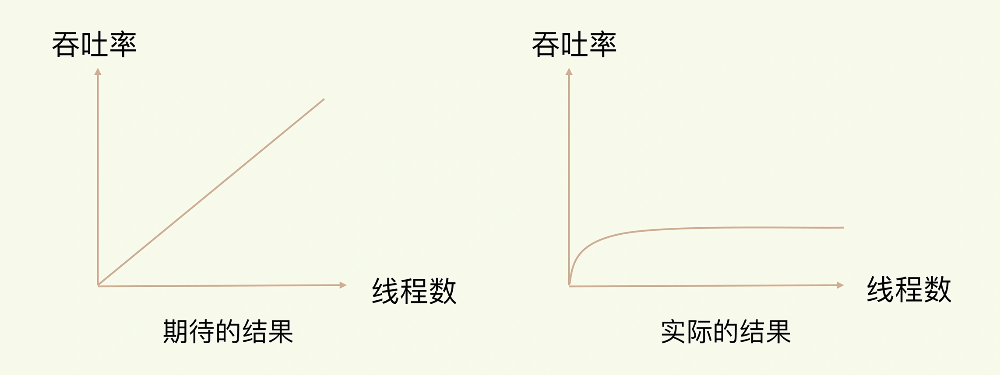
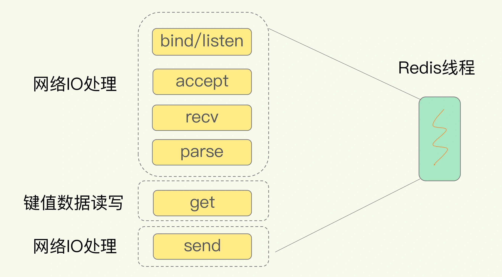
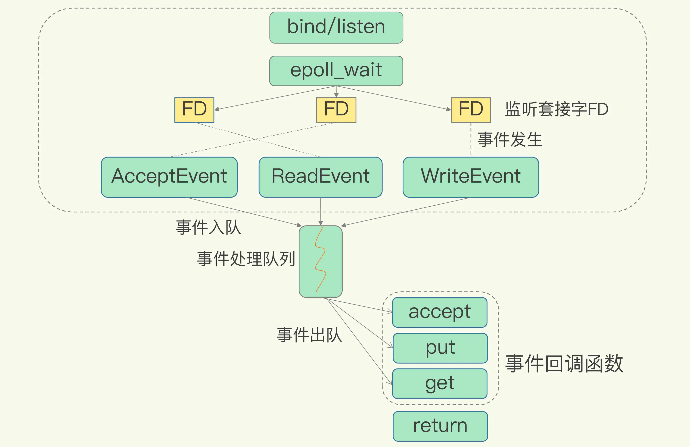

##临界知识
内存业务
io复用增大吞吐
数据结构优化速度
##多线程的适用场景
###优点
多核cpu合理利用多核性能
###问题
多线程增加cpu上下文切换

多线程竞争共享资源
###redis的多线程问题
```asp
拿 Redis 来说，在上节课中，我提到过，Redis 有 List 的数据类型，并提供出队（LPOP）和入队（LPUSH）操作。
假设 Redis 采用多线程设计，如下图所示，现在有两个线程 A 和 B，线程 A 对一个 List 做 LPUSH 操作，
并对队列长度加 1。同时，线程 B 对该 List 执行 LPOP 操作，并对队列长度减 1。
为了保证队列长度的正确性，Redis 需要让线程 A 和 B 的 LPUSH 和 LPOP 串行执行，
这样一来，Redis 可以无误地记录它们对 List 长度的修改。否则，我们可能就会得到错误的长度结果。
这就是多线程编程模式面临的共享资源的并发访问控制问题。
```


```asp
只是简单地采用一个粗粒度互斥锁，就会出现不理想的结果：即使增加了线程，大部分线程也在等待获取访问共享资源的互斥锁，
并行变串行，系统吞吐率并没有随着线程的增加而增加。而且，采用多线程开发一般会引入同步原语来保护共享资源的并发访问，
这也会降低系统代码的易调试性和可维护性。为了避免这些问题，Redis 直接采用了单线程模式。
```
##i/o复用模型

###同步阻塞IO
当 Redis 监听到一个客户端有连接请求，但一直未能成功建立起连接时，会阻塞在 accept() 函数这里，导致其他客户端无法和 Redis 建立连接。类似的，
当 Redis 通过 recv() 从一个客户端读取数据时，如果数据一直没有到达，Redis 也会一直阻塞在 recv()。
####redis中阻塞io的影响
accept
recv
连接过多时间消耗主要在同步io读写
kv操作过多
###同步非阻塞IO
Linux 中的 IO 多路复用机制是指一个线程处理多个 IO 流,select/epoll 机制

select/epoll 提供了基于事件的回调机制，即针对不同事件的发生，调用相应的处理函数。
```asp
这些事件会被放进一个事件队列，Redis 单线程对该事件队列不断进行处理。这样一来，
Redis 无需一直轮询是否有请求实际发生，这就可以避免造成 CPU 资源浪费。
同时，Redis 在对事件队列中的事件进行处理时，会调用相应的处理函数，
这就实现了基于事件的回调。因为 Redis 一直在对事件队列进行处理，
所以能及时响应客户端请求，提升 Redis 的响应性能。
```
##redis单线程为什么快
Redis 却能使用单线程模型达到每秒数十万级别的处理能力
###redis单线程指什么
Redis 的单线程指 Redis 的网络 IO 和键值对读写由一个线程来完成的（这是 Redis 对外提供键值对存储服务的主要流程）
它对网络 IO 和数据读写KV的操作采用了一个线程，而采用单线程的一个核心原因是避免多线程开发的并发控制问题
单线程的 Redis 也能获得高性能，跟多路复用的 IO 模型密切相关，因为这避免了 accept() 和 send()/recv() 潜在的网络 IO 操作阻塞点。  

Redis 的持久化、异步删除、集群数据同步等功能是由其他线程而不是主线程来执行的，所以严格来说，Redis 并不是单线程
##redis6.0多线程
Redis 的瓶颈不在 CPU ，而在内存和网络，内存不够可以增加内存或通过数据结构等进行优化
但 Redis 的网络 IO 的读写占用了大部分 CPU 的时间，如果可以把网络处理改成多线程的方式，性能会有很大提升

所以总结下 Redis 6.0 版本引入多线程有两个原因
1.充分利用服务器的多核资源
2.多线程分摊 Redis 同步 IO 读写负荷
###内存存储
###数据结构
哈希表和跳表

##redis高吞吐
Redis 采用了多路复用机制，使其在网络 IO 操作中能并发处理大量的客户端请求
